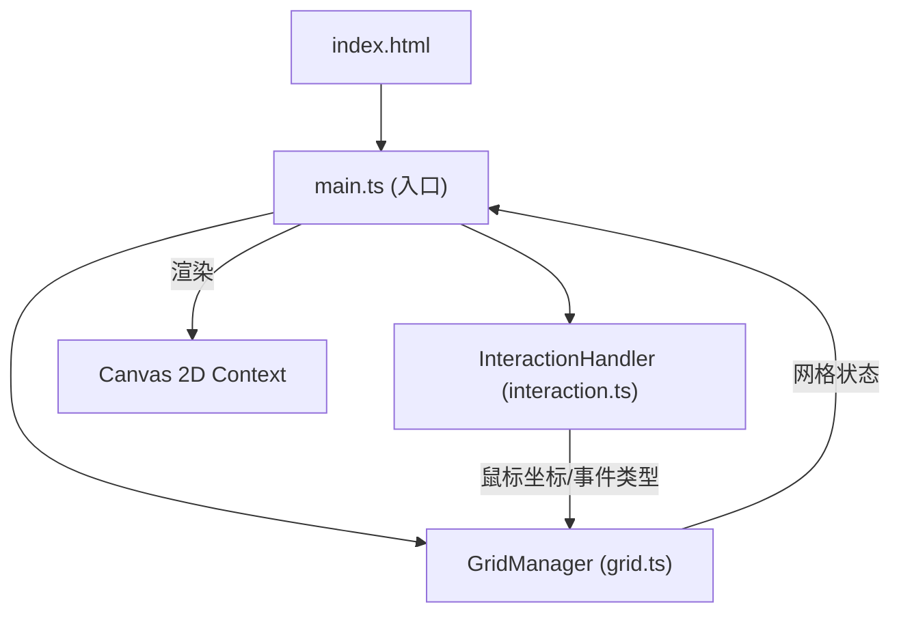

## 1. 架构设计



### 模块职责与数据流向

1. **main.ts** - 入口脚本
   - 初始化 Canvas 并设置全屏
   - 启动 requestAnimationFrame 动画循环
   - 创建 GridManager 和 InteractionHandler 实例
   - 每帧调用 grid.update() 和 grid.render()

2. **grid.ts** - 网格管理
   - 维护六边形色块数组（800-1000个）
   - 数据输入：从 InteractionHandler 接收鼠标坐标、事件类型、移动速度
   - 内部计算：色块位置、颜色、位移、物理模拟
   - 数据输出：更新后的网格状态供渲染
   - 渲染：遍历色块调用 drawHexagon()

3. **interaction.ts** - 交互处理
   - 监听 mousedown/mousemove/mouseup/touch 事件
   - 计算鼠标移动速度和方向
   - 数据输出：将交互数据传递给 GridManager
   - 维护扰动源、波纹、色爆等交互状态

## 2. 技术描述

- **前端**：TypeScript + Vite + Canvas 2D API（无框架）
- **初始化工具**：Vite vanilla-ts 模板
- **构建工具**：Vite 5.x，支持 HMR
- **语言目标**：ES2020，严格模式
- **渲染方式**：Canvas 2D 原生 API
- **动画引擎**：requestAnimationFrame + 时间增量计算

### 核心类定义

```typescript
// Cell - 单个色块
interface Cell {
  baseX: number;          // 基准X坐标
  baseY: number;          // 基准Y坐标
  offsetX: number;        // 当前X偏移
  offsetY: number;        // 当前Y偏移
  velocityX: number;      // X方向速度
  velocityY: number;      // Y方向速度
  baseHue: number;        // 基础色相
  currentHue: number;     // 当前色相
  saturation: number;     // 饱和度
  lightness: number;      // 亮度
  restSaturation: number; // 静止饱和度
  restLightness: number;  // 静止亮度
  size: number;           // 六边形大小
  trail: TrailPoint[];    // 尾迹点数组
}

// InteractionData - 交互数据
interface InteractionData {
  type: 'move' | 'down' | 'up';
  x: number;
  y: number;
  velocityX: number;
  velocityY: number;
  speed: number;
  timestamp: number;
}

// Ripple - 波纹
interface Ripple {
  x: number;
  y: number;
  radius: number;
  maxRadius: number;
  speed: number;
  strength: number;
  active: boolean;
}

// ColorBurst - 色爆
interface ColorBurst {
  x: number;
  y: number;
  startTime: number;
  duration: number;
  active: boolean;
}
```

## 3. 项目结构

```
auto5/
├── package.json
├── vite.config.js
├── tsconfig.json
├── index.html
└── src/
    ├── main.ts          # 入口，动画循环
    ├── grid.ts          # GridManager，色块网格管理
    ├── interaction.ts   # InteractionHandler，交互处理
    └── types.ts         # 类型定义（可选）
```

### 文件调用关系

1. **main.ts** 导入 `GridManager` 和 `InteractionHandler`
2. **main.ts** 实例化 `GridManager`，传入 canvas context
3. **main.ts** 实例化 `InteractionHandler`，传入 canvas 和 grid 实例
4. **interaction.ts** 通过 `grid.handleInteraction(data)` 传递交互数据
5. **grid.ts** 不直接依赖 interaction.ts，保持单向数据流

## 4. 性能优化策略

| 优化点 | 实现方式 |
|--------|----------|
| 绘制性能 | 预计算六边形顶点，避免每帧重复计算 |
| 内存管理 | 对象池复用尾迹点，避免频繁 GC |
| 循环优化 | 使用 for 循环而非 forEach，减少函数调用开销 |
| 离屏缓存 | 静态背景离屏 canvas 缓存 |
| 帧率控制 | requestAnimationFrame 时间增量计算，与帧率解耦 |
| 边界检测 | 视口裁剪，只渲染可见区域色块 |
| 批量绘制 | 相同颜色色块批量绘制，减少状态切换 |

## 5. 动画缓动函数

```typescript
// ease-in-out 缓动
function easeInOut(t: number): number {
  return t < 0.5 ? 2 * t * t : 1 - Math.pow(-2 * t + 2, 2) / 2;
}

// 弹簧回弹
function springBack(current: number, target: number, velocity: number, stiffness: number, damping: number): [number, number] {
  const force = (target - current) * stiffness;
  velocity += force;
  velocity *= damping;
  return [current + velocity, velocity];
}
```

## 6. 运行方式

```bash
npm install
npm run dev
```

开发服务器默认端口 5173，支持 HMR 热更新。
