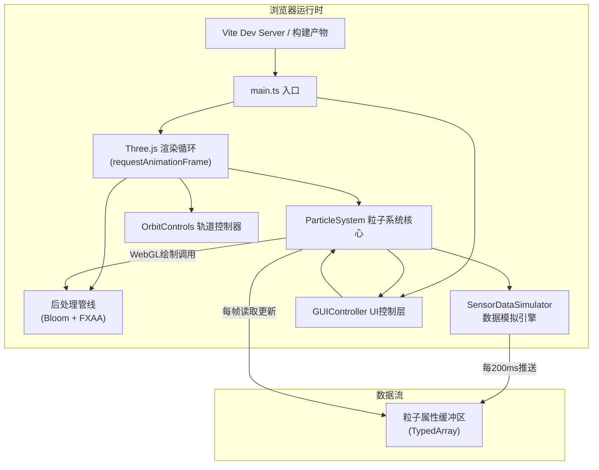

## 1. 架构设计



## 2. 技术选型说明
- **前端框架**：原生 TypeScript + Three.js r152+，不引入React/Vue以最大化3D渲染性能，减少框架层开销
- **构建工具**：Vite 5.x，开发时HMR热更新，生产Rollup tree-shaking
- **3D引擎**：Three.js @0.152+（BufferGeometry + ShaderMaterial实现高性能粒子系统）
- **类型系统**：TypeScript严格模式（strict: true），ES2020编译目标
- **样式方案**：原生CSS3 + CSS变量主题系统，backdrop-filter实现磨砂玻璃
- **无后端**：纯前端运行，传感器数据由内置模拟器生成

## 3. 文件组织结构
```
项目根目录
├── package.json           # 依赖：three, @types/three；脚本：dev/build
├── vite.config.js         # Vite配置（端口、sourcemap、优化）
├── tsconfig.json          # TypeScript严格模式配置
├── index.html             # 入口HTML，全屏viewport，字体预加载
└── src/
    ├── main.ts            # 主入口：场景/相机/渲染器初始化，启动循环
    ├── particleSystem.ts  # 粒子系统核心：生成/更新/生命周期/着色器
    ├── sensorDataSimulator.ts  # 传感器模拟器：200ms周期生成数据
    └── guiController.ts   # 控制面板UI：模式切换/指标/响应式
```

### 模块职责定义

| 模块文件 | 核心职责 | 关键导出 |
|----------|----------|----------|
| [main.ts](file:///c:/Users/Administrator/Desktop/VersionFastPro/tasks/auto5/src/main.ts) | 场景装配、渲染循环、事件绑定、生命周期管理 | 无（IIFE启动） |
| [particleSystem.ts](file:///c:/Users/Administrator/Desktop/VersionFastPro/tasks/auto5/src/particleSystem.ts) | 粒子Buffer管理、GPU着色器、生命周期队列、模式过渡插值 | `ClimateParticleSystem`类 |
| [sensorDataSimulator.ts](file:///c:/Users/Administrator/Desktop/VersionFastPro/tasks/auto5/src/sensorDataSimulator.ts) | 随机数生成器、气候参数分布模型、数据推送回调 | `SensorDataSimulator`类 |
| [guiController.ts](file:///c:/Users/Administrator/Desktop/VersionFastPro/tasks/auto5/src/guiController.ts) | DOM构建、CSS变量主题、事件委托、FPS采样器 | `GUIController`类 |

## 4. 核心数据结构

### 4.1 粒子属性模型
```typescript
// 单个粒子的内存布局（存储于Float32Array交错缓冲区）
interface ParticleData {
  // 几何属性（每顶点）
  position: [number, number, number];     // x, y, z 世界坐标
  velocity: [number, number, number];     // vx, vy, vz 速度向量
  // 物理属性
  temperature: number;                    // -10 ~ 45 摄氏度
  humidity: number;                       // 0 ~ 100 相对湿度%
  // 生命周期
  birthTime: number;                      // 出生时间戳(ms)
  lifetime: number;                       // 总寿命(固定5000ms)
  // 渲染属性
  seed: number;                           // 随机种子(0~1)用于噪声扰动
}
```

### 4.2 气候模式参数集
```typescript
interface ClimateProfile {
  id: 'summer' | 'winter' | 'storm';
  // 温度分布
  tempMean: number;       // 温度均值
  tempStd: number;        // 温度标准差
  // 湿度分布
  humidityMean: number;
  humidityStd: number;
  // 空间分布
  distributionBias: [number, number, number];  // 位置偏移偏向
  distributionRadius: number;                  // 分布球半径
  // 运动参数
  speedMultiplier: number;                      // 速度系数
  turbulenceStrength: number;                   // 湍流强度
  updraftStrength