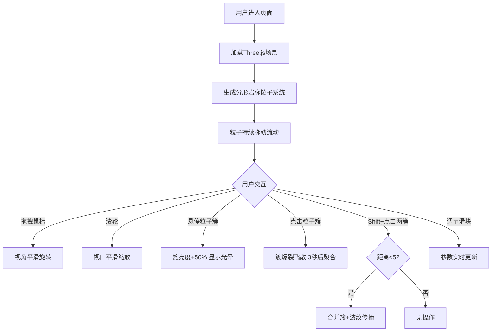

## 1. 产品概述

「岩脉流光」是一款基于WebGL的交互式三维可视化应用，在浏览器中呈现由动态粒子构成的地下岩脉系统，支持多角度观察、实时交互操控和参数调节。

- 面向对三维可视化、数据艺术、地质模拟感兴趣的用户
- 提供沉浸式的粒子分形结构观赏体验，兼具艺术性和交互性

## 2. 核心特性

### 2.1 用户角色

| 角色 | 注册方式 | 核心权限 |
|------|----------|----------|
| 普通用户 | 无需注册，直接访问 | 观赏、交互操控、参数调节 |

### 2.2 功能模块

1. **三维场景主视图**：全屏粒子岩脉系统，含分形主脉、分支、末端粒子簇
2. **交互控制系统**：鼠标拖拽旋转、滚轮缩放、悬停高亮、点击爆裂、Shift+点击合并
3. **参数控制面板**：速度、渐变速率、粒子密度三滑块实时调节

### 2.3 页面详情

| 页面名称 | 模块名称 | 功能描述 |
|-----------|-------------|---------------------|
| 主场景页 | 分形岩脉粒子系统 | 5-8条主脉随机延伸，每条2-3条分支，末端发散粒子簇 |
| 主场景页 | 粒子动态脉动 | 沿脉路方向移动(0.1-0.5单位/秒)，颜色在色域内循环渐变 |
| 主场景页 | 鼠标交互 | 拖拽旋转(Y/X轴)、滚轮缩放(0.5-5倍)、悬停增亮+光晕、点击爆裂飞散 |
| 主场景页 | 簇合并机制 | Shift+点击两簇，距离<5单位时合并，产生彩色波纹传播 |
| 主场景页 | 控制面板 | 左下角半透明浮层，三滑块(速度0.1-2.0、渐变速率0.1-1.0、密度0.5-2.0) |

## 3. 核心流程

用户打开页面后即可看到全屏岩脉粒子系统，粒子持续脉动流动。用户可通过鼠标拖拽旋转视角、滚轮缩放，悬停粒子簇获得高亮反馈，点击触发爆裂特效，按住Shift点击两个邻近簇可触发合并。左下角控制面板可实时调节各项参数。

## 4. 用户界面设计

### 4.1 设计风格

- **主色调**：深褐黑(#0D0806)到暗岩灰(#2E2B28)径向渐变背景，营造地下深邃氛围
- **粒子色**：主脉琥珀橙(#FFA500)→血红(#8B0000)，分支青绿(#00CED1)→钴蓝(#0000FF)
- **控制面板**：#1A1A1A半透明背景，8px圆角，backdrop-filter磨砂玻璃效果
- **滑块样式**：轨道#555浅灰，按钮#FFD700金色圆形，hover放大1.2倍
- **粒子渲染**：Additive blending发光效果，主脉3px、分支2px、末端1px，近大远小

### 4.2 页面设计概览

| 页面名称 | 模块名称 | UI元素 |
|-----------|-------------|-------------|
| 主场景页 | 三维视口 | 全屏WebGL画布，径向渐变背景，发光粒子分形结构 |
| 主场景页 | 控制面板 | 左下角20px处，200px宽，三滑块带标签与实时数值 |
| 主场景页 | 交互反馈 | 悬停光晕、爆裂粒子、合并波纹，所有过渡0.3s ease-out |

### 4.3 响应式

桌面端优先，全屏自适应，支持窗口resize实时调整画布尺寸。

### 4.4 3D场景指引

- **环境**：深褐黑径向渐变背景，营造地下矿脉氛围
- **光照**：粒子采用Additive blending自发光，无需额外光源
- **相机**：PerspectiveCamera，初始距离适中，支持Y/X轴旋转和0.5-5倍缩放
- **构图**：粒子分形结构居中，视觉焦点在屏幕中央
- **交互**：所有操作平滑过渡(0.3s ease-out)，悬停高亮、点击爆裂、合并波纹动画
- **后处理**：Additive blending实现粒子发光叠加
- **性能**：粒子总数≤15000，目标60FPS
