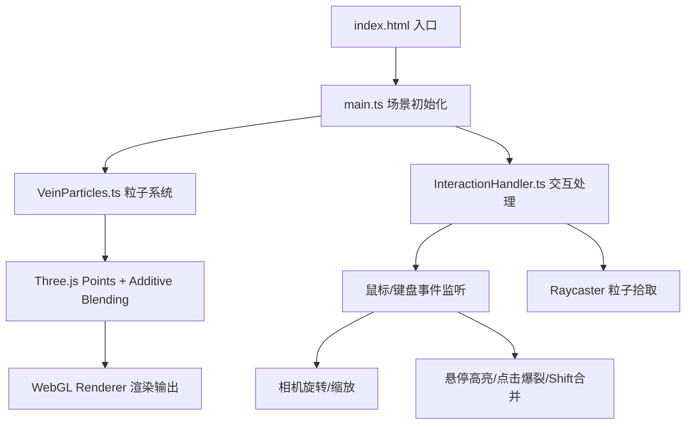

## 1. 架构设计



## 2. 技术说明

- **前端**：TypeScript + Three.js + Vite
- **构建工具**：Vite（支持HMR热更新）
- **后端**：无，纯前端静态应用
- **数据库**：无

## 3. 文件结构

| 文件 | 用途 |
|------|------|
| `package.json` | 依赖声明（three、typescript、vite、@types/three）与脚本 |
| `vite.config.js` | Vite构建配置，启用HMR |
| `tsconfig.json` | TypeScript严格模式，目标ES2022 |
| `index.html` | 入口页面，全屏径向渐变背景 |
| `src/main.ts` | Three.js场景、相机、渲染器初始化，主循环 |
| `src/VeinParticles.ts` | 粒子系统创建、分形岩脉生成、脉动更新、爆裂、合并 |
| `src/InteractionHandler.ts` | 鼠标拖拽旋转、滚轮缩放、悬停、点击、Shift合并 |

## 4. 核心数据结构

### 4.1 粒子数据

```typescript
interface ParticleData {
  position: THREE.Vector3;       // 当前位置
  originalPosition: THREE.Vector3; // 原始位置（用于爆裂后聚合）
  velocity: THREE.Vector3;       // 运动方向与速度
  clusterId: number;             // 所属粒子簇ID
  veinLevel: 0 | 1 | 2;          // 0=主脉 1=分支 2=末端簇
  colorA: THREE.Color;           // 渐变起始色
  colorB: THREE.Color;           // 渐变结束色
  colorPhase: number;            // 颜色渐变相位
  size: number;                  // 粒子渲染大小
  burstOffset?: THREE.Vector3;   // 爆裂时偏移量
  burstTime?: number;            // 爆裂进度(0~1)
}

interface ParticleCluster {
  id: number;
  particles: number[];           // 粒子索引列表
  center: THREE.Vector3;         // 簇中心
  baseColor: THREE.Color;        // 基础颜色
  velocity: number;              // 平均速度
  radius: number;                // 簇半径
  hovered: boolean;              // 是否悬停高亮
  burst: boolean;                // 是否处于爆裂状态
  burstStart: number;            // 爆裂开始时间
}
```

## 5. 核心算法

### 5.1 分形岩脉生成

1. 从原点(0,0,0)出发，随机生成5-8条主脉方向向量
2. 每条主脉沿方向延伸，途中每段加入随机扰动形成自然弯曲
3. 每条主脉在2/3长度处随机分出2-3条分支（方向偏转30°-60°）
4. 分支末端生成粒子簇（半径0.5-1.5的球形分布）
5. 控制总粒子数≤15000

### 5.2 粒子脉动更新

```
每帧:
  对每个粒子:
    pos += velocity * deltaTime * speedMultiplier
    超出脉路范围则回绕
    colorPhase += deltaTime * colorGradientSpeed
    color = lerp(colorA, colorB, (sin(colorPhase)+1)/2)
    若burst状态: 根据burstTime计算爆裂偏移
```

### 5.3 交互拾取

使用 THREE.Raycaster 对 Points 进行拾取，通过 intersectObjects 获取命中粒子，再根据 clusterId 确定所属簇。

### 5.4 簇合并

两簇中心距离<5时，沿中点插值靠拢，合并后：
- 半径 = 2 × max(r1, r2)
- 颜色 = 0.5×c1 + 0.5×c2
- 速度 = (v1 + v2) / 2
- 触发波纹动画沿脉路传播
