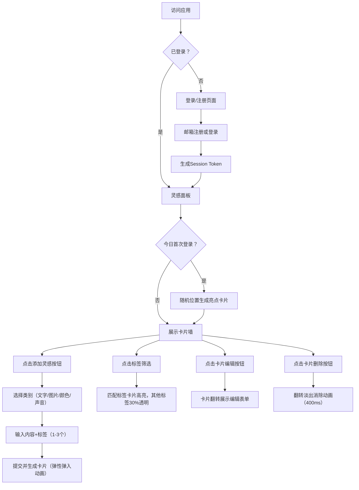

## 1. 产品概述

「灵感切片板」是一款面向创意工作者的个人灵感管理Web应用，解决创意人群在收集零散灵感（文字、图片、颜色、声音）时缺乏统一归类和可视化复盘的痛点。通过毛玻璃风格的可视化卡片墙，让用户能够直观地浏览、筛选、编辑和回顾自己的灵感收藏。

## 2. 核心功能

### 2.1 用户角色
| 角色 | 注册方式 | 核心权限 |
|------|----------|----------|
| 普通用户 | 邮箱注册 | 登录后管理个人灵感，执行CRUD操作，使用标签筛选，查看亮点卡片 |

### 2.2 功能模块
1. **登录/注册页面**：邮箱注册、邮箱登录、表单验证
2. **灵感面板页面**：横向滚动卡片墙、卡片添加/删除/编辑、标签筛选、亮点卡片
3. **添加灵感模态框**：类别选择（文字/图片/颜色/声音）、内容输入、自定义标签
4. **取色器组件**：色轮+亮度饱和度面板、颜色预览
5. **录音组件**：麦克风录音、波形实时绘制、播放功能

### 2.3 页面详情
| 页面名称 | 模块名称 | 功能描述 |
|----------|----------|----------|
| 登录页 | 登录表单 | 邮箱密码输入、登录按钮、跳转注册链接 |
| 登录页 | 注册表单 | 邮箱密码确认输入、注册按钮、跳转登录链接 |
| 灵感面板 | 顶部导航 | 标题展示、添加灵感按钮（悬停扩展）、退出登录 |
| 灵感面板 | 卡片墙 | 横向滚动、卡片弹性入场动画、卡片删除翻转动画 |
| 灵感面板 | 灵感卡片 | 删除按钮（左上）、编辑按钮（右下）、标签徽标（底部） |
| 灵感面板 | 亮点卡片 | 每日首次登录随机位置展示、渐变背景、旋转星形、粒子动画 |
| 添加灵感 | 类别选择 | 4个类别Tab切换，不同类别显示不同内容输入区 |
| 添加灵感 | 标签输入 | 逗号分隔1-3个自定义标签，实时预览标签徽标 |
| 添加灵感 | 颜色取色器 | 色轮选择色相、矩形面板选择饱和度亮度、实时预览 |
| 添加灵感 | 录音面板 | 麦克风按钮（波纹动画）、倒计时15秒、波形预览 |

## 3. 核心流程

### 3.1 用户主流程
用户首次访问进入登录页 → 注册账号或登录 → 每日首次登录生成亮点卡片 → 浏览卡片墙 → 点击「添加灵感」→ 选择类别 → 输入内容和标签 → 确认添加（卡片弹性弹入） → 点击标签筛选（其他标签半透明） → 点击卡片编辑（翻转展示表单） → 点击删除（翻转淡出消除）。

## 4. 用户界面设计

### 4.1 设计风格
- **主题色调**：深灰蓝（#1E2A38）→ 暗紫灰（#2A1E38）背景渐变，主色 #5B7FFF（悬停 #7B9FFF）
- **毛玻璃效果**：卡片背景 rgba(255,255,255,0.08)，backdrop-filter: blur(12px)
- **圆角系统**：卡片16px，标签徽标小圆角，按钮柔和圆角
- **阴影系统**：卡片 0px 4px 20px rgba(0,0,0,0.3)，焦点发光 #5B7FFF blur 8px
- **字体**：标题700字重 24px，正文适中，标签小号粗体
- **图标风格**：简洁线性风格，使用Lucide图标库
- **动效风格**：Spring弹性入场（阻尼0.7，弹性5）、卡片删除旋转收缩（360°/350ms）、按钮过渡300ms

### 4.2 页面设计总览
| 页面名称 | 模块名称 | UI元素详情 |
|----------|----------|------------|
| 登录/注册 | 表单容器 | 居中毛玻璃卡片，输入框焦点发光动画，按钮悬停渐变 |
| 灵感面板 | 顶部导航 | 固定64px高度，滚动时透明→半透明白渐变，标题#E0E0E0 |
| 灵感面板 | 添加按钮 | 圆形44px，悬停扩展为圆角矩形显示"新建灵感"，过渡300ms |
| 灵感面板 | 卡片墙 | 80%视口宽度，上下居中，横向滚动，间距24px |
| 灵感面板 | 卡片 | 220×280px，圆角16px，毛玻璃背景，弹入动画（底部向上） |
| 灵感面板 | 删除按钮 | 卡片左上角，悬停效果，点击翻转淡出400ms |
| 灵感面板 | 编辑按钮 | 卡片右下角，点击卡片翻转180°展示表单 |
| 灵感面板 | 标签徽标 | 彩色小圆角，卡片底部，点击筛选，其他标签30%透明 |
| 灵感面板 | 颜色卡片 | 背景为所选颜色，中央白色hex值带投影，5px互补色微光边框，闪烁2秒周期 |
| 灵感面板 | 声音卡片 | Canvas渐变背景波形图，播放按钮，播放时波形随音量跳动 |
| 灵感面板 | 亮点卡片 | 暖橙→粉红渐变，白色粗体标题"今日灵感 #序号"，3秒旋转星形，周围漂浮光点粒子 |
| 取色器 | 色轮 | 圆形色相选择器，中心取色点 |
| 取色器 | 饱和度面板 | 矩形渐变，横向饱和度纵向亮度，取色点 |
| 录音组件 | 麦克风按钮 | 点击后波纹动画从中心扩散，录制中闪烁 |
| 录音组件 | 波形 | Canvas实时绘制，渐变背景，播放时跳动 |

### 4.3 响应式
- **断点**：768px
- **桌面端（>768px）**：多列横向滚动卡片墙，卡片220×280px，间距24px
- **移动端（≤768px）**：单列垂直布局，卡片宽度自适应，间距降至12px

### 4.4 性能要求
- 卡片墙滚动帧率 ≥ 30fps
- 录音波形绘制频率 ≥ 30帧/秒
- Canvas背景粒子平滑运行，使用requestAnimationFrame
