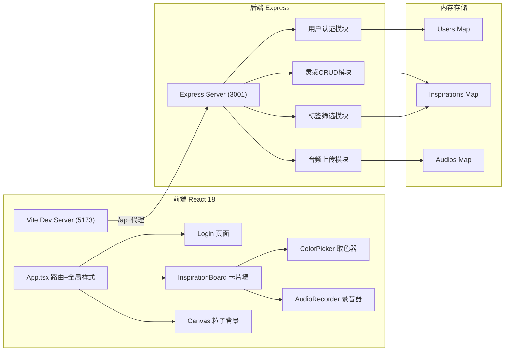
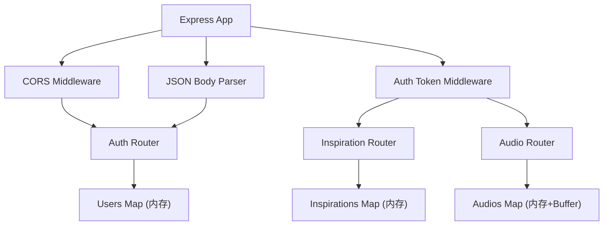
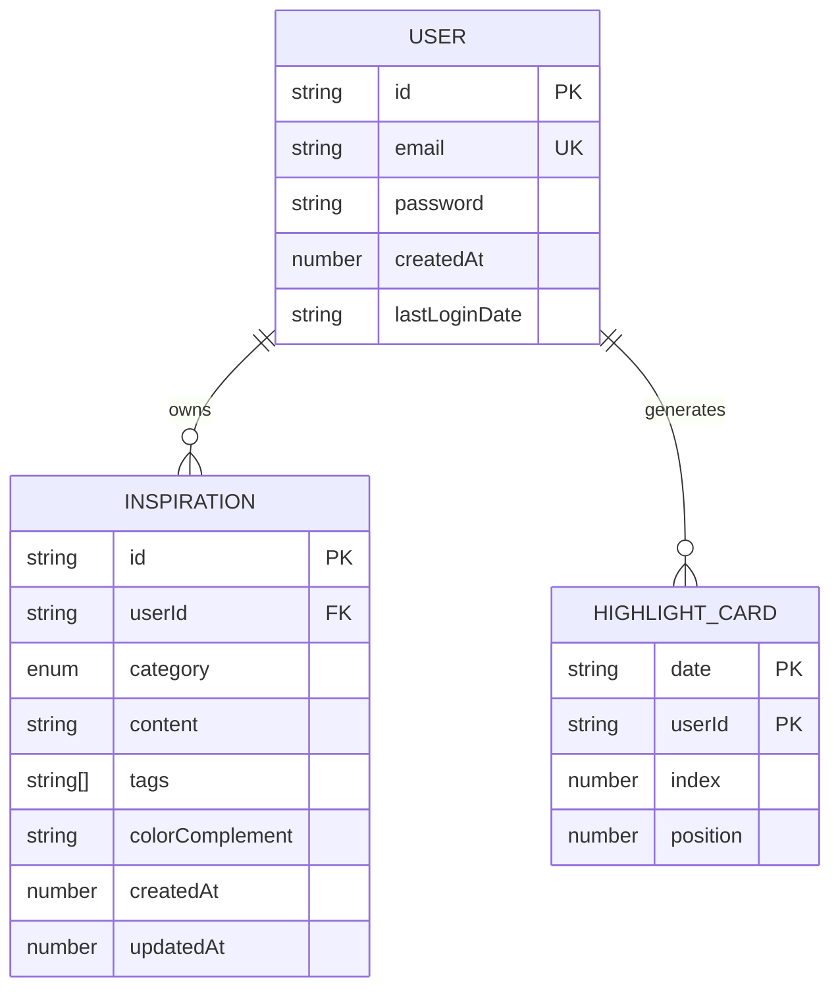

## 1. 架构设计



## 2. 技术选型说明

- **前端框架**：React@18 + TypeScript（严格模式，目标ES2020，jsx: react-jsx）
- **构建工具**：Vite（开发服务器端口5173，代理/api到3001）
- **状态管理**：React hooks（useState, useEffect, useRef, useMemo）
- **动画方案**：CSS关键帧动画 + CSS transitions + Spring弹性动画 + requestAnimationFrame
- **音频处理**：Web Audio API（AnalyserNode波形分析） + MediaRecorder（录音）
- **取色实现**：Canvas 2D（色轮绘制 + 饱和度面板）
- **图标库**：lucide-react
- **后端框架**：Express@4 + TypeScript
- **跨域处理**：cors 中间件
- **ID生成**：uuid
- **文件上传**：multiparty（音频文件处理）
- **数据存储**：内存 Map（生产环境可替换为持久化数据库）

## 3. 路由定义

### 3.1 前端路由
| 路由路径 | 页面组件 | 用途 |
|----------|----------|------|
| /login | Login | 登录页，未登录重定向至此 |
| /register | Register | 注册页 |
| /board | InspirationBoard | 灵感面板主页面，登录后默认页 |
| * | - | 404重定向到/login或/board |

### 3.2 后端API路由
| 方法 | 路径 | 用途 |
|------|------|------|
| POST | /api/auth/register | 用户注册 |
| POST | /api/auth/login | 用户登录，返回token |
| GET | /api/inspirations | 获取当前用户所有灵感（按时间倒序） |
| POST | /api/inspirations | 创建新灵感 |
| PUT | /api/inspirations/:id | 更新指定灵感 |
| DELETE | /api/inspirations/:id | 删除指定灵感 |
| GET | /api/inspirations/tag/:tag | 按标签筛选灵感 |
| POST | /api/audio/upload | 上传音频文件，返回audioId |
| GET | /api/audio/:id | 获取音频文件流 |

## 4. API数据结构定义

### 4.1 核心类型
```typescript
// 用户
interface User {
  id: string;           // uuid
  email: string;
  password: string;     // 演示用明文，生产需hash
  createdAt: number;
  lastLoginDate?: string; // YYYY-MM-DD格式
}

// 灵感类别
type InspirationCategory = 'text' | 'image' | 'color' | 'audio';

// 灵感
interface Inspiration {
  id: string;              // uuid
  userId: string;
  category: InspirationCategory;
  content: string;         // 文字内容/图片URL/颜色hex/audioId
  tags: string[];          // 1-3个标签
  colorComplement?: string; // 颜色类别的互补色
  createdAt: number;
  updatedAt: number;
}

// 亮点卡片记录
interface HighlightCard {
  date: string;     // YYYY-MM-DD
  userId: string;
  index: number;    // #序号
  position: number; // 插入位置索引
}

// API统一响应
interface ApiResponse<T> {
  success: boolean;
  data?: T;
  error?: string;
}
```

### 4.2 请求/响应示例
**POST /api/auth/register**
请求体：`{ email: string, password: string }`
成功响应：`{ success: true, data: { token: string, userId: string } }`

**POST /api/inspirations**
请求体：`{ category, content, tags, colorComplement? }`
成功响应：`{ success: true, data: Inspiration }`

## 5. 后端服务架构



后端分层：
- **路由层**：定义RESTful端点，参数校验
- **中间件层**：CORS、JSON解析、Token鉴权
- **数据层**：内存Map模拟数据库，支持UUID主键
- **端口**：3001

## 6. 数据模型

### 6.1 ER关系


### 6.2 内存Map定义
```typescript
const users = new Map<string, User>();           // key: userId
const emails = new Map<string, string>();         // key: email → userId
const tokens = new Map<string, string>();         // key: token → userId
const inspirations = new Map<string, Inspiration>(); // key: id
const userInspirations = new Map<string, string[]>(); // key: userId → inspirationIds
const highlights = new Map<string, HighlightCard>(); // key: `${userId}_${date}`
const audioFiles = new Map<string, { buffer: Buffer, type: string }>(); // key: audioId
```

## 7. 项目文件结构

```
/ (项目根)
├── package.json          # 前后端统一依赖和脚本
├── vite.config.js        # Vite配置+代理
├── tsconfig.json         # TS严格模式
├── index.html            # 入口HTML
├── server.ts             # Express后端（端口3001）
├── .trae/
│   └── documents/
│       ├── PRD.md
│       └── TechArch.md
└── src/
    ├── App.tsx           # 根组件+路由+全局样式+Canvas粒子
    ├── InspirationBoard.tsx  # 卡片墙主组件
    ├── ColorPicker.tsx   # 取色器组件
    └── AudioRecorder.tsx # 录音+波形组件
```

## 8. 启动方式

```bash
npm install          # 安装所有依赖
npm run dev          # 并行启动 Vite(5173) + Express(3001)
# 访问 http://localhost:5173
```

`npm run dev` 使用 `concurrently` 或自定义脚本并行启动前后端。Vite 通过 server.proxy 将 `/api` 请求转发到 `http://localhost:3001`。
