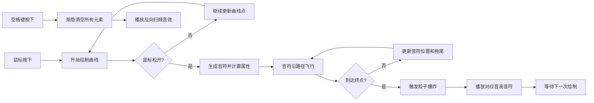

## 1. 产品概述

脉冲编织者是一款在浏览器中运行的音乐节奏创作游戏，玩家通过鼠标在画布上绘制波形曲线来生成音符，音符沿曲线路径飞行并撞击目标，根据路径特征产生不同音高和色彩爆炸效果。

- 目标用户：音乐爱好者、创意游戏玩家、视觉艺术探索者
- 产品价值：将绘画与音乐创作融合，提供沉浸式的即兴音乐创作体验

## 2. 核心功能

### 2.1 功能模块

1. **主画布页面**：全屏Canvas画布、鼠标绘制交互、音符飞行、粒子爆炸、音频播放

### 2.2 页面详情

| 页面名称 | 模块名称 | 功能描述 |
|----------|----------|----------|
| 主画布页面 | 路径绘制系统 | 按住鼠标拖动绘制平滑波形曲线，线条颜色从暖橙渐变到亮紫，线条宽度随光标速度变化 |
| 主画布页面 | 音符生成系统 | 松开鼠标时在曲线末端生成发光音符圆点，沿路径从起点飞向终点 |
| 主画布页面 | 音频映射系统 | 根据路径长度映射音高(C4-C6)，弯曲度决定音色，垂直偏移决定音量 |
| 主画布页面 | 并行飞行机制 | 支持最多8个同时飞行的音符，超出时自动淘汰最旧音符 |
| 主画布页面 | 粒子爆炸系统 | 音符到达终点时触发50-100颗粒子爆炸，颜色随机偏移±20°色相 |
| 主画布页面 | 视觉回波反馈 | 撞击点扩散彩色光环，背景色调瞬间偏移10%产生呼吸感 |
| 主画布页面 | 清空与重放 | 空格键清空所有元素，播放反向扫频音效 |

## 3. 核心流程

用户鼠标按下→拖动绘制曲线→松开鼠标生成音符→音符沿路径飞行→到达终点播放音效并爆炸→用户可继续绘制或按空格清空

## 4. 用户界面设计

### 4.1 设计风格

- **主色调**：深空蓝(#0A1628)到墨黑(#050A14)垂直渐变，叠加3%透明度白噪声纹理
- **点缀色**：暖橙(#FF8C42)到亮紫(#9D4EDD)路径渐变色，淡蓝(#88CCFF)准星光晕
- **字体**：无衬线现代字体，仅标题使用
- **鼠标样式**：画布内为24px淡蓝色发光十字准星，画布外为默认箭头
- **整体风格**：极简沉浸式、赛博朋克、暗色调霓虹发光效果

### 4.2 页面设计概览

| 页面名称 | 模块名称 | UI元素 |
|----------|----------|--------|
| 主画布页面 | 背景层 | 深空蓝到墨黑渐变、3%透明度白噪声纹理、色调呼吸动画 |
| 主画布页面 | 路径绘制 | 暖橙→亮紫渐变线、动态宽度、流光粒子拖尾(2px,1.5s寿命) |
| 主画布页面 | 音符元素 | 8px发光圆点、30px流线光尾、半透明轨迹 |
| 主画布页面 | 爆炸效果 | 50-100颗粒子、径向渐变发光、±20°色相偏移 |
| 主画布页面 | 回波效果 | 0→80px彩色光环、500ms持续、背景10%色调偏移(300ms) |
| 主画布页面 | 标题元素 | 顶部居中"脉冲编织者"文字、半透明不干扰操作 |

### 4.3 响应式设计

- 画布自适应浏览器窗口大小，监听resize事件实时调整
- 鼠标坐标转换为Canvas内部坐标系
- 1920x1080分辨率下保证55fps以上帧率

### 4.4 性能目标

- 5个同时飞行音符 + 3个粒子爆炸(50颗粒子/个) + 1条绘制中路径时帧率≥55fps
- 所有粒子使用对象池复用，避免GC抖动
- Web Audio Oscillator节点播放完毕后立即断开释放资源
