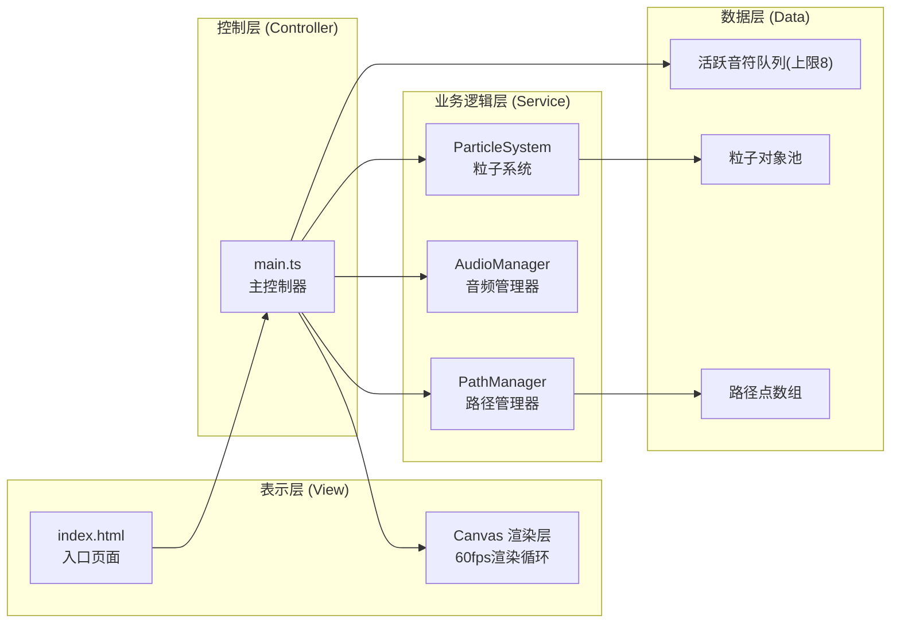

## 1. 架构设计



**数据流向**：
1. 鼠标输入 → main.ts → PathManager：存储路径点、计算路径长度和切线角度
2. PathManager → main.ts：返回音符生成位置、角度、路径长度、弯曲度
3. main.ts → AudioManager：传入频率、音色类型、音量参数播放音符
4. main.ts → ParticleSystem：传入撞击坐标和颜色参数生成爆炸粒子
5. main.ts → Canvas渲染层：每帧更新并绘制所有视觉元素

## 2. 技术描述

- **前端构建**：Vite 5.x + TypeScript 5.x（严格模式，目标ES2020）
- **渲染技术**：HTML5 Canvas 2D API
- **音频技术**：Web Audio API（OscillatorNode、GainNode、WaveShaperNode）
- **性能优化**：对象池模式、requestAnimationFrame渲染循环、增量渲染

## 3. 项目文件结构

```
auto8/
├── index.html              # 入口HTML，全屏Canvas，深空蓝渐变背景
├── package.json            # 依赖：typescript、vite，启动脚本：npm run dev
├── vite.config.js          # Vite基础配置，支持HMR
├── tsconfig.json           # TypeScript严格模式，目标ES2020
└── src/
    ├── main.ts             # 入口脚本，主控制器
    ├── path-manager.ts     # 路径管理器模块
    ├── audio-manager.ts    # Web Audio音频管理模块
    └── particle-system.ts  # 粒子爆炸系统模块
```

## 4. 模块调用关系与数据结构

### 4.1 PathManager (path-manager.ts)

**对外接口**：
```typescript
class PathManager {
  points: PathPoint[]           // 路径点数组 {x, y, speed}
  addPoint(x, y, speed): void   // 添加路径点
  clear(): void                 // 清除路径
  getLength(): number           // 计算总路径长度
  getTangentAngle(t): number    // 获取t位置(0~1)的切线角度
  getPointAt(t): {x, y}         // 获取t位置的坐标
  getCurvature(): number        // 计算路径弯曲度(累计角度/长度)
  getVerticalOffset(): number   // 起点到终点的垂直偏移量
  getEndColor(): string         // 获取曲线末端渐变颜色
}
```

**调用关系**：被main.ts调用，不依赖其他模块

### 4.2 AudioManager (audio-manager.ts)

**对外接口**：
```typescript
class AudioManager {
  constructor(audioContext: AudioContext)
  playNote(params: {
    frequency: number,          // 频率(Hz)
    duration: number,           // 持续时间(s)
    type: 'sine' | 'sawtooth',  // 音色类型
    volume: number,             // 音量(0~1)
    distortion: number          // 失真度(0~1)
  }): void
  playResetSweep(): void        // 播放反向扫频(重置音效)
}
```

**调用关系**：被main.ts调用，需要外部传入AudioContext

### 4.3 ParticleSystem (particle-system.ts)

**对外接口**：
```typescript
class ParticleSystem {
  constructor(canvas: HTMLCanvasElement, ctx: CanvasRenderingContext2D)
  spawnExplosion(params: {
    x: number, y: number,       // 撞击坐标
    baseColor: string,          // 基础颜色
    count?: number              // 粒子数量(默认50~100)
  }): void
  spawnRipple(params: {
    x: number, y: number,       // 撞击坐标
    color: string               // 光环颜色
  }): void
  spawnTrailParticle(params: {
    x: number, y: number,       // 路径点坐标
    color: string               // 拖尾粒子颜色
  }): void
  update(deltaTime: number): void  // 更新所有粒子状态
  render(): void                   // 渲染所有粒子
  reset(): void                    // 渐隐清空所有粒子
}
```

**调用关系**：被main.ts调用，需要Canvas和Context引用

### 4.4 Main Controller (main.ts)

**数据结构**：
```typescript
interface FlyingNote {
  id: number
  pathPoints: PathPoint[]       // 飞行路径点
  progress: number              // 飞行进度(0~1)
  speed: number                 // 飞行速度(px/s转换)
  color: string                 // 音符颜色
  frequency: number             // 对应音高
  noteType: 'sine' | 'sawtooth' // 音色
  volume: number                // 音量
  curvature: number             // 弯曲度(用于失真)
  createdAt: number             // 创建时间戳
}
```

**核心流程**：
1. 初始化：创建Canvas、AudioContext、PathManager、ParticleSystem实例
2. 鼠标事件：mousedown开始绘制→mousemove更新路径→mouseup生成音符
3. 渲染循环(60fps)：更新音符位置→更新粒子→绘制背景→绘制路径→绘制音符及拖尾→渲染粒子→更新背景色调
4. 键盘事件：空格键触发重置动画和音效

### 4.5 音高映射算法

- 基础频率：C4 = 261.63 Hz
- 半音步长：每100px路径长度升高1个半音
- 半音公式：`frequency = 261.63 * Math.pow(2, semitones / 12)`
- 范围限制：C4 (261.63 Hz) ~ C6 (1046.50 Hz)，即0~24半音
- 弯曲度阈值：>0.01 rad/px 使用带失真的锯齿波，否则使用纯净正弦波
- 音量映射：垂直偏移量归一化后反转映射，偏移大→音量小，偏移小→音量大

## 5. 性能优化策略

### 5.1 对象池模式
- 粒子对象预先分配，复用而非创建/销毁
- 飞行音符使用环形队列(上限8)，超出时覆盖最早元素
- 避免每帧创建临时对象，使用可复用的变量缓存

### 5.2 渲染优化
- 路径使用二次贝塞尔曲线平滑插值，而非逐点绘制线段
- 粒子更新使用deltaTime，保证不同帧率下动画速度一致
- 离屏Canvas缓存静态背景(渐变+噪声)，每帧仅重新绘制动态元素
- 渐变颜色值缓存，避免重复计算

### 5.3 音频资源管理
- OscillatorNode使用后立即调用stop()和disconnect()
- GainNode和WaveShaperNode可复用，不重复创建
- 音频上下文在用户首次交互时激活(浏览器策略要求)

## 6. 视觉特效参数

| 效果 | 参数 |
|------|------|
| 路径渐变 | 暖橙#FF8C42 → 亮紫#9D4EDD，HSL线性插值 |
| 路径宽度 | 速度映射：0~10px/s对应1~8px线宽 |
| 音符半径 | 8px，带2px光晕 |
| 音符拖尾 | 长度30px，宽度2px，透明度50%→0%渐变 |
| 爆炸粒子 | 数量50~100，速度50~200px/s，寿命2s |
| 粒子色相 | 基础色±20°HSL随机偏移 |
| 回波光环 | 0→80px，500ms，透明度80%→0% |
| 背景偏移 | 撞击颜色10%混合，300ms线性恢复 |
| 重置动画 | 所有元素透明度100%→0%，400ms渐隐 |
