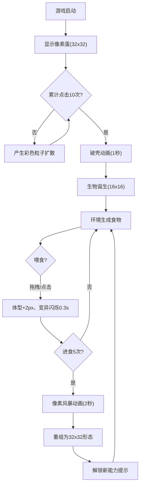

## 1. 产品概述

「像素孵化器」是一款基于浏览器的像素风格宠物养成游戏，玩家通过鼠标点击和拖拽操作，在动态像素场景中孵化、培育并进化由随机基因生成的像素生物。目标是为玩家提供轻松有趣的养成体验，通过视觉化的成长过程和丰富的粒子特效带来沉浸式乐趣。

- 核心玩法：点击孵化蛋 → 喂食培育 → 进化解锁新能力
- 目标用户：喜欢休闲养成类游戏、像素风格美术的玩家
- 产品价值：轻量级浏览器游戏，无需安装即可体验完整养成循环

---

## 2. 核心功能

### 2.1 功能模块

1. **孵化场景**：像素蛋展示、点击孵化交互、破壳动画
2. **养成场景**：生物展示、食物生成、喂食交互、状态面板
3. **进化系统**：进化检测、像素风暴动画、能力解锁
4. **环境系统**：动态草地、24小时时间循环、天气切换
5. **UI面板**：饱食度、进化阶段、亲密度显示

### 2.2 页面详情

| 页面名称 | 模块名称 | 功能描述 |
|---------|---------|---------|
| 游戏主页面 | 孵化模块 | 32x32像素蛋，累计10次点击升温孵化，点击产生20-30个彩色粒子向外扩散，0.5秒淡出 |
| 游戏主页面 | 破壳动画 | 孵化后8块蛋壳碎片向四周散落，持续1秒 |
| 游戏主页面 | 生物养成 | 16x16像素生物由随机基因生成，每30秒消耗饱食度，喂食后体型增大2像素并触发基因变异闪烁 |
| 游戏主页面 | 食物系统 | 地面随机生成暖色系像素食物，拖拽或点击喂食 |
| 游戏主页面 | 进化系统 | 累计进食5次触发2秒像素风暴动画（100+粒子旋转扩散），重组为32x32形态并解锁能力 |
| 游戏主页面 | 环境渲染 | 16x16动态草地（呼吸感色调变化）、24小时色渐变、每30分钟切换天气（晴/阴/雨/雪） |
| 游戏主页面 | 状态面板 | 右上角200x100半透明面板：饱食度心形、进化阶段数字、亲密度进度条 |

---

## 3. 核心流程

### 主循环流程
```
玩家打开游戏 → 显示像素蛋 → 点击蛋10次 → 破壳动画 → 生物诞生
    ↓
生物生成(16x16) ← 基因随机初始化
    ↓
等待食物生成 → 拖拽/点击喂食 → 饱食度+、体型+2、变异闪烁
    ↓
累计进食5次？ → 否 → 返回等待
    ↓ 是
触发进化动画(2秒像素风暴) → 生物重组(32x32) → 解锁新能力 → 继续养成循环
```



---

## 4. 用户界面设计

### 4.1 设计风格

**复古像素游戏风格**
- **主色调**：深靛蓝背景 `#1B2838`、翠绿草地 `#4A7C59`
- **强调色**：亮黄 `#F5D442`、橙红 `#E25822`
- **字体**：等宽像素字体（通过 @font-face 加载）
- **按钮风格**：像素风格 8px 圆角，悬停外发光效果
- **布局风格**：居中场景区域 640x480 像素，自适应缩放保持宽高比，上下暗色渐变边框

### 4.2 页面设计概览

| 页面名称 | 模块名称 | UI元素细节 |
|---------|---------|-----------|
| 游戏主页面 | 场景容器 | 640x480居中Canvas，深靛蓝背景，上下暗色渐变边框，自适应等比缩放 |
| 游戏主页面 | 状态面板 | 右上角固定，200x100半透明暗色矩形，圆角8px |
| 游戏主页面 | 饱食度 | 10颗像素心形，每颗10%，喂食后0.5秒灰变红动画 |
| 游戏主页面 | 进化阶段 | 渐变色数字动画 |
| 游戏主页面 | 亲密度 | 红到金渐变进度条，每次交互+5% |
| 游戏主页面 | 进化提示 | 屏幕上方居中，缩放弹出动画 |
| 游戏主页面 | 时间指示器 | 顶部背景色24小时渐变（深蓝→暖橙→深蓝） |
| 游戏主页面 | 天气粒子 | 晴(无)、阴(灰雾)、雨(蓝点降落)、雪(白点飘落) |

### 4.3 响应式设计

- **桌面优先**：主场景 640x480 像素居中显示
- **自适应缩放**：Canvas 按比例缩放，保持 4:3 宽高比
- **触摸优化**：支持触摸事件，兼容移动端点击和拖拽操作

### 4.4 动效规范

- **目标帧率**：60FPS，最低不低于30FPS
- **点击反馈延迟**：≤16ms
- **粒子系统**：每个粒子生命周期计算 ≤0.1ms
- **绘制优化**：每帧独立绘制调用 ≤20次
- **关键动画时长**：
  - 孵化粒子淡出：0.5秒
  - 破壳动画：1秒
  - 基因变异闪烁：0.3秒
  - 进化像素风暴：2秒
  - 心形变色动画：0.5秒
  - 天气切换：每30分钟（真实时间）
