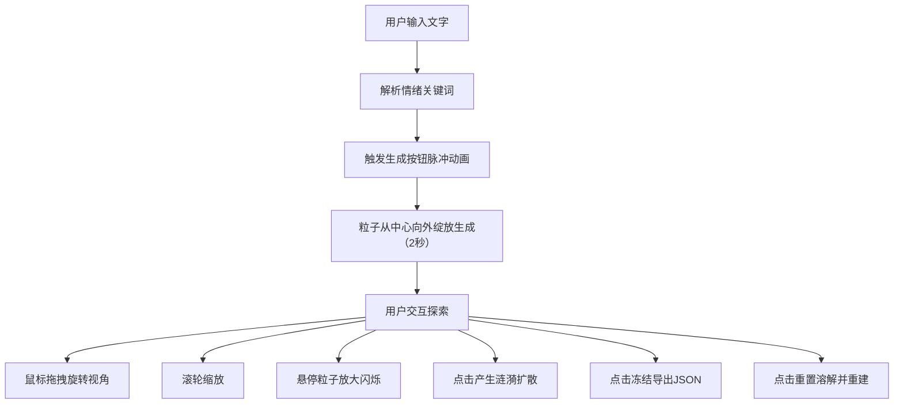

## 1. 产品概述

「记忆花园」是一款基于 Three.js 的交互式 3D 粒子景观冥想应用，用户通过输入文字描述，系统自动解析情绪关键词并生成动态粒子花园，为用户提供沉浸式的思维可视化与情绪疗愈体验。

- 核心价值：将抽象的情绪与记忆转化为可交互的具象视觉体验
- 目标用户：需要冥想放松、创意灵感、情绪可视化的用户群体
- 解决问题：传统冥想工具缺乏具象化、互动性的视觉反馈

## 2. 核心功能

### 2.1 功能模块

1. **文字输入与粒子生成**：磨砂玻璃风格输入框，脉冲加载动画，花园绽放生成效果
2. **情绪粒子系统**：根据情绪关键词动态调整粒子形状、颜色、速度
3. **视角交互与反馈**：鼠标拖拽旋转、滚轮缩放、悬停放大、点击涟漪
4. **粒子生命周期**：粒子生成、渐变、爆炸消散、子粒子扩散
5. **花园状态保存与重置**：JSON 导出下载、溶解重置为默认模式

### 2.2 页面详情

| 页面名称 | 模块名称 | 功能描述 |
|-----------|-------------|---------------------|
| 主场景 | 3D 粒子景观 | 全屏 Three.js 场景，动态粒子花园渲染 |
| 主场景 | 输入面板 | 左上角毛玻璃悬浮面板，文字输入与生成按钮 |
| 主场景 | 控制按钮 | 右下角冻结/重置圆形按钮 |

## 3. 核心流程

用户输入文字描述 → 解析情绪关键词 → 触发生成动画 → 粒子花园逐步绽放 → 用户交互探索（旋转/缩放/悬停/点击涟漪） → 保存状态或重置花园

## 4. 用户界面设计

### 4.1 设计风格

- **整体风格**：柔和发光、梦幻粒子、毛玻璃 UI、深色科技感
- **主色调**：深灰蓝（#1A1E2E）→ 暗紫（#2D1B4E）径向渐变背景
- **情绪色彩**：
  - 快乐：暖橙 → 金黄渐变
  - 忧伤：冷蓝 → 靛紫渐变
  - 宁静：薄荷绿 → 天蓝渐变
- **按钮风格**：圆形按钮，悬停放大 + 光晕，过渡 200ms ease-out
- **字体**：现代无衬线字体，轻盈通透
- **动效缓动**：统一 ease-in-out cubic-bezier(0.42, 0, 0.58, 1)

### 4.2 页面设计概述

| 页面名称 | 模块名称 | UI 元素 |
|-----------|-------------|-------------|
| 主场景 | 3D 粒子景观 | 5000+ 粒子，发光效果，动态运动，生命周期动画 |
| 主场景 | 输入面板 | 毛玻璃效果（背景模糊 8px），半透明输入框，生成按钮 |
| 主场景 | 控制按钮 | 两个圆形按钮（直径 48px），悬停放大至 56px，微弱光晕 |

### 4.3 响应式

- 全屏自适应，随窗口大小调整
- 桌面端为主，鼠标交互优先

### 4.4 3D 场景指引

- **环境**：深色径向渐变背景，无外部光源，粒子自发光
- **相机**：透视相机，初始俯视 45 度
- **交互**：轨道控制 + 弹簧阻尼延迟跟随效果
- **粒子效果**：边缘光晕、颜色渐变、大小随机
- **性能目标**：5000 粒子稳定 55fps+，涟漪动画 30fps+
