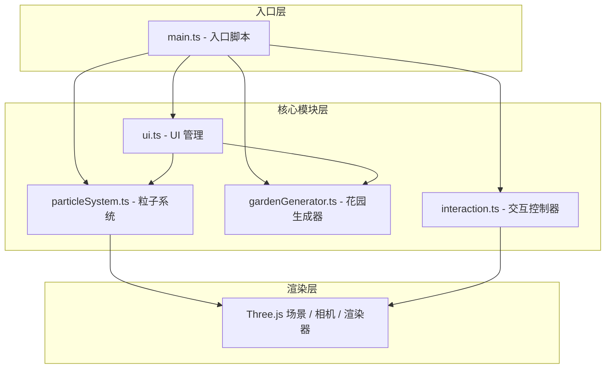

## 1. 架构设计



## 2. 技术描述

- **前端框架**：TypeScript + Three.js + Vite
- **构建工具**：Vite（支持 HMR，base: './'）
- **语言目标**：ES2022，严格模式
- **模块解析**：bundler 模式
- **渲染引擎**：Three.js r160+，Points + ShaderMaterial
- **状态管理**：模块化类封装，无外部状态库

## 3. 项目结构

```
/
├── package.json
├── vite.config.js
├── tsconfig.json
├── index.html
└── src/
    ├── main.ts              # 入口：初始化 Three.js、启动循环
    ├── particleSystem.ts    # 粒子系统核心类
    ├── gardenGenerator.ts   # 情绪关键词 → 粒子布局
    ├── interaction.ts       # 鼠标/触摸交互控制器
    └── ui.ts                # UI 元素与事件管理
```

## 4. 核心模块设计

### 4.1 ParticleSystem（粒子系统）

- **职责**：管理粒子池、更新粒子状态、渲染粒子
- **核心属性**：
  - `particles`：粒子数组（位置、颜色、大小、速度、生命周期、初始颜色）
  - `geometry`：THREE.BufferGeometry
  - `material`：THREE.PointsMaterial / ShaderMaterial
- **核心方法**：
  - `update(delta)`：每帧更新粒子位置、颜色、生命周期
  - `dispose()`：资源清理
  - `spawnParticle(config)`：生成单个粒子
  - `triggerRipple(center, radius)`：触发涟漪效果

### 4.2 GardenGenerator（花园生成器）

- **职责**：解析文字情绪 → 生成粒子布局配置
- **情绪映射**：
  - 快乐 → 螺旋上升形状 + 暖橙→金黄配色
  - 忧伤 → 垂落雨丝形状 + 冷蓝→靛紫配色
  - 宁静 → 水平波浪形状 + 薄荷绿→天蓝配色
- **核心方法**：
  - `parseEmotion(text)`：解析文字情绪关键词
  - `generate(particleSystem, emotion)`：初始化粒子阵列
  - `getShapeFunction(type)`：返回形状生成函数
  - `getColorMap(type)`：返回颜色映射表

### 4.3 Interaction（交互控制器）

- **职责**：处理鼠标/触摸交互事件
- **交互类型**：
  - 拖拽旋转视角（带弹簧阻尼延迟）
  - 滚轮缩放
  - 悬停检测 + 粒子放大闪烁（200ms）
  - 点击涟漪扩散（BFS 算法，互补色切换 1.5s）
- **核心方法**：
  - `update(delta)`：每帧更新相机位置（弹簧阻尼）
  - `handleMouseMove(event)`：鼠标移动
  - `handleClick(event)`：点击事件
  - `handleWheel(event)`：滚轮缩放

### 4.4 UI（UI 管理）

- **职责**：创建和管理 DOM UI 元素
- **UI 元素**：
  - 左上角输入面板（毛玻璃效果）
  - 输入框 + 生成按钮
  - 右下角冻结/重置圆形按钮
- **核心方法**：
  - `init()`：初始化 UI 元素
  - `onGenerate(callback)`：生成按钮回调
  - `onFreeze(callback)`：冻结按钮回调
  - `onReset(callback)`：重置按钮回调

## 5. 性能优化策略

1. **BufferGeometry**：使用单个 BufferGeometry 管理所有粒子，避免大量 Mesh
2. **TypedArray**：位置、颜色等数据使用 Float32Array 直接操作
3. **粒子池复用**：粒子对象池化，避免频繁 GC
4. **帧率检测**：动态调整粒子数量保证流畅
5. **数学优化**：预计算形状函数，减少每帧重复计算

## 6. 动画系统

- **生成动画**：2 秒绽放效果，粒子从中心向外逐步出现
- **生命周期**：10-15 秒随机寿命，颜色向白色渐变，终点爆炸为 10 个子粒子
- **涟漪效果**：BFS 扩散，互补色切换 1.5 秒后渐回原色
- **相机跟随**：弹簧阻尼系统，目标位置 → 当前位置缓动
