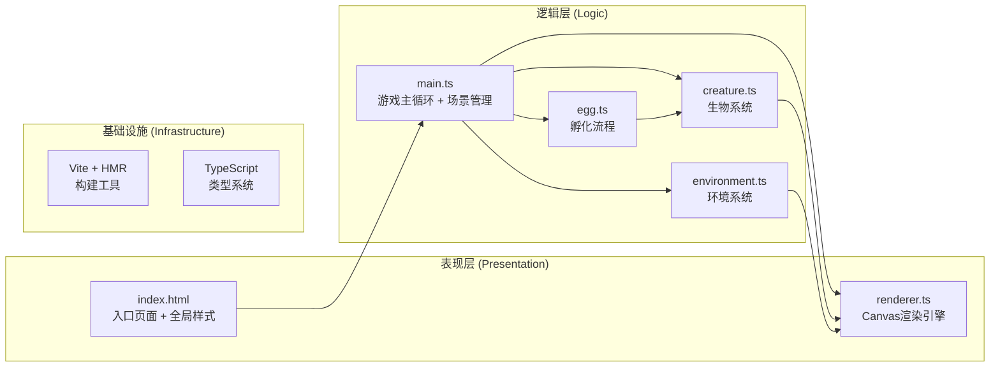

## 1. 架构设计



---

## 2. 技术选型说明

| 类别 | 技术 | 说明 |
|------|------|------|
| 前端框架 | 原生TypeScript | 轻量级Canvas游戏，无需React/Vue |
| 构建工具 | Vite 5.x | 支持HMR热更新，极速开发体验 |
| 类型系统 | TypeScript 5.x | 严格模式，目标ES2020 |
| 渲染引擎 | HTML5 Canvas 2D | 像素级绘制控制 |
| 样式方案 | 原生CSS + @font-face | 全局样式内联于index.html |
| 字体方案 | Press Start 2P (Google Fonts) | 像素风格等宽字体 |

---

## 3. 项目文件结构

```
auto10/
├── package.json          # 依赖配置 + 启动脚本
├── vite.config.js        # Vite构建配置 (HMR支持)
├── tsconfig.json         # TypeScript严格模式配置
├── index.html            # 入口页面 + 全局样式
└── src/
    ├── main.ts           # 游戏主循环 + 场景切换 + 状态管理
    ├── creature.ts       # 生物类：基因生成 + 变异 + 生长 + 行为
    ├── egg.ts            # 蛋类：孵化流程 + 破壳动画 + 基因分配
    ├── environment.ts    # 环境：草地 + 天气 + 时间 + 食物生成
    └── renderer.ts       # 渲染引擎：Canvas绘制 + 粒子系统 + 缩放
```

---

## 4. 核心数据结构

### 4.1 基因系统 (Genes)
```typescript
interface Genes {
  bodySize: number;          // 体型系数
  eyeColor: string;          // 眼睛颜色 (hex)
  limbCount: number;         // 肢体数量 (2-6)
  patternMode: 'dots' | 'stripes' | 'spots' | 'gradient';
  bodyColor: string;         // 主体颜色
  accentColor: string;       // 装饰色
}
```

### 4.2 生物状态 (CreatureState)
```typescript
interface CreatureState {
  x: number; y: number;      // 位置坐标
  size: number;              // 当前像素尺寸
  genes: Genes;              // 基因组合
  satiety: number;           // 饱食度 (0-100)
  evolutionLevel: number;    // 进化阶段 (1+)
  intimacy: number;          // 亲密度 (0-100)
  feedCount: number;         // 累计进食次数
  abilities: string[];       // 已解锁能力列表
  isMutating: boolean;       // 变异动画中
  isEvolving: boolean;       // 进化动画中
}
```

### 4.3 粒子系统 (Particle)
```typescript
interface Particle {
  x: number; y: number;
  vx: number; vy: number;
  color: string;
  size: number;
  life: number;              // 剩余生命周期(ms)
  maxLife: number;
  type: 'hatch' | 'evolution' | 'weather' | 'mutation';
}
```

### 4.4 环境状态 (EnvironmentState)
```typescript
interface EnvironmentState {
  timeOfDay: number;         // 0-1440 (分钟)
  weather: 'sunny' | 'cloudy' | 'rain' | 'snow';
  weatherTimer: number;      // 天气计时器(ms)
  foods: Food[];             // 地面食物
  grassTiles: GrassTile[][]; // 草地瓷砖
}

interface Food {
  x: number; y: number;
  shape: 'circle' | 'square' | 'triangle';
  color: string;
  size: number;
  isDragging: boolean;
}

interface GrassTile {
  baseColor: string;
  hueOffset: number;
  frameCounter: number;
}
```

---

## 5. 渲染优化策略

### 5.1 绘制调用优化
- **离屏Canvas**：草地瓷砖预渲染为离屏Canvas，每帧只做一次贴图
- **批处理绘制**：同类型粒子合并为一次路径绘制
- **脏矩形区域**：仅重绘动态变化区域（进化阶段不启用）

### 5.2 粒子性能优化
- **对象池模式**：Particle对象复用，避免频繁GC
- **生命周期上限**：同时活动粒子数 ≤300
- **简化物理计算**：线性插值运动，避免三角函数

### 5.3 帧率保证
- **requestAnimationFrame**：使用原生高优先级循环
- **增量时间计算**：dt-based动画，与帧率解耦
- **降级策略**：帧率<30时关闭非关键粒子效果

---

## 6. 事件系统

### 交互事件映射
| 用户操作 | 事件处理 | 触发逻辑 |
|---------|---------|---------|
| 左键点击蛋 | mousedown + hitTest | 蛋点击计数+1，生成孵化粒子 |
| 点击食物 | mousedown + hitTest | 设置食物拖拽状态，生物跟随鼠标 |
| 拖拽食物 | mousemove | 更新食物坐标，检测生物碰撞 |
| 释放食物 | mouseup | 碰撞则喂食成功，否则食物落回地面 |
| 点击生物 | mousedown + hitTest | 亲密度+5%，触发互动动画 |

---

## 7. 配色规范 (CSS变量)

```css
:root {
  --bg-deep: #1B2838;         /* 深靛蓝背景 */
  --grass-green: #4A7C59;     /* 翠绿草地 */
  --accent-yellow: #F5D442;   /* 亮黄强调色 */
  --accent-orange: #E25822;   /* 橙红强调色 */
  --panel-bg: rgba(27, 40, 56, 0.85);
  --panel-border: rgba(245, 212, 66, 0.4);
  --heart-empty: #4a4a4a;
  --heart-full: #e74c3c;
  --intimacy-start: #e74c3c;
  --intimacy-end: #f1c40f;
}
```
