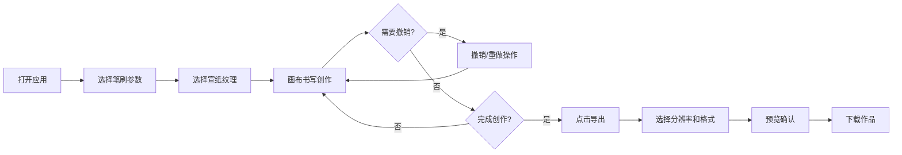

## 1. 产品概述

「墨影书道」是一款基于浏览器的交互式书法创作工具，让用户通过鼠标或触控笔实时生成带有水墨扩散和飞白效果的动态笔迹，最终作品可导出为高清图片或动态SVG分享给朋友。

- **核心目标**：在浏览器中模拟真实毛笔书法的书写体验，提供水墨扩散、飞白等自然效果
- **目标用户**：书法爱好者、创意设计师、教育工作者
- **市场价值**：降低书法创作门槛，提供数字化书法创作和分享平台

## 2. 核心功能

### 2.1 功能模块
1. **画布区**：4:3比例的书法创作画布，支持宣纸纹理背景
2. **笔触引擎**：根据速度和压感动态调整笔划宽度与墨色透明度
3. **水墨效果**：水扩散效果、飞白效果、墨点粒子
4. **工具栏**：笔刷大小调节、墨色选择、宣纸纹理切换
5. **撤销重做**：支持最多50步的撤销/重做操作
6. **作品导出**：支持高清PNG（1x/2x/4x）和矢量SVG导出
7. **状态栏**：实时显示笔触宽度、墨色、撤销步数等信息

### 2.2 页面详情

| 页面名称 | 模块名称 | 功能描述 |
|---------|---------|---------|
| 主页面 | 画布区域 | 4:3比例创作区，最大宽度900px，支持宣纸纹理 |
| 主页面 | 浮动工具栏 | 笔刷大小滑块、墨色选择器、纹理切换按钮 |
| 主页面 | 底部状态栏 | 显示笔触宽度、墨色、撤销步数进度条 |
| 主页面 | 导出预览弹窗 | 导出前预览确认，支持分辨率选择 |

## 3. 核心流程

### 用户创作流程
用户打开应用 → 选择笔刷大小和墨色 → 选择宣纸纹理 → 在画布上书写 → 可随时撤销/重做 → 点击导出 → 选择分辨率和格式 → 预览确认 → 下载作品

## 4. 用户界面设计

### 4.1 设计风格
- **整体风格**：仿古书卷风格，典雅温润
- **主色调**：米黄色(#F5E6CA)背景，深棕色(#3E2723)文字
- **辅助色**：墨蓝(#1A237E)、墨绿(#1B5E20)、朱砂(#C04040)、石青(#2E6B8A)
- **字体**：标题使用 Ma Shan Zheng（书法字体），正文使用系统字体
- **毛玻璃效果**：工具栏和状态栏使用背景模糊8px的半透明效果
- **按钮风格**：圆角12px，浅阴影，hover时放大1.1倍并加深阴影

### 4.2 页面设计概述

| 页面名称 | 模块名称 | UI元素 |
|---------|---------|--------|
| 主页面 | 标题栏 | 书法字体"墨影书道"，深棕色，24px |
| 主页面 | 画布区 | 4:3比例，宣纸纹理，最大宽度900px |
| 主页面 | 工具栏 | 宽度240px，圆角12px，半透明毛玻璃 |
| 主页面 | 状态栏 | 高度48px，图标文字居中，撤销进度条 |
| 主页面 | 导出弹窗 | 居中显示，预览图+格式选择+确认按钮 |

### 4.3 响应式设计
- **桌面端（>768px）**：画布居左，工具栏浮动右侧
- **移动端（≤768px）**：工具栏折叠为底部抽屉式面板，可拖出使用
- **触控优化**：支持触控笔压感，增大按钮点击区域

### 4.4 动效设计
- 按钮hover：放大1.1倍，阴影加深，过渡0.2s
- 撤销进度条：颜色从墨蓝渐变到墨绿，每步占2%宽度
- 导出加载：旋转墨点圆环动画，周期1秒
- 页面加载：淡入效果，元素依次出现
