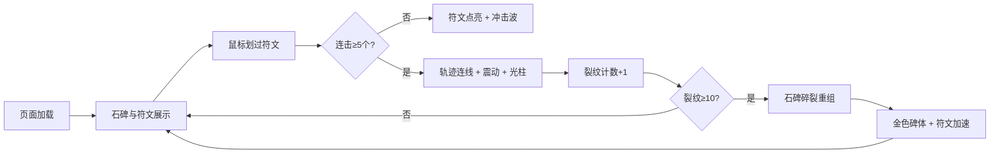

## 1. 产品概述

「浮空铭文碑」是一款基于 Canvas 的交互式视觉艺术作品，在浏览器中模拟一座悬浮在星空中的古老石碑，碑面上浮现不断流转的古代符文。用户通过鼠标或触摸与符文互动，触发一系列视觉和听觉反馈，最终达成石碑的进化与重生。

- **核心体验**：神秘、宁静且带有史诗感的暗色调交互体验
- **目标用户**：喜欢视觉艺术、互动媒体和沉浸式体验的用户
- **产品价值**：探索 Web 图形技术与交互设计的边界，创造令人难忘的视觉体验

## 2. 核心功能

### 2.1 功能模块

1. **主场景**：深空渐变背景 + 悬浮石碑 + 流转符文
2. **符文交互**：鼠标触碰点亮 + 冲击波效果 + 低频共鸣音
3. **连击系统**：连续划过符文形成发光轨迹 + 石碑震动 + 光柱喷射
4. **进化机制**：成功触发累计增加裂纹 → 石碑碎裂重组 → 金色碑体

### 2.2 交互细节

| 交互模块 | 功能描述 | 视觉效果 | 听觉效果 |
|---------|---------|---------|---------|
| 符文点亮 | 鼠标经过符文时触发 | 金色变荧光青，冲击波扩散 | 低频蜂鸣（120Hz, 200ms） |
| 连击轨迹 | 连续划过≥5个符文 | 发光轨迹线（青→玫瑰红渐变） | - |
| 光柱喷射 | 连击达成后触发 | 石碑震动 + 垂直光柱 + 星点粒子 | - |
| 石碑进化 | 累计10次成功触发 | 裂纹增加 → 碎裂重组 → 金色碑体 | - |

## 3. 核心流程

用户进入页面 → 看到悬浮石碑与流转符文 → 鼠标划过符文逐个点亮 → 连续划过5个以上符文 → 触发光柱喷射与石碑震动 → 重复触发积累裂纹 → 第10次时石碑进化为金色碑体 → 符文速度加倍 → 进入下一轮循环

## 4. 用户界面设计

### 4.1 设计风格

- **主色调**：深空钴蓝(#0D1B2A) → 暗夜紫(#1B0A2E) 渐变背景
- **石碑**：灰色带裂纹纹理，半透明磨砂质感，金色描边(#C5A55A)发光
- **符文**：金色(#E8D48B)象形符号，32x32像素，6像素柔光阴影
- **高亮色**：荧光青(#00FFC8)用于激活状态，玫瑰红(#FF6B8A)用于轨迹渐变
- **整体风格**：神秘、宁静、史诗感的暗色调美学

### 4.2 动画规范

| 动画类型 | 缓动函数 | 持续时间 |
|---------|---------|---------|
| 所有动画 | easeInOutCubic | - |
| 符文浮出 | easeInOutCubic | ≤ 1秒 |
| 冲击波扩散 | easeInOutCubic | 300ms |
| 石碑震动 | - | 200ms |
| 光柱喷射 | easeInOutCubic | 1.5秒 |

### 4.3 性能要求

- 目标帧率：60 FPS
- 符文数量上限：24个活跃符文
- 超出上限时最早符文提前淡出

### 4.4 响应式设计

- 桌面端：鼠标交互
- 移动端：触摸交互（自动适配）
- 石碑尺寸：占视口宽度50%，高度70%
