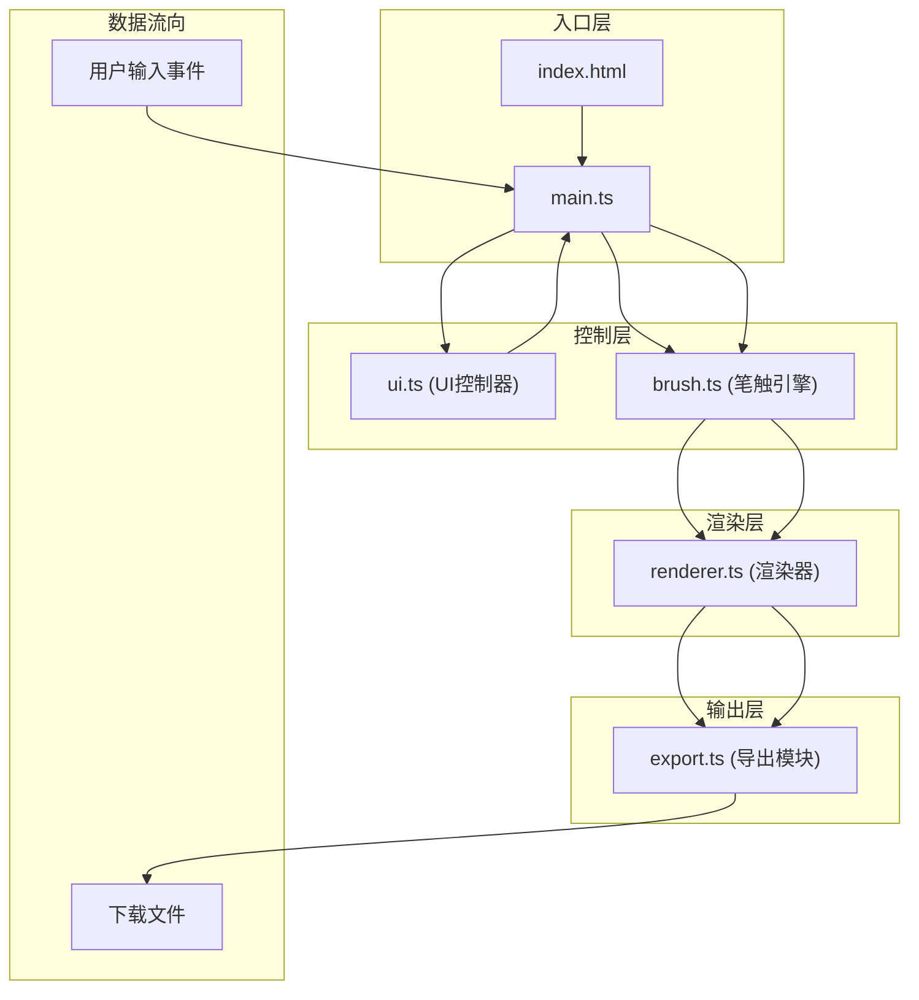

## 1. 架构设计

本项目为纯前端Canvas应用，采用模块化架构设计，各模块职责分明，数据流向清晰。



## 2. 技术说明

- **前端框架**：原生 TypeScript + HTML5 Canvas
- **构建工具**：Vite (支持HMR热更新)
- **编程语言**：TypeScript (严格模式，目标ES2020)
- **样式方案**：原生CSS (毛玻璃效果、响应式布局)
- **字体方案**：Google Fonts - Ma Shan Zheng (书法字体)
- **状态管理**：模块内局部状态 + 事件驱动

## 3. 文件结构与职责

| 文件路径 | 职责说明 | 调用关系 |
|---------|---------|---------|
| `package.json` | 项目依赖配置 | 无 |
| `vite.config.js` | Vite构建配置 | 无 |
| `tsconfig.json` | TypeScript编译配置 | 无 |
| `index.html` | 入口页面，全局样式 | 加载main.ts |
| `src/main.ts` | 应用主入口，事件管理 | 调用 brush.ts、ui.ts、renderer.ts、export.ts |
| `src/brush.ts` | 书法笔触引擎 | 接收鼠标事件 → 输出渲染数据给 renderer.ts |
| `src/renderer.ts` | Canvas渲染器 | 接收brush数据 → 绘制笔迹/飞白/扩散 → 提供画布数据给export.ts |
| `src/export.ts` | 作品导出模块 | 接收画布数据 → 生成PNG/SVG并触发下载 |
| `src/ui.ts` | UI控制器 | 管理工具栏/状态栏状态 → 返回工具参数给main.ts |

## 4. 核心数据结构

### 4.1 笔触参数 (BrushSettings)
```typescript
interface BrushSettings {
  baseSize: number;      // 基础笔刷大小 (1-50px)
  color: string;         // 墨色 (hex格式)
  minOpacity: number;    // 最小透明度 (0.3)
  maxOpacity: number;    // 最大透明度 (1.0)
}
```

### 4.2 笔触点数据 (BrushPoint)
```typescript
interface BrushPoint {
  x: number;             // X坐标
  y: number;             // Y坐标
  width: number;         // 笔触宽度
  opacity: number;       // 透明度
  speed: number;         // 移动速度
  timestamp: number;     // 时间戳
}
```

### 4.3 笔触路径 (StrokePath)
```typescript
interface StrokePath {
  points: BrushPoint[];  // 点集合
  color: string;         // 墨色
  isComplete: boolean;   // 是否完成
}
```

### 4.4 飞白粒子 (DryStrokeParticle)
```typescript
interface DryStrokeParticle {
  x: number;
  y: number;
  size: number;
  opacity: number;
}
```

### 4.5 画布状态 (CanvasState)
```typescript
interface CanvasState {
  strokes: StrokePath[];      // 所有笔触
  historyIndex: number;       // 当前历史索引
  maxHistory: number;         // 最大历史步数 (50)
  texture: PaperTexture;      // 宣纸纹理类型
}
```

## 5. 性能优化策略

1. **Canvas双缓冲**：使用离屏Canvas进行中间绘制，减少重绘闪烁
2. **requestAnimationFrame**：所有绘制操作使用RAF调度，保证60FPS
3. **增量渲染**：仅绘制新增点，不全量重绘
4. **对象池**：粒子对象复用，减少GC压力
5. **分片导出**：大尺寸PNG导出时分片编码，避免内存溢出
6. **节流处理**：鼠标移动事件节流，平衡响应速度和性能

## 6. 响应式断点

| 断点 | 布局方式 | 工具栏位置 |
|------|---------|-----------|
| > 768px | 桌面端布局 | 右侧浮动工具栏 |
| ≤ 768px | 移动端布局 | 底部抽屉式面板 |

## 7. 导出规格

| 格式 | 分辨率选项 | 尺寸 (4x) |
|------|-----------|-----------|
| PNG | 1x / 2x / 4x | 4096 × 3072 |
| SVG | 矢量 (无损) | 与画布等比 |
