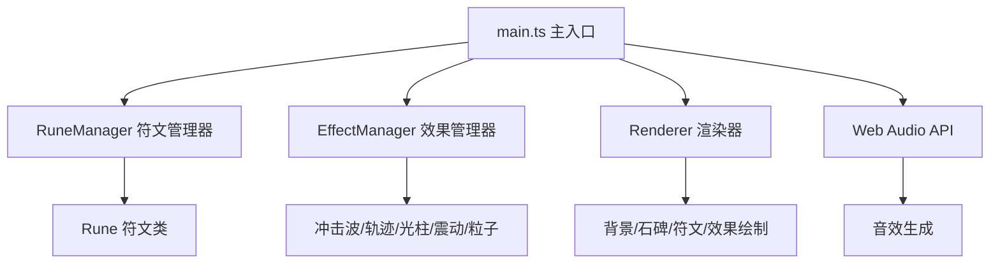

## 1. 架构设计

本项目采用纯前端 Canvas 2D 渲染架构，模块化设计，各职责分离。



## 2. 技术栈

- **语言**：TypeScript（严格模式，目标 ES2020）
- **构建工具**：Vite（支持 HMR）
- **渲染**：Canvas 2D API
- **音频**：Web Audio API
- **包管理**：npm

## 3. 文件结构

```
.
├── package.json          # 项目依赖与脚本
├── vite.config.js        # Vite 构建配置
├── tsconfig.json         # TypeScript 配置
├── index.html            # 入口页面
└── src/
    ├── main.ts           # 主入口：初始化Canvas，主循环，调度管理器
    ├── rune.ts           # 符文类：单个符文的属性与方法
    ├── runeManager.ts    # 符文管理器：生成、更新、碰撞检测、数量控制
    ├── effectManager.ts  # 效果管理器：冲击波、轨迹、光柱、震动、粒子
    └── renderer.ts       # 渲染器：所有视觉元素的绘制
```

## 4. 核心模块设计

### 4.1 Rune 符文类

```typescript
class Rune {
  x: number;           // X 坐标
  y: number;           // Y 坐标
  char: string;        // 符文字符
  color: string;       // 当前颜色
  brightness: number;  // 亮度 0-1
  size: number;        // 大小
  isActive: boolean;   // 是否被激活
  lifeStage: 'emerging' | 'floating' | 'fading';  // 生命周期阶段
  lifeTime: number;    // 已存活时间
  totalLife: number;   // 总生命周期
  
  activate(): void;    // 激活符文
  fadeOut(): void;     // 开始淡出
  update(dt: number): void;  // 更新状态
}
```

### 4.2 RuneManager 符文管理器

```typescript
class RuneManager {
  runes: Rune[];                // 活跃符文列表
  maxRunes: number;             // 最大符文数（24）
  spawnInterval: [number, number];  // 生成间隔范围
  steleRect: { x, y, w, h };   // 碑面区域
  
  update(dt: number, mouseX: number, mouseY: number): Rune[];  // 更新所有符文，返回被激活的
  spawnRune(): void;           // 生成新符文
  checkCollisions(x: number, y: number): Rune | null;  // 碰撞检测
}
```

### 4.3 EffectManager 效果管理器

```typescript
class EffectManager {
  shockwaves: Shockwave[];     // 冲击波列表
  trailPoints: TrailPoint[];   // 轨迹点列表
  lightBeam: LightBeam | null; // 光柱
  shake: ShakeState;           // 震动状态
  particles: Particle[];       // 粒子列表
  comboCount: number;          // 当前连击数
  lastActivationTime: number;  // 上次激活时间
  successCount: number;        // 成功触发次数
  
  addShockwave(x, y): void;
  addTrailPoint(x, y, color): void;
  triggerLightBeam(steleTop): void;
  triggerShake(): void;
  update(dt: number): void;
}
```

### 4.4 Renderer 渲染器

```typescript
class Renderer {
  ctx: CanvasRenderingContext2D;
  width: number;
  height: number;
  
  drawBackground(): void;
  drawStele(x, y, w, h, rotation, shakeOffset, cracks, isGolden): void;
  drawRunes(runes: Rune[]): void;
  drawEffects(effectManager: EffectManager): void;
}
```

## 5. 主循环

```
requestAnimationFrame → 
  计算 deltaTime →
  RuneManager.update() → 生成新符文、更新位置、碰撞检测
  EffectManager.update() → 更新所有效果
  检查连击逻辑 → 触发光柱/震动
  Renderer.draw() → 绘制所有元素
```

## 6. 性能优化策略

1. **对象池**：符文和粒子对象复用，避免频繁 GC
2. **离屏画布**：静态背景预渲染
3. **数量上限**：符文最多24个，粒子数量可控
4. **增量渲染**：仅必要时重绘
5. **RAF 调度**：使用 requestAnimationFrame 确保流畅
