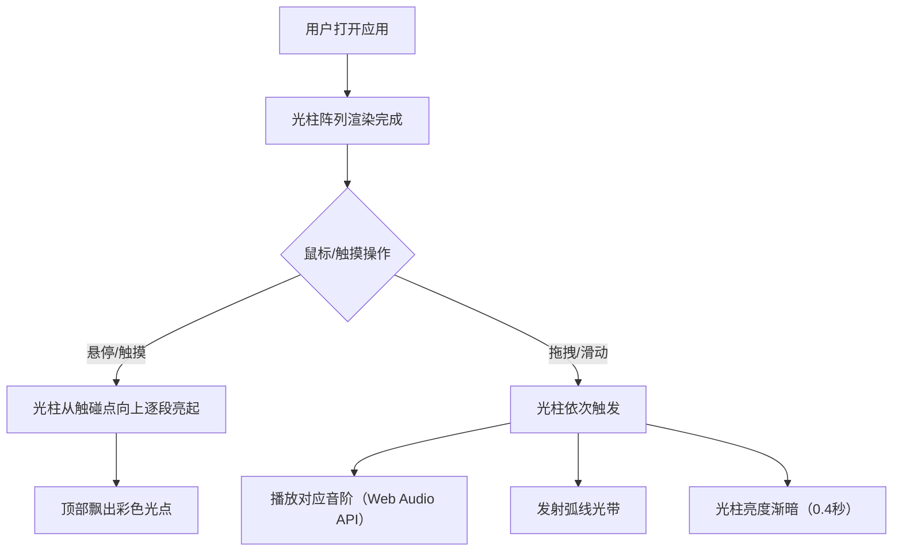
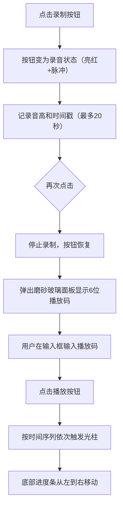
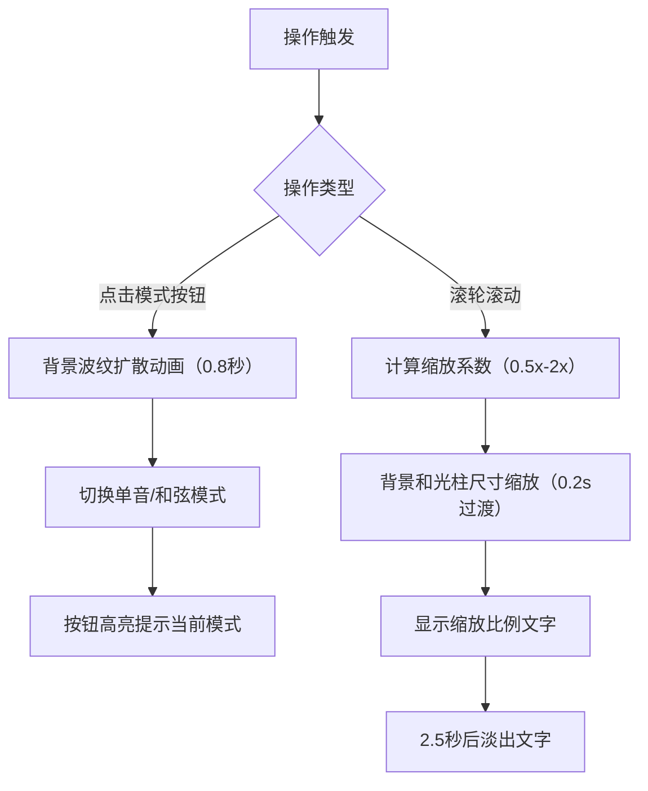

## 1. 产品概述

「流动光琴」是一款基于浏览器的交互式音乐可视化应用，通过直观的光柱阵列和绚丽的视觉反馈，让用户以拖拽滑动的方式即兴创作和演奏音乐。

- 解决传统音乐创作工具学习门槛高、缺乏直观视觉反馈的问题
- 目标用户：音乐爱好者、创意工作者、普通用户
- 产品价值：降低音乐创作门槛，提供沉浸式的视听体验和即兴演奏乐趣

## 2. 核心功能

### 2.1 用户角色
| 角色 | 注册方式 | 核心权限 |
|------|----------|----------|
| 普通用户 | 无需注册 | 演奏、录制、回放、调整模式、缩放视图 |

### 2.2 功能模块
1. **主界面**：渐变背景、12根光柱琴键阵列、控制栏
2. **演奏系统**：鼠标/触摸滑动触发、光柱点亮动画、粒子飞散、弧线光带、钢琴音色合成
3. **模式切换**：单音模式 / 和弦模式
4. **录制与回放**：20秒录制、6位播放码、自动回放
5. **视图控制**：滚轮缩放、响应式适配

### 2.3 页面详情
| 页面名称 | 模块名称 | 功能描述 |
|----------|----------|----------|
| 主界面 | 渐变背景 | 深海蓝到星云紫的全屏渐变，支持缩放 |
| 主界面 | 光柱阵列 | 12根垂直光柱，悬停点亮，触发时播放音效和视觉效果 |
| 主界面 | 粒子效果 | 光柱触发时顶部飘出彩色光点向上飞散 |
| 主界面 | 弧线光带 | 光柱触发时从顶端发射贝塞尔曲线光带 |
| 主界面 | 控制栏 | 录制按钮、播放码输入框、模式切换按钮 |
| 主界面 | 设置面板 | 右下角模式切换按钮，切换时有波纹动画 |
| 主界面 | 回放面板 | 停止录制后弹出磨砂玻璃面板显示播放码 |
| 主界面 | 进度指示 | 回放时光柱底部横向光条显示播放进度 |
| 主界面 | 缩放提示 | 缩放时显示半透明比例文字，2.5秒后淡出 |

## 3. 核心流程

### 3.1 演奏流程
用户打开页面 → 鼠标悬停/触摸光柱 → 光柱逐段亮起 + 粒子飞散 → 拖拽/滑动扫过光柱 → 光柱依次点亮 + 播放音阶 + 弧线光带

### 3.2 录制回放流程
用户点击录制按钮 → 开始记录20秒内演奏数据 → 再次点击停止 → 生成6位播放码 → 输入播放码点击播放 → 自动回放演奏序列

### 3.3 模式切换与缩放流程
点击模式按钮 → 背景波纹动画 → 切换单音/和弦模式；滚轮缩放 → 背景和光柱缩放 → 显示比例文字

## 4. 用户界面设计

### 4.1 设计风格
- **主色调**：深海蓝 #0B1A3A → 星云紫 #2A1B4A 渐变背景
- **强调色**：亮蓝 #4A9EFF、亮紫 #7A7AFF、浅蓝 #AADDFF
- **光柱色阶**：底部 #0A184A → 顶部 #3A7AFF 线性渐变
- **控制栏背景**：深海蓝 #0D1F3D，底部阴影 #00000066
- **按钮样式**：圆角矩形，hover时白色外发光（0.3px）+ 1.1倍缩放（0.3秒过渡）
- **磨砂玻璃效果**：backdrop-filter: blur(10px)，半透明背景
- **字体**：深色主题下的现代无衬线字体，白色字体配合阴影提升可读性

### 4.2 页面设计概览
| 页面名称 | 模块名称 | UI元素 |
|----------|----------|--------|
| 主界面 | 背景区域 | 全屏线性渐变（#0B1A3A→#2A1B4A），支持CSS scale缩放 |
| 主界面 | 光柱阵列 | 12根垂直光柱（300px高，40px宽，10px间隔），底部半透明底座，中央对齐 |
| 主界面 | 粒子效果 | 2-4px彩色圆点，从光柱顶部向上飞散（1.2秒生命周期） |
| 主界面 | 弧线光带 | 2px宽半透明蓝色曲线，沿贝塞尔轨迹飘向右上角（1秒消散） |
| 主界面 | 控制栏 | 80px高，底部固定，左到右：录制按钮、播放码输入框、模式切换按钮 |
| 主界面 | 录制按钮 | 圆形图标切换（圆↔录音带），暗红色→亮红色+脉冲光环 |
| 主界面 | 播放码面板 | 300px×200px磨砂玻璃面板，居中显示6位数字 |
| 主界面 | 进度指示 | 光柱底部横向光条，移动速度200px/秒 |
| 主界面 | 缩放提示 | 14px白色字体，5px阴影，2.5秒淡出 |
| 主界面 | 模式按钮 | 灰#444→亮蓝#4A9EFF背景切换（0.3秒过渡） |

### 4.3 响应式设计
- **桌面优先**：默认光柱宽40px、间距10px、控制栏高80px
- **平板/移动适配**（<768px）：光柱宽24px、间距6px、控制栏高64px
- **触摸优化**：支持touchstart/touchmove/touchend事件，增大触摸热区

### 4.4 性能要求
- **帧率目标**：60fps流畅运行
- **极端场景**：同时触发10+弧线光带时FPS≥55
- **优化策略**：Canvas 2D批量绘制、粒子池复用、RAF主循环统一调度
