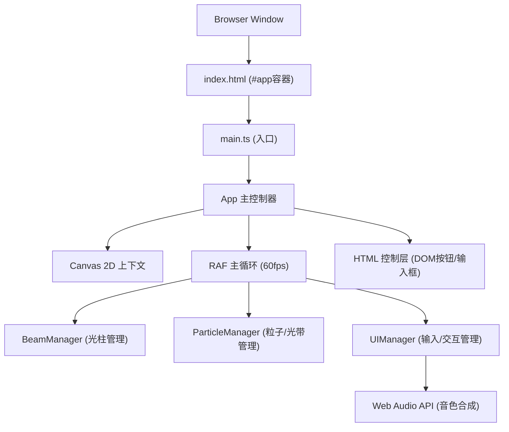

## 1. 架构设计



## 2. 技术选型

- **前端框架**：无框架（原生TypeScript + Canvas 2D），确保轻量高性能
- **构建工具**：Vite@5（支持HMR、TypeScript编译、开发服务器）
- **语言**：TypeScript@5（严格模式，目标ES2020）
- **音频引擎**：Web Audio API（原生OscillatorNode + GainNode合成钢琴音色）
- **渲染引擎**：Canvas 2D Context（requestAnimationFrame驱动）
- **样式方案**：内联CSS + CSS变量（控制栏、按钮、弹窗采用DOM）

## 3. 文件结构与职责

```
auto13/
├── package.json              # 依赖声明 (typescript, vite)
├── vite.config.js            # Vite基础配置 (HMR支持)
├── tsconfig.json             # TypeScript严格模式配置
├── index.html                # 入口页面 (#app容器, 全屏样式)
└── src/
    ├── main.ts               # 入口：创建Canvas, 初始化App, 启动主循环
    ├── App.ts                # 主控制器：协调各Manager, 全局状态管理
    ├── BeamManager.ts        # 光柱管理：12根Beam状态、渲染、触发逻辑
    ├── ParticleManager.ts    # 粒子/光带管理：Particle/Ribbon数组、渲染更新
    ├── UIManager.ts          # 输入管理：鼠标/触摸/滚轮、录制回放、模式状态
    ├── AudioEngine.ts        # Web Audio封装：钢琴音色合成、音阶映射
    └── types.ts              # 类型定义：Beam, Particle, Ribbon, RecordEntry等
```

## 4. 核心数据模型

### 4.1 类型定义

```typescript
// 光柱数据结构
interface Beam {
  x: number;              // 左上角X坐标（缩放前）
  baseWidth: number;      // 基础宽度40px
  baseHeight: number;     // 基础高度300px
  width: number;          // 当前宽度（受scaleFactor影响）
  height: number;         // 当前高度（受scaleFactor影响）
  currentBrightness: number;  // 当前亮度 0.0~1.0
  targetBrightness: number;   // 目标亮度
  isTriggered: boolean;   // 是否已触发（用于音效去抖）
  soundFrequency: number; // 对应音频频率
  triggerTime: number;    // 上次触发时间戳（ms）
  hoverSegments: number;  // 悬停点亮段数（每段10px）
}

// 粒子（光点飞散）
interface Particle {
  x: number; y: number;         // 当前位置
  targetX: number; targetY: number;  // 目标位置（贝塞尔终点）
  lifeTime: number;             // 剩余生命帧数
  maxLife: number;              // 总生命帧数（1.2s ≈ 72帧）
  color: string;                // 颜色：#4A9EFF / #7A7AFF / #AADDFF
  size: number;                 // 大小 2~4px
}

// 弧线光带
interface Ribbon {
  points: Array<{x: number; y: number}>;  // 轨迹点数组
  color: string;                          // 颜色 #4A9EFF
  lifeTime: number;                       // 剩余生命帧数（1s ≈ 60帧）
}

// 录制条目
interface RecordEntry {
  beamIndex: number;     // 光柱索引 0~11
  timestamp: number;     // 相对录制开始的时间戳（ms）
}

// 录制数据
interface Recording {
  code: string;          // 6位播放码
  entries: RecordEntry[];
  duration: number;      // 总时长（ms）
}

// 全局应用状态
interface AppState {
  scaleFactor: number;         // 缩放系数 0.5~2.0
  mode: 'single' | 'chord';    // 演奏模式
  isRecording: boolean;        // 是否正在录制
  isPlaying: boolean;          // 是否正在回放
  rippleTime: number;          // 波纹动画剩余时间
  scaleTextTime: number;       // 缩放文字剩余显示时间
}
```

### 4.2 频率映射（12根光柱 → C4~B4半音阶）

| 索引 | 音名 | 频率(Hz) |
|------|------|----------|
| 0 | C4 | 261.63 |
| 1 | C#4 | 277.18 |
| 2 | D4 | 293.66 |
| 3 | D#4 | 311.13 |
| 4 | E4 | 329.63 |
| 5 | F4 | 349.23 |
| 6 | F#4 | 369.99 |
| 7 | G4 | 392.00 |
| 8 | G#4 | 415.30 |
| 9 | A4 | 440.00 |
| 10 | A#4 | 466.16 |
| 11 | B4 | 493.88 |

## 5. 核心算法与渲染流程

### 5.1 主循环（requestAnimationFrame）
每帧执行顺序：
1. `UIManager.handleInput()` - 处理累积的输入状态（光标位置等）
2. `BeamManager.update(dt)` - 更新亮度插值、触发判定（速度0.15/帧）
3. `ParticleManager.update(dt)` - 更新粒子位置、光带轨迹点
4. 清画布 → 绘制渐变背景
5. `BeamManager.render(ctx)` - 绘制光柱（线性渐变+亮度叠加）、底座
6. `ParticleManager.render(ctx)` - 绘制粒子、贝塞尔光带
7. `UIManager.drawScaleText(ctx)` - 绘制缩放比例文字
8. 若在回放 → 更新进度条 → 按时间戳触发对应光柱

### 5.2 亮度插值算法
```
currentBrightness += (targetBrightness - currentBrightness) * 0.15
```
触发时targetBrightness设为1.0，0.4秒后（~24帧）设为0.0

### 5.3 光柱碰撞检测
根据光标Y坐标计算悬停段数：`segments = max(0, ceil((beamBottomY - cursorY) / 10))`

### 5.4 贝塞尔弧线光带
采用二次贝塞尔曲线，起点在光柱顶端，控制点随机偏移50px，终点在画布右上区域。每帧将新坐标插入points头部，超出最大长度则剔除尾部。

### 5.5 钢琴音色合成（Web Audio）
```
OscillatorNode (type: 'triangle')
  → GainNode (ADSR包络：攻击10ms/衰减80ms/延音0.3/释放300ms)
  → AudioContext.destination
```
触发后播放400ms自动停止。

## 6. 性能优化策略

1. **Canvas分层绘制**：避免每帧重绘DOM元素，所有视觉效果走Canvas
2. **粒子池复用**：Particle/Ribbon对象从数组头部移除后可复用（简单起见直接splice，数量可控）
3. **RAF调度**：所有更新/渲染统一在一个RAF回调中完成
4. **亮度插值节流**：固定系数0.15每帧，无需额外计时器
5. **音频去抖**：每根光柱设置最小触发间隔（如80ms）避免重复触发
6. **批量路径绘制**：光带绘制时将同色路径合并，减少Canvas状态切换
7. **DPR适配**：Canvas尺寸按devicePixelRatio缩放，避免模糊同时控制像素数

## 7. 响应式适配逻辑

```typescript
// 在UIManager中监听resize / 初始化时计算
const isMobile = window.innerWidth < 768;
const beamWidth = isMobile ? 24 : 40;
const beamGap = isMobile ? 6 : 10;
const controlBarHeight = isMobile ? 64 : 80;

// 光柱阵列总宽度 = 12 * beamWidth + 11 * beamGap
// 居中定位：startX = (canvasWidth - totalWidth) / 2
// 垂直位置：beamTop = canvasHeight * 0.8 - beamHeight - 50 (底部留空给控制栏)
```
