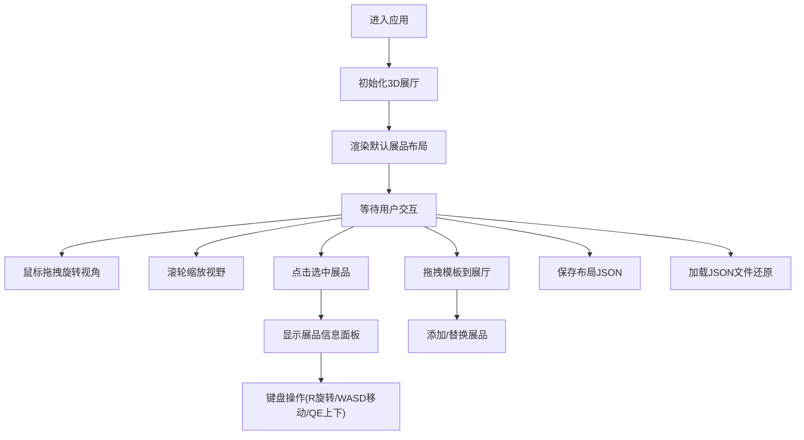

## 1. 产品概述

「光之橱窗」是一款交互式数字陈列廊应用，用户可在3D虚拟展厅中自由摆放、观赏具有动态光影效果的几何展品，并支持保存与分享展位快照。

- **目标用户**：虚拟策展人、数字艺术爱好者、创意设计师
- **核心价值**：提供沉浸式的3D展品陈列体验，让用户轻松创建个性化数字展厅
- **技术亮点**：基于Canvas 2D模拟3D透视效果，无需WebGL依赖，轻量高性能

## 2. 核心功能

### 2.1 用户角色
| 角色 | 注册方式 | 核心权限 |
|------|----------|----------|
| 访客用户 | 无需注册 | 浏览展厅、操作展品、保存/加载布局 |

### 2.2 功能模块
1. **3D展厅场景**：中央光柱展台、最多6个展品位、地板反射效果、动态光影
2. **展品管理**：添加/移除/排列展品、展品旋转、位置微调、材质与颜色
3. **用户交互**：鼠标拖拽旋转视角、滚轮缩放、点击选中、键盘快捷键
4. **布局管理**：JSON格式保存/加载展厅布局、拖入文件还原
5. **信息面板**：展示选中展品的组成、颜色、旋转角度等详细信息
6. **模板库**：右侧可折叠面板，提供预设几何体模板供拖拽使用

### 2.3 页面详情
| 页面名称 | 模块名称 | 功能描述 |
|----------|----------|----------|
| 主展厅页 | 左侧信息面板 | 深灰半透明磨砂背景，展示选中展品的详细属性 |
| 主展厅页 | 中央Canvas区域 | 3D展厅渲染区，径向渐变背景随鼠标移动 |
| 主展厅页 | 右侧模板库 | 可折叠面板，预设几何体模板缩略图，支持拖拽添加 |
| 主展厅页 | 底部控制栏 | 转速调节滑块、保存/加载按钮、重置按钮 |

## 3. 核心流程

### 3.1 主流程描述
用户进入应用后，默认看到一个中央带光柱的虚拟展厅，四周摆放着6个预设展品。用户可通过鼠标拖拽旋转视角、滚轮缩放来观赏展品。点击任一展品可查看详细信息，使用键盘快捷键可旋转或移动展品。从右侧模板库拖拽新模板可替换或添加展品。用户可随时保存当前布局为JSON文件，也可拖入JSON文件还原布局。

### 3.2 流程图

## 4. 用户界面设计

### 4.1 设计风格
- **整体风格**：暗冷色调科技感，沉浸式数字艺术展厅氛围
- **主色调**：青蓝 #4FC3F7、紫罗兰 #7C4DFF
- **背景色**：夜蓝 #0A1128 到 暗紫 #1C1B33 径向渐变
- **高亮色**：金橙到暖红渐变描边，用于选中展品
- **按钮样式**：柔和圆角，悬停上浮阴影，颜色加深反馈
- **字体**：现代无衬线字体，数字等宽显示
- **质感**：磨砂玻璃半透明面板、金属拉丝/磨砂玻璃材质几何体
- **动画**：平滑过渡、发光闪烁、光晕呼吸效果

### 4.2 页面设计概览
| 页面名称 | 模块名称 | UI元素 |
|----------|----------|--------|
| 主展厅页 | 左侧信息面板 | 半透明深灰背景、磨砂玻璃效果、展品名称、几何体列表、颜色值、旋转角度 |
| 主展厅页 | 中央Canvas | 3D场景渲染、径向渐变背景、动态光柱、地板反射、光晕效果 |
| 主展厅页 | 右侧模板库 | 可折叠面板、缩略图网格、悬停放大、模板名称 |
| 主展厅页 | 底部控制区 | 转速滑块、保存按钮、加载按钮、重置按钮 |

### 4.3 响应式设计
- **桌面端**：三栏布局（左信息面板 + 中央Canvas + 右模板库）
- **移动端**（<768px）：上下布局，Canvas全屏，信息面板转为底部半透明浮层，模板库可从侧边滑出
- **触控优化**：支持双指旋转/缩放，点击选中，长按弹出操作菜单

### 4.4 3D场景指导
- **环境**：暗紫色径向渐变背景，营造深夜展厅氛围
- **灯光**：顶部聚光灯 + 环境光，展品带自发光和投影效果
- **相机**：透视投影，默认45度俯视角，可360度水平旋转，垂直角度限制
- **构图**：中央光柱为视觉中心，展品环绕四周，对称式布局
- **交互**：鼠标拖拽惯性旋转、平滑过渡动画、选中高亮闪烁
- **后处理**：半透明光晕、地板反射、Z-buffer遮挡、发光描边
- **性能**：总多边形<2000，帧率>50FPS，最多8个展品
