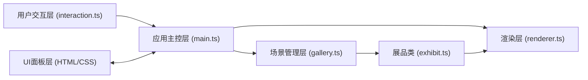

## 1. 架构设计



**架构说明**：
- **应用主控层 (main.ts)**：初始化场景、相机、灯光，启动渲染循环，协调整体数据流
- **场景管理层 (gallery.ts)**：管理所有展品的位置、旋转、动画，提供增删改查方法
- **展品类 (exhibit.ts)**：单个展品的几何体构建、材质、光影效果、碰撞检测
- **渲染层 (renderer.ts)**：Canvas 2D 3D投影渲染器，实现透视投影、光照模型、Z-buffer
- **用户交互层 (interaction.ts)**：处理鼠标、键盘、触摸事件，转化为场景操作指令
- **UI面板层**：HTML/CSS实现的信息面板、模板库、控制栏

## 2. 技术描述

- **前端框架**：原生 TypeScript + Vite（无React/Vue框架）
- **渲染技术**：Canvas 2D API 模拟 3D 透视投影效果
- **构建工具**：Vite 5.x，支持 HMR 热更新
- **语言版本**：TypeScript 5.x，目标 ES2020，严格模式
- **样式方案**：原生 CSS + CSS 变量，实现毛玻璃效果和动画
- **无后端**：纯前端应用，数据存储使用 localStorage 和 JSON 文件导入导出

## 3. 文件结构与调用关系

```
项目根目录
├── package.json          # 项目依赖和脚本
├── vite.config.js        # Vite构建配置
├── tsconfig.json         # TypeScript配置
├── index.html            # 入口页面，包含三栏布局结构
└── src/
    ├── main.ts           # [主控] 应用入口，初始化与渲染循环
    ├── gallery.ts        # [场景] 画廊场景类，展品集合管理
    ├── exhibit.ts        # [实体] 展品类，几何体组合与动画
    ├── interaction.ts    # [交互] 用户输入处理，事件监听
    ├── renderer.ts       # [渲染] Canvas 2D 3D渲染器
    └── types.ts          # [类型] 全局类型定义
```

**数据流向**：
1. `main.ts` 初始化 → 创建 `Gallery` 实例和 `Renderer` 实例
2. `interaction.ts` 监听DOM事件 → 调用 `main.ts` 暴露的接口
3. `main.ts` 接收输入 → 调用 `gallery.ts` 方法更新场景
4. `gallery.ts` 更新 → 操作内部 `Exhibit` 实例数组
5. 每帧 `main.ts` → 调用 `renderer.render(gallery)` 绘制当前帧

## 4. 核心数据模型

### 4.1 3D数学基础
```typescript
interface Vec3 { x: number; y: number; z: number; }
interface Mat4 { m: number[]; } // 4x4矩阵，列主序
```

### 4.2 几何体类型
```typescript
type GeometryType = 'cube' | 'sphere' | 'cone' | 'cylinder' | 'torus';

interface GeometryPart {
  type: GeometryType;
  position: Vec3;       // 相对于展品中心的偏移
  rotation: Vec3;       // 局部旋转角度(弧度)
  scale: Vec3;          // 缩放比例
  color: string;        // 基础颜色
  material: 'metal' | 'glass' | 'matte';
}
```

### 4.3 展品数据
```typescript
interface ExhibitData {
  id: string;
  templateId: string;   // 来源模板ID
  name: string;
  position: Vec3;       // 世界坐标
  rotation: Vec3;       // 欧拉角(弧度)
  scale: number;        // 整体缩放
  parts: GeometryPart[];// 组成几何体
  isRotating: boolean;  // 是否持续自转
  rotationSpeed: number;// 自转速(度/帧)
  selected: boolean;
}
```

### 4.4 相机与灯光
```typescript
interface Camera {
  position: Vec3;
  target: Vec3;
  fov: number;          // 视野角度(度)
  near: number;
  far: number;
}

interface Light {
  position: Vec3;
  color: string;
  intensity: number;
  type: 'point' | 'spot' | 'ambient';
}
```

### 4.5 模板数据
```typescript
interface ExhibitTemplate {
  id: string;
  name: string;
  thumbnail: string;    // 缩略图DataURL或CSS绘制
  parts: GeometryPart[];
  description: string;
}
```

## 5. 核心算法

### 5.1 3D投影算法
- **透视投影**：使用类似针孔相机模型，`screenX = (x/z) * focalLength + centerX`
- **世界变换**：矩阵乘法实现平移、旋转、缩放
- **视图变换**：相机视角变换，LookAt矩阵

### 5.2 渲染管线
1. **几何阶段**：顶点变换（模型→世界→视图→裁剪→屏幕）
2. **背面剔除**：根据面法向量剔除不可见面
3. **Z-Buffer**：按深度排序面，处理遮挡关系
4. **光栅化**：扫描线填充多边形，计算每个像素颜色
5. **光照计算**：漫反射 + 环境光 + 高光近似

### 5.3 碰撞检测
- 展品间使用**球体包围盒**碰撞检测
- 简化为圆心距 + 半径比较，保证性能

### 5.4 平滑动画
- 视角旋转使用**缓动函数**(easeOutCubic)实现0.5秒平滑过渡
- 展品位置移动使用**线性插值**

## 6. 性能优化策略

1. **面数控制**：每个球体使用12段经线×8段纬线，总面数<2000
2. **深度排序优化**：按展品整体深度排序，而非逐个面排序
3. **离屏Canvas**：模板缩略图缓存，避免重复绘制
4. **requestAnimationFrame**：使用原生API确保帧率稳定
5. **脏标记**：仅在展品变化时重算变换矩阵
6. **帧率监控**：动态调整渲染细节以维持50FPS以上

## 7. 浏览器兼容性

- Chrome/Edge 90+
- Firefox 88+
- Safari 14+
- 依赖：Canvas 2D API、ES2020语法、requestAnimationFrame
