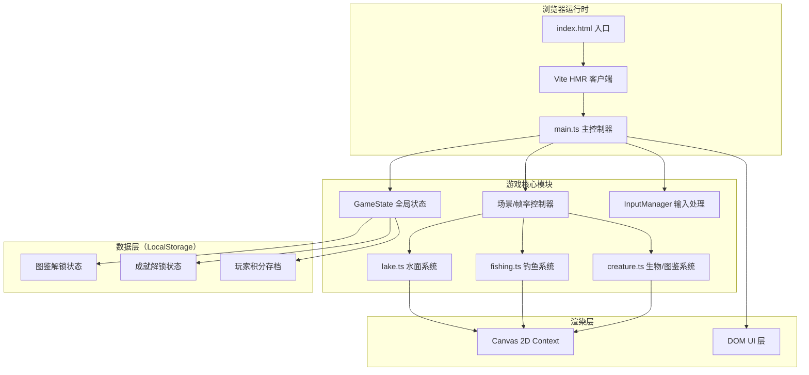

## 1. 架构设计

本项目采用纯前端 Canvas 架构，无后端依赖。使用 TypeScript 进行类型安全开发，Vite 提供快速构建与热更新。渲染采用单 Canvas + 分层绘制策略（逻辑分层，物理单层以减少上下文切换开销）。



---

## 2. 技术描述

- **前端框架**：原生 TypeScript（无React/Vue），面向对象模块化设计
- **构建工具**：Vite@5.x（HMR热更新，快速开发服务器）
- **语言版本**：TypeScript@5.x，严格模式（`strict: true`），目标 ES2020
- **渲染引擎**：HTML5 Canvas 2D Context，60FPS requestAnimationFrame 主循环
- **物理模拟**：自实现轻量物理：多层正弦波合成、抛物线运动、粒子FIFO池
- **状态持久化**：Window.localStorage（自动保存图鉴/成就/积分）
- **样式方案**：原生 CSS + CSS Variables（主题色/动画关键帧）
- **字体方案**：Google Fonts CDN（Cinzel + Noto Sans SC）

---

## 3. 文件结构定义

| 文件路径 | 职责说明 |
|---------|---------|
| `package.json` | 依赖声明（typescript、vite），启动脚本 `npm run dev` |
| `vite.config.js` | Vite 基础配置，开启 HMR，端口默认 5173 |
| `tsconfig.json` | TS 严格模式，target ES2020，module ESNext |
| `index.html` | 入口页面，加载全局样式、Canvas容器、字体链接 |
| `src/main.ts` | 游戏主循环，GameState 全局状态，资源加载，帧率控制，DOM UI 绑定 |
| `src/lake.ts` | Lake 类：水面渲染（多层波浪）、浮标漂浮物理、波纹粒子池、溅水粒子生成 |
| `src/fishing.ts` | Fishing 类：蓄力投掷、抛物线、咬钩检测、收杆判定、收杆动画序列 |
| `src/creature.ts` | 生物定义（枚举/接口）、随机生成算法、图鉴数据维护、稀有度权重 |

---

## 4. 核心数据模型

### 4.1 接口定义

```typescript
// ========== creature.ts ==========
type Rarity = 'common' | 'rare' | 'epic' | 'legendary' | 'mythic';
type CreatureType = 'ghost_fish' | 'shipwreck_chest' | 'driftwood_spirit' | 'abyss_lord' | 'starlight_jellyfish';

interface Creature {
  id: CreatureType;
  name: string;
  description: string;
  color: string;
  secondaryColor?: string; // 用于渐变
  size: { w: number; h: number };
  rarity: Rarity;
  score: number;
  emoji: string;
  weight: number; // 随机生成权重
}

interface CollectedCreature {
  type: CreatureType;
  firstCaughtAt: number;
  count: number;
}

// ========== lake.ts ==========
interface WaveLayer {
  amplitude: number;   // 2-6px
  frequency: number;   // 波频
  phase: number;       // 初相
  speed: number;       // 传播速度
  direction: number;   // 方向角（弧度）
}

interface Ripple {
  x: number;
  y: number;
  radius: number;     // 当前半径
  maxRadius: number;
  opacity: number;
  life: number;       // 0-1 生命周期
}

interface Particle {
  x: number;
  y: number;
  vx: number;
  vy: number;
  size: number;
  color: string;
  opacity: number;
  life: number;
  maxLife: number;
}

// ========== fishing.ts ==========
type FishingPhase = 'idle' | 'charging' | 'casting' | 'floating' | 'biting' | 'reeling' | 'result';

interface FloatState {
  x: number;
  y: number;
  baseY: number;      // 落水点Y（用于波浪偏移）
  driftVX: number;    // 飘移速度
  driftVY: number;
  shakeAmplitude: number;
  shakePhase: number;
  isBiting: boolean;
  biteTimer: number;  // 咬钩反应窗口计时
}

interface CastArc {
  startX: number;
  startY: number;
  targetX: number;
  targetY: number;
  progress: number;   // 0-1
  peakHeight: number;
}

// ========== main.ts ==========
interface Achievement {
  id: string;
  name: string;
  description: string;
  threshold: number;  // 触发条件值
  checkFn: (state: GameState) => boolean;
  unlocked: boolean;
  unlockedAt?: number;
}

interface GameState {
  score: number;
  totalCaught: number;
  phase: FishingPhase;
  collection: Map<CreatureType, CollectedCreature>;
  achievements: Achievement[];
  currentFloat: FloatState | null;
  castPower: number;  // 0-1 蓄力值
  lastCatchRarity: Rarity | null;
  isCharging: boolean;
}
```

---

## 5. 关键算法

### 5.1 波浪合成算法

```
水面高度 = Σ(amplitude[i] * sin(frequency[i] * (x*cos(dir) + y*sin(dir)) * phase[i] + time * speed[i]))
方向旋转：每 5s 将 direction[i] 缓动至新随机角度（lerp）
```

### 5.2 生物随机生成（稀有度加权）

| 稀有度 | 权重 | 概率 |
|-------|-----|-----|
| 普通 common | 60 | 60% |
| 稀有 rare | 22 | 22% |
| 史诗 epic | 11 | 11% |
| 传说 legendary | 5.5 | 5.5% |
| 神话 mythic | 1.5 | 1.5% |

权重加权随机：`rand = Math.random() * totalWeight;` 累加匹配。

### 5.3 咬钩时间窗口

- 浮标落水后 `[1.5s, 5.0s]` 内随机触发咬钩
- 咬钩反应窗口：**0.8s**
- 超过 8s 未咬钩 → 生物逃脱，需重新投掷

### 5.4 粒子池管理

```
MAX_PARTICLES = 200
push(particle):
  if pool.length >= MAX_PARTICLES:
    pool.shift()  // 淘汰最早粒子
  pool.push(particle)
```

---

## 6. UI 组件结构

```
index.html
└── #app (fullscreen, overflow: hidden)
    ├── canvas#game-canvas (position: absolute, inset: 0, z-index: 1)
    ├── .top-toolbar (position: absolute, top: 0, left: 0, right: 0, z-index: 10)
    │   ├── .score-display (top-center, 金色发光)
    │   ├── .btn-codex (左, 图鉴入口)
    │   └── .btn-achievements (右, 成就入口)
    ├── .codex-panel (position: absolute, top: 0, transition: transform 0.3s, z-index: 20)
    │   └── .codex-grid (5列网格)
    ├── .achievement-panel (position: absolute, right: 0, transition: transform 0.3s, z-index: 20)
    │   └── .achievement-list (滚动列表)
    ├── .power-bar (position: fixed, z-index: 30, 跟随鼠标)
    ├── .bite-hint (position: fixed, top/center, 红色闪烁)
    ├── .achievement-unlock (fixed 全屏覆盖, 金色闪烁)
    └── .creature-result (fixed center, 结果弹窗)
```

---

## 7. 性能优化策略

1. **Canvas 分层逻辑**：背景波浪每帧重绘，但仅绘制可视区域；粒子仅更新活跃部分
2. **对象池复用**：波纹、粒子对象复用，避免频繁 GC
3. **离屏 Canvas 预渲染**：生物图标、浮标形状预渲染到离屏 canvas，每帧 drawImage 而非重绘路径
4. **节流/防抖**：鼠标移动事件节流到 16ms；resize 事件防抖 200ms
5. **降级策略**：帧率检测 < 25FPS 时自动降低波浪层数（5→3）、降低粒子上限

---

## 8. 构建与运行

```bash
# 安装依赖
npm install

# 启动开发服务器（带HMR）
npm run dev
# 默认访问 http://localhost:5173

# 生产构建
npm run build
```
