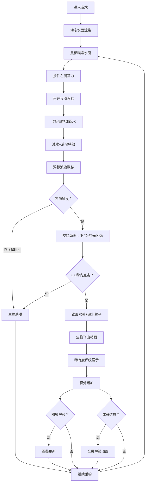

## 1. 产品概述

「墨渊钓客」是一款在浏览器中运行的沉浸式钓鱼模拟游戏，通过动态水面物理渲染和深度交互机制，解决传统数字钓鱼游戏缺乏真实感和沉浸感的痛点。玩家在深黑蓝色的神秘湖面上，通过精准控制浮标投掷和收杆时机，钓起5种独特的奇幻生物，收集图鉴、解锁成就、累积积分。

- 目标用户：休闲游戏爱好者、收藏类游戏玩家、追求视觉沉浸感的玩家
- 产品价值：以极简的操作（鼠标）创造丰富的交互深度，融合物理模拟、收藏系统与成就激励的深度游戏循环

---

## 2. 核心功能

### 2.1 功能模块

1. **动态水面渲染系统**：多层正弦波合成的波浪、浮标浮动物理、环形波纹扩散、溅水粒子特效
2. **浮标投掷与蓄力系统**：鼠标蓄力显示、抛物线轨迹计算、落点溅水动画、浮标飘移
3. **咬钩与收杆判定**：咬钩提示动画（下沉+晃动+红光闪烁）、0.8秒反应窗口、锥形水幕动画、生物破水粒子
4. **生物生成与图鉴系统**：5种生物随机生成、5级稀有度、缩略图鉴网格、详情弹窗
5. **计分与成就系统**：积分累加、8个成就解锁、全屏金色闪烁解锁动画、成就列表滚动展示

### 2.2 页面详情

| 页面名称 | 模块名称 | 功能描述 |
|---------|---------|---------|
| 游戏主场景 | 湖面画布 | Canvas渲染的全屏动态水面、波浪、波纹、粒子系统 |
| 游戏主场景 | 浮标交互层 | 蓄力条显示、浮标投掷抛物线、咬钩动画、收杆特效 |
| 游戏主场景 | 顶部工具栏 | 图鉴按钮、成就按钮、积分显示、当前状态提示 |
| 图鉴面板 | 图鉴网格 | 5列布局，未解锁灰色方块，已解锁显示缩略图+名称 |
| 图鉴面板 | 生物详情 | 点击生物展示属性、稀有度、获取时间、描述文本 |
| 成就面板 | 成就列表 | 右侧滚动显示8个成就，解锁后彩色+发光效果 |
| 成就系统 | 解锁动画 | 全屏金色闪烁+文字弹出，持续2秒 |

---

## 3. 核心流程

### 3.1 主游戏循环

玩家进入游戏 → 观察动态水面 → 鼠标移动瞄准 → 按住左键蓄力 → 松开投掷浮标 → 浮标落水飘移 → 等待咬钩 → 咬钩提示（0.8秒内点击）→ 收杆动画 → 获得生物+积分 → 解锁成就/图鉴 → 重复垂钓

### 3.2 流程图

---

## 4. 用户界面设计

### 4.1 设计风格

**主题**：深色海洋·神秘深邃

- **主背景**：垂直渐变 `#0a192f` → `#020c1b`（黑蓝深海）
- **主色调**：青色 `#64ffda`（按钮/图标/高亮）
- **悬停色**：金色 `#fbbf24`（鼠标悬停，缩放1.05倍，0.2秒过渡）
- **稀有度配色**：
  - 普通：绿色 `#4ade80`
  - 稀有：紫色 `#c084fc`
  - 史诗：橙色 `#fb923c`
  - 传说：金色 `#fbbf24`
  - 神话：红色渐变 `#ff6b6b` → `#ff4757`
- **UI控件**：半透明毛玻璃 `rgba(10,25,47,0.8)`，`backdrop-filter: blur(8px)`
- **面板动画**：图鉴从上方滑入（0.3s ease-out），成就从右侧滑入（0.3s ease-out）
- **字体**：主字体使用 'Cinzel' 或 'ZCOOL XiaoWei'（展示字体）+ 'Noto Sans SC'（正文）
- **图标风格**：手绘奇幻风，Emoji辅助（🎣🐟💎🪼👻）

### 4.2 页面设计概览

| 区域 | 模块 | UI元素细节 |
|-----|------|-----------|
| 全屏背景 | 动态湖面 | Canvas多层波浪，波峰2-6px，方向每5秒旋转 |
| 水面元素 | 浮标 | 白色水滴状16x24px，咬钩时红色+1.2倍大小+3-5Hz晃动 |
| 水面元素 | 光圈 | 浮标周围40px半透明蓝色光圈，旋转动画 |
| 鼠标旁 | 蓄力条 | 0-100%进度条，青色填充，毛玻璃背景 |
| 左上角 | 图鉴入口 | 5列网格，毛玻璃面板，滑入动画 |
| 右上角 | 成就入口 | 滚动列表，毛玻璃面板，右侧滑入 |
| 顶部中央 | 积分显示 | 大号金色字体，带发光效果 |
| 画面中央 | 咬钩提示 | 红色闪烁，文字"咬钩！点击收杆" |
| 画面中央 | 解锁动画 | 全屏金色闪烁，成就名称弹出 |

### 4.3 响应式适配

- **设计优先**：桌面端（≥1024px）为主要设计目标
- **平板端（768-1023px）**：面板尺寸自适应缩小，图鉴网格保持5列
- **移动端（<768px）**：
  - 顶部工具栏改为横向滚动导航栏
  - 浮标触控灵敏度提升1.5倍
  - 图鉴网格调整为3列
  - 按钮触控区域增大至44x44px
  - 蓄力条尺寸适当增大

### 4.4 性能约束

- **帧率目标**：≥30FPS（requestAnimationFrame驱动）
- **粒子上限**：同时活跃粒子≤200个，超过时FIFO淘汰最早粒子
- **波纹上限**：最多3个同时存在的环形波纹
- **Canvas策略**：分层Canvas（水面层+特效层+UI层）或脏矩形优化
