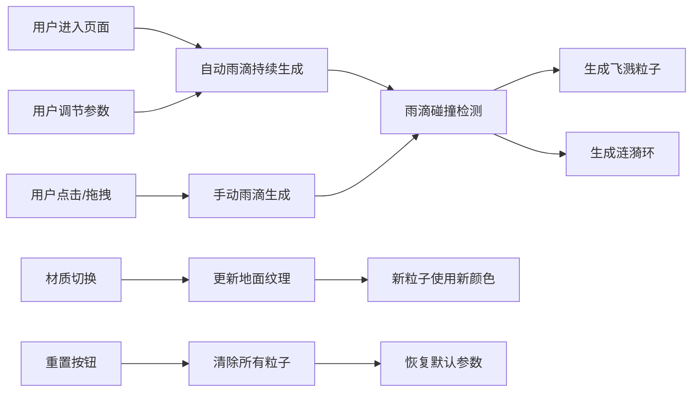

## 1. 产品概述

「雨痕物语」是一款基于 Three.js 的交互式三维粒子模拟应用，面向环境科学教学与动态壁纸设计场景，通过可视化方式展示雨滴落在不同材质表面时的物理效果。

- 核心用途：动态壁纸设计教学演示，环境科学课程辅助工具
- 目标用户：环境科学家、设计师、教育工作者
- 市场价值：提供沉浸式、可交互的雨滴物理效果模拟平台

## 2. 核心功能

### 2.1 用户角色

| 角色 | 注册方式 | 核心权限 |
|------|----------|----------|
| 普通用户 | 直接使用 | 调节参数、切换材质、手动触发雨滴、重置场景 |

### 2.2 功能模块

1. **三维场景**：雨滴粒子系统、飞溅粒子、涟漪环扩散、材质地面平面
2. **交互系统**：鼠标点击/拖拽触发雨滴、相机轨道控制
3. **控制面板**：材质切换、雨滴数量调节、雨滴速度调节、场景重置

### 2.3 页面详情

| 页面名称 | 模块名称 | 功能描述 |
|---------|---------|---------|
| 主页面 | 三维场景 | 实时渲染雨滴下落、碰撞、飞溅、涟漪粒子效果 |
| 主页面 | 控制面板 | 材质切换按钮（4种）、速度滑条、数量滑条、重置按钮 |
| 主页面 | 交互层 | 鼠标点击/拖拽生成雨滴，OrbitControls 相机控制 |

## 3. 核心流程

用户进入页面 → 自动生成雨滴持续下落 → 雨滴击中表面触发飞溅和涟漪 → 用户通过控制面板调节参数/切换材质 → 用户点击/拖拽场景手动生成雨滴 → 用户点击重置恢复默认状态

## 4. 用户界面设计

### 4.1 设计风格

- 主色调：深蓝灰 #1a1a2e，渐变过渡 #0f3460
- 强调色：粉红 #e94560（按钮激活、滑条填充）
- 材质色系：水面 #4A90D9，金属 #C0C0C0，玻璃 #B0E0E6，树叶 #228B22
- 按钮样式：圆形材质按钮（40px），激活状态外发光 + 1.1倍放大，未激活半透明0.5，悬停0.8
- 滑条样式：轨道高度4px，填充色 #e94560，圆形滑块16px带白色外圈
- 过渡动画：所有交互 0.2s ease-out
- 字体：白色标题 20px

### 4.2 页面设计概览

| 页面名称 | 模块名称 | UI 元素 |
|---------|---------|---------|
| 主页面 | 三维场景 | Canvas 画布占满剩余空间，暗色调背景渐变 |
| 主页面 | 控制面板 | 右侧半透明垂直面板（220px宽，rgba(0,0,0,0.6)，圆角12px，内边距16px） |
| 主页面 | 响应式布局 | <768px 时控制面板折叠为底部水平工具栏（80px高） |

### 4.3 响应式

- 桌面端优先：控制面板固定在右侧（宽度220px），场景自适应填充
- 移动端（<768px）：控制面板折叠为底部水平工具栏（高度80px），图标缩小为32px，滑条变为图标按钮点击弹出浮层调节
- 全屏覆盖，无滚动条

### 4.4 3D 场景指导

- 环境：暗色调深蓝灰背景，地面与背景线性渐变过渡
- 光照：环境光 + 方向光，确保粒子可见且有层次感
- 相机：PerspectiveCamera，OrbitControls 轨道控制
- 地面：4x4 单位平面，切换四种材质纹理（水面、金属、玻璃、树叶）
- 粒子：白色半透明椭球雨滴（长度0.15单位），飞溅小粒子带拖尾和生命周期，涟漪环向外扩散淡出
- 性能：粒子缓冲池，总数限制（雨滴≤500，飞溅≤800，涟漪≤60），帧率自适应降级，稳定 30FPS+
