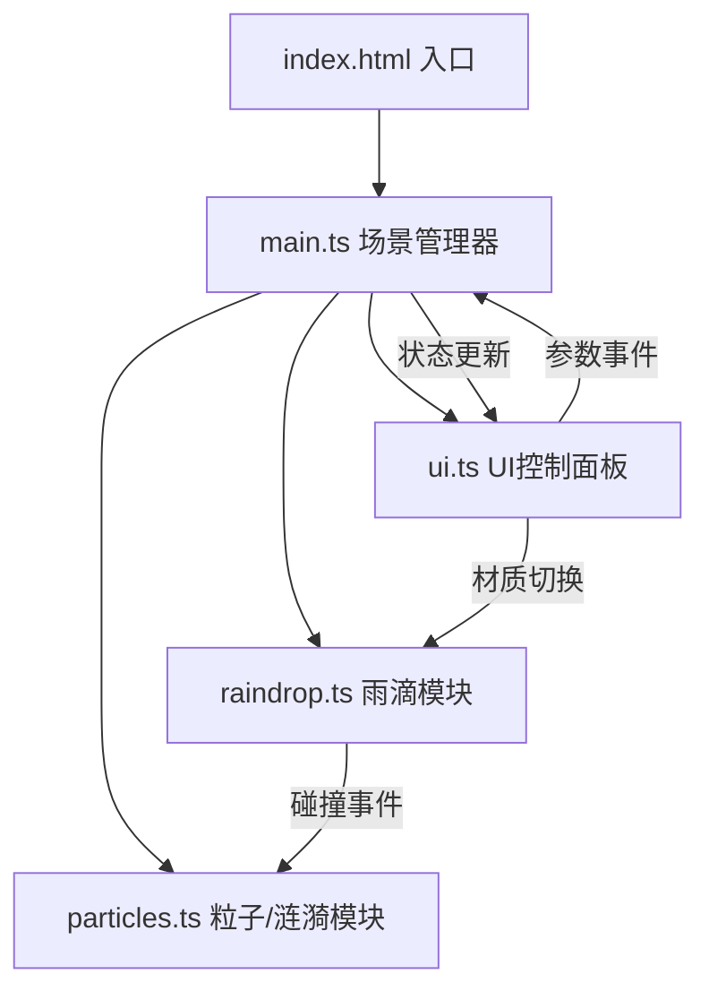

## 1. 架构设计



## 2. 技术选型

- 前端框架：原生 TypeScript + Three.js（不使用 React/Vue，按用户要求）
- 构建工具：Vite（支持 HMR）
- 类型系统：TypeScript 严格模式，目标 ES2020
- 三维引擎：Three.js r160+
- 相机控制：OrbitControls（Three.js 内置）

## 3. 文件结构与职责

```
auto17/
├── package.json              # 项目依赖与启动脚本
├── vite.config.js            # Vite 基础配置
├── tsconfig.json             # TS 严格模式配置
├── index.html                # 入口页面
├── assets/                   # 材质纹理资源
│   ├── water.jpg
│   ├── metal.jpg
│   ├── glass.jpg
│   └── leaf.jpg
└── src/
    ├── main.ts               # 场景初始化、渲染循环、事件分发
    ├── raindrop.ts           # 雨滴生成、运动、碰撞检测
    ├── particles.ts          # 飞溅粒子、涟漪环管理
    └── ui.ts                 # 控制面板渲染与事件发射
```

### 模块调用关系

| 模块 | 输入来源 | 输出去向 | 核心职责 |
|------|---------|---------|---------|
| main.ts | 用户交互事件（DOM）、UI事件 | → raindrop.ts、→ particles.ts | 场景生命周期管理、渲染循环、参数分发 |
| raindrop.ts | main.ts（材质切换、速度参数、手动雨滴） | → particles.ts（碰撞事件） | 雨滴池管理、位置更新、碰撞检测 |
| particles.ts | raindrop.ts（碰撞坐标、材质颜色） | → main.ts（统计信息，可选） | 飞溅粒子池、涟漪环池、生命周期、渲染 |
| ui.ts | main.ts（参数同步） | → main.ts（用户操作事件） | 控制面板 DOM 渲染、事件发射器 |

## 4. 数据流向

```
用户点击/拖拽 → main.ts 接收坐标 → raindrop.ts 创建雨滴
自动生成计时器 → raindrop.ts 创建雨滴
raindrop.ts 更新位置 → 检测 y ≤ 0 → 发射碰撞事件 → particles.ts 生成飞溅+涟漪
UI 滑条拖动 → ui.ts 发射 speed/rate 事件 → main.ts 更新参数 → raindrop.ts 实时生效
UI 材质按钮 → ui.ts 发射 material 事件 → main.ts 更新地面纹理 → raindrop.ts 更新颜色映射
```

## 5. 数据模型

### 5.1 核心类型定义

```typescript
// 材质类型
type MaterialType = 'water' | 'metal' | 'glass' | 'leaf';

// 材质颜色映射
const MATERIAL_COLORS: Record<MaterialType, number> = {
  water: 0x4A90D9,
  metal: 0xC0C0C0,
  glass: 0xB0E0E6,
  leaf: 0x228B22
};

// 雨滴数据
interface Raindrop {
  mesh: THREE.Mesh;
  velocity: number;
  active: boolean;
}

// 飞溅粒子数据
interface SplashParticle {
  mesh: THREE.Mesh;
  velocity: THREE.Vector3;
  life: number;
  maxLife: number;
  color: number;
  trail: THREE.Points;
}

// 涟漪环数据
interface Ripple {
  mesh: THREE.Mesh;
  life: number;
  maxLife: number;
  color: number;
}

// 场景参数
interface SceneParams {
  material: MaterialType;
  raindropSpeed: number;    // 0.5 - 2.0
  raindropRate: number;     // 100 - 500 个/秒
}
```

## 6. 性能策略

1. **粒子缓冲池**：雨滴≤500，飞溅≤800，涟漪≤60，超出时淘汰最老粒子
2. **对象复用**：粒子对象从对象池获取，避免频繁 GC
3. **帧率自适应**：监测 FPS，低于 30 时自动降低雨滴生成率
4. **合并几何体**：使用 InstancedMesh 或 Points 批量渲染同类型粒子
5. **材质共享**：同类粒子共享 Material 实例
