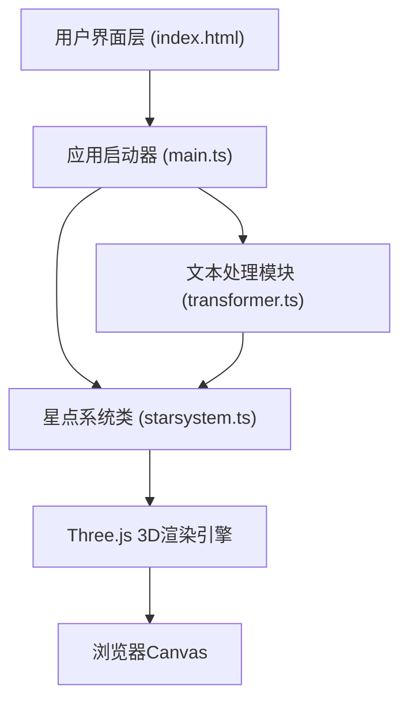

## 1. 架构设计



## 2. 技术描述

- **前端框架**：纯TypeScript + Three.js（无React/Vue，用户指定架构）
- **构建工具**：Vite 5.x，支持HMR热更新
- **核心依赖**：
  - three@^0.160.0：3D渲染引擎
  - @types/three@^0.160.0：TypeScript类型定义
  - typescript@^5.3.0：类型系统
  - vite@^5.0.0：构建与开发服务器

## 3. 文件结构与职责

| 文件路径 | 职责描述 |
|----------|----------|
| [package.json](file:///c:/Users/Administrator/Desktop/VersionFastPro/tasks/auto18/package.json) | 项目依赖管理，npm run dev启动脚本 |
| [vite.config.js](file:///c:/Users/Administrator/Desktop/VersionFastPro/tasks/auto18/vite.config.js) | Vite基础配置，HMR支持 |
| [tsconfig.json](file:///c:/Users/Administrator/Desktop/VersionFastPro/tasks/auto18/tsconfig.json) | TypeScript严格模式，target ES2020 |
| [index.html](file:///c:/Users/Administrator/Desktop/VersionFastPro/tasks/auto18/index.html) | 入口页面，磨砂玻璃UI，Three.js挂载点 |
| [src/main.ts](file:///c:/Users/Administrator/Desktop/VersionFastPro/tasks/auto18/src/main.ts) | 应用入口，初始化Three.js场景，UI事件绑定，数据流管理 |
| [src/transformer.ts](file:///c:/Users/Administrator/Desktop/VersionFastPro/tasks/auto18/src/transformer.ts) | 文本处理：中文分词、词频统计、情感分析、语义聚类算法 |
| [src/starsystem.ts](file:///c:/Users/Administrator/Desktop/VersionFastPro/tasks/auto18/src/starsystem.ts) | 星点系统：创建星点、飞行动画、拖尾粒子、脉冲光晕、连线绘制、旋转控制 |

## 4. 核心数据结构

### 4.1 星点数据 (StarPoint)

```typescript
interface StarPoint {
  id: string;
  text: string;
  frequency: number;      // 词频，决定亮度
  sentiment: 'positive' | 'neutral' | 'negative';  // 情感，决定颜色
  color: string;           // 映射后的颜色值
  brightness: number;      // 映射后的亮度值 0.5-2.0
  startPosition: THREE.Vector3;  // 起始位置（输入框位置）
  targetPosition: THREE.Vector3; // 目标位置（语义聚类位置）
  semanticGroup: number;   // 语义分组ID
  flyDuration: number;     // 飞行时长（错开动画）
  flyDelay: number;        // 飞行延迟
  hasArrived: boolean;     // 是否已到达目标
}
```

### 4.2 连线数据 (Connection)

```typescript
interface Connection {
  from: string;      // 星点ID
  to: string;        // 星点ID
  distance: number;  // 语义距离，决定线宽
  opacity: number;   // 透明度
}
```

## 5. 关键算法设计

### 5.1 中文分词策略
- 使用简单但有效的分词方法：按单字分割 + 常见双字词匹配
- 建立基础词库：常见情感词、停用词表
- 词频统计：Map<string, number> 统计词出现次数

### 5.2 情感分析映射
- 基于关键词匹配的简化情感分析
- 建立积极/消极情感词库（各50+常用词）
- 匹配成功则归类，否则为中性
- 颜色映射：积极→#FFD700，中性→#C0C0C0，消极→#4A90D9

### 5.3 语义聚类与3D坐标生成
- 使用改进的球面K-means算法将语义分组映射到3D球面
- 同组星点在小范围内随机分布，形成星座效果
- 坐标范围：x/y/z ∈ [-8, 8]，避免超出视锥体
- 使用稳定的伪随机数确保相同输入产生相同布局

### 5.4 飞行动画与拖尾效果
- 使用TWEEN.js风格的自定义补间动画（避免额外依赖）
- 缓动函数：easeOutCubic，飞行时长1.5-2.5秒
- 拖尾效果：每个星点维护一个位置历史队列，每帧更新生成粒子
- 拖尾粒子使用渐变透明度，0.2秒后完全消失

### 5.5 脉冲光晕效果
- 星点到达目标时触发，持续0.5秒
- 使用额外的Sprite作为光晕，半径从0放大到10px再缩小到0
- 光晕颜色与星点一致，透明度随半径变化

## 6. 性能优化策略

1. **对象池**：复用星点Sprite和连线几何体，避免频繁GC
2. **批量渲染**：使用InstancedMesh替代多个独立Mesh（200个星点时仍可使用Sprite）
3. **帧率控制**：动画循环使用requestAnimationFrame，必要时启用deltaTime控制
4. **几何体优化**：连线使用BufferGeometry，定期更新顶点数据
5. **透明度管理**：合理设置depthWrite和depthTest，避免排序开销
6. **粒子上限**：拖尾粒子总数限制在1000以内，超出则复用最旧粒子

## 7. 交互事件绑定

| UI元素 | 事件 | 处理逻辑 |
|--------|------|----------|
| 输入框 | input | 实时字数统计，50-200字校验 |
| 转化按钮 | click | 调用transformer处理文本，触发星点系统动画 |
| 速度滑块 | input | 动态调整starsystem.rotationSpeed |
| Canvas | mousedown/mousemove | OrbitControls接管视角控制 |
| Window | resize | 自动调整相机宽高比和渲染器尺寸 |
