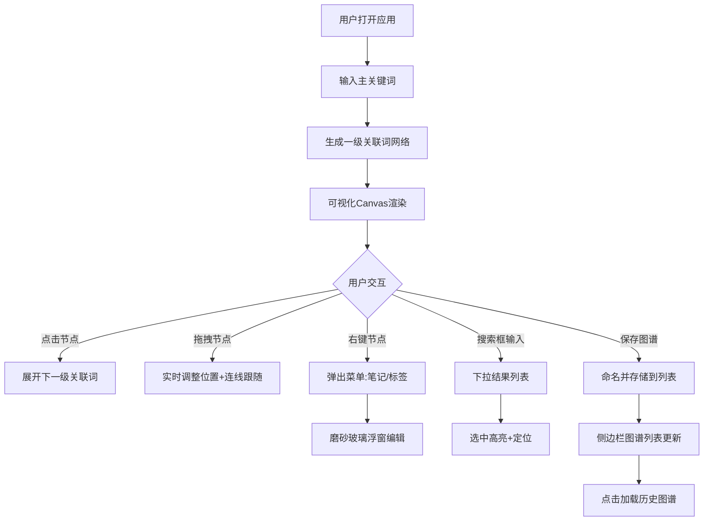

## 1. 产品概述

「词络织梦」是一款面向知识工作者、学习者和创作者的个人知识图谱Web应用，帮助用户通过关键词关联的方式构建、组织和可视化个人知识网络。

- 核心价值：将碎片化知识通过关联词网络进行结构化呈现，支持笔记与标签标注，形成可搜索、可保存的个人知识图谱。
- 目标用户：学生、研究人员、内容创作者、知识管理爱好者。

## 2. 核心功能

### 2.1 用户角色
| 角色 | 注册方式 | 核心权限 |
|------|----------|----------|
| 普通用户 | 无需注册，本地存储 | 创建图谱、编辑节点、添加笔记标签、搜索、保存加载 |

### 2.2 功能模块
1. **主页面（词络图区域）**：关键词输入、Canvas网络图可视化、节点交互（展开/拖拽/右键菜单）
2. **侧边面板**：搜索框、图谱列表、笔记编辑面板
3. **节点笔记系统**：右键弹出浮窗、Markdown笔记编辑、彩色标签管理
4. **图谱管理**：保存命名、列表展示、加载切换
5. **搜索高亮**：节点搜索、关联节点高亮、非相关节点半透明

### 2.3 页面详情
| 页面名称 | 模块名称 | 功能描述 |
|----------|----------|----------|
| 主页面 | 顶部输入区 | 主关键词输入框，提交后生成初始关联词网络 |
| 主页面 | 词络图Canvas | 节点绘制、有向箭头连线、拖拽、缩放、悬停放大、点击光晕 |
| 主页面 | 右键菜单 | 添加笔记、添加标签、删除节点 |
| 侧边面板 | 搜索模块 | 实时搜索节点、下拉结果列表、选中后高亮定位 |
| 侧边面板 | 图谱列表 | 已保存图谱展示、加载切换、删除、重命名 |
| 侧边面板 | 笔记面板 | 选中节点后展示笔记内容、Markdown编辑、标签管理 |
| 笔记浮窗 | 编辑模态框 | 磨砂玻璃效果、Markdown输入、标签逗号分隔输入 |

## 3. 核心流程

### 3.1 主用户流程
用户打开应用 → 输入主关键词（如"人工智能"）→ 系统生成一级关联词网络（机器学习、深度学习等）→ 用户点击节点展开下一级 → 用户拖拽调整布局 → 用户右键节点添加笔记和标签 → 用户在搜索框搜索关键词定位 → 用户保存当前图谱命名 → 用户在侧边栏切换加载历史图谱

### 3.2 流程图

## 4. 用户界面设计

### 4.1 设计风格
- **主色调**：深墨绿 `#0D1B2A` → 暗灰蓝 `#1B263B` 径向渐变背景
- **节点色**：默认钴蓝 `#1E3A5F`，一级节点冷色 `#4A90D9`，叶节点暖色 `#D98A4A`
- **连线**：半透明白 `rgba(255,255,255,0.3)`，有向箭头，粗细表示关联强度
- **字体**：标题使用 `Noto Serif SC`（思源宋体），正文使用 `Noto Sans SC`（思源黑体）
- **按钮风格**：圆角胶囊形，悬浮时微妙上浮+发光
- **图标**：Lucide React 图标库，线性风格
- **整体氛围**：暗色系沉浸式"梦境织网"美学，节点如星辰，连线如思维脉络

### 4.2 页面设计概览
| 页面名称 | 模块名称 | UI元素 |
|----------|----------|--------|
| 主页面 | 词络图区域(70%) | Canvas画布、径向渐变背景、节点(大小=相关性)、有向箭头连线、节点悬停1.2x放大+投影、点击0.6s光晕脉动 |
| 主页面 | 右侧面板(300px固定) | 白色半透明卡片背景、搜索框(聚焦时下展开列表)、图谱列表项(可展开操作)、笔记编辑区(Markdown预览) |
| 笔记浮窗 | 模态层 | 磨砂玻璃`rgba(255,255,255,0.15)`+`backdrop-filter:blur(10px)`、圆角16px、Markdown输入框、标签输入(回车/逗号分隔、彩色小标签) |

### 4.3 响应式
- **桌面端**：左侧70%画布 + 右侧固定300px面板
- **移动端(<768px)**：画布全屏，右侧面板折叠为底部抽屉，点击按钮上滑展开
- **触摸优化**：长按替代右键，双指缩放画布，拖拽节点支持触摸

### 4.4 动画设计
- 节点展开：从父节点径向扩散，弹性缓动 `cubic-bezier(0.34, 1.56, 0.64, 1)`
- 搜索框下拉：低延迟(80ms)渐入展开
- 节点光晕：点击后 `0.6s` 径向扩散脉动
- 图谱切换：淡出 → 新图谱淡入
- 抽屉：底部上滑 `0.3s ease-out`
