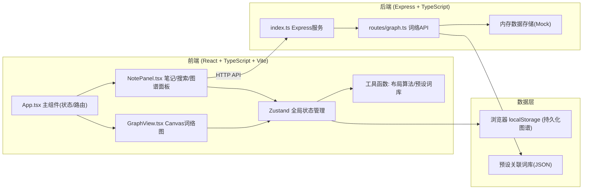
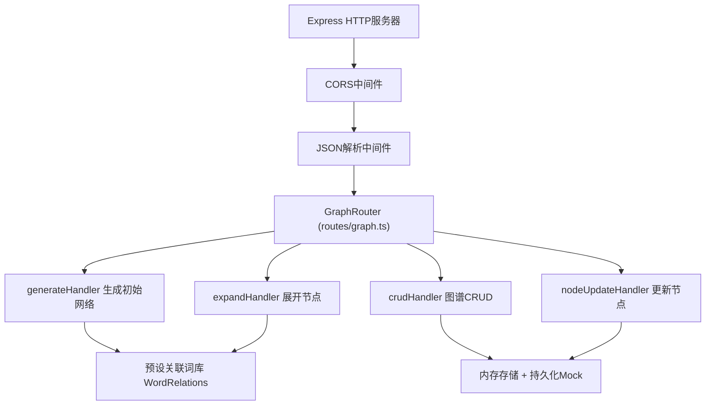
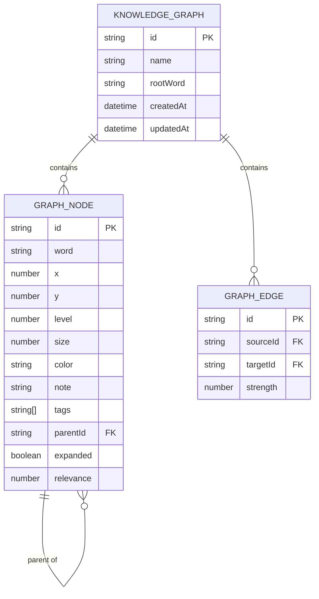

## 1. 架构设计



## 2. 技术说明
- **前端**：React@18 + TypeScript@5 + Vite@5 + Zustand@4
- **后端**：Express@4 + TypeScript@5 + CORS
- **工具库**：uuid (节点ID)、lucide-react (图标)
- **构建**：Vite (React HMR热更新) + 后端TS编译运行
- **数据**：本地内存 + localStorage持久化 + 预设关联词库(Mock)
- **样式**：原生CSS + CSS变量主题系统（不引入Tailwind以减小体积并精确控制Canvas视觉）
- **渲染**：Canvas 2D API，自定义节点/连线绘制，requestAnimationFrame动画循环

## 3. 路由定义
| 路由 | 用途 |
|------|------|
| `/` | 主应用页面（单页应用，React内管理视图状态） |

## 4. API 定义

### 4.1 类型定义
```typescript
interface GraphNode {
  id: string;
  word: string;
  x: number;
  y: number;
  level: number;        // 层级：0=根节点,1=一级,2+叶子
  size: number;         // 节点大小=关联强度
  color: string;        // 节点颜色
  note?: string;        // Markdown笔记
  tags: string[];       // 标签列表
  parentId?: string;    // 父节点ID
  expanded: boolean;    // 是否已展开
  relevance: number;    // 与根节点关联强度 0-1
}

interface GraphEdge {
  id: string;
  sourceId: string;
  targetId: string;
  strength: number;     // 关联强度 0-1，决定线粗
}

interface KnowledgeGraph {
  id: string;
  name: string;
  rootWord: string;
  nodes: GraphNode[];
  edges: GraphEdge[];
  createdAt: number;
  updatedAt: number;
}
```

### 4.2 API端点
| 方法 | 路径 | 请求参数 | 响应 | 说明 |
|------|------|----------|------|------|
| `POST` | `/api/graph/generate` | `{ keyword: string }` | `{ nodes, edges }` | 根据关键词生成初始关联词网络 |
| `POST` | `/api/graph/expand` | `{ nodeId: string, word: string }` | `{ nodes: GraphNode[], edges: GraphEdge[] }` | 展开指定节点的下一级关联词 |
| `GET` | `/api/graph/saved` | - | `KnowledgeGraph[]` | 获取所有已保存图谱列表 |
| `POST` | `/api/graph/save` | `KnowledgeGraph` | `{ id: string }` | 保存图谱到存储 |
| `GET` | `/api/graph/:id` | - | `KnowledgeGraph` | 加载指定图谱 |
| `DELETE` | `/api/graph/:id` | - | `{ success: boolean }` | 删除指定图谱 |
| `PUT` | `/api/graph/node/:id` | `{ note?, tags? }` | `GraphNode` | 更新节点笔记/标签 |

## 5. 服务端架构图



## 6. 数据模型

### 6.1 数据模型ER图


### 6.2 预设关联词库结构
```json
{
  "人工智能": {
    "机器学习": 0.95,
    "深度学习": 0.9,
    "神经网络": 0.88,
    "自然语言处理": 0.82,
    "计算机视觉": 0.8
  },
  "机器学习": {
    "监督学习": 0.9,
    "无监督学习": 0.85,
    "强化学习": 0.8,
    "决策树": 0.75,
    "随机森林": 0.72
  }
}
```
