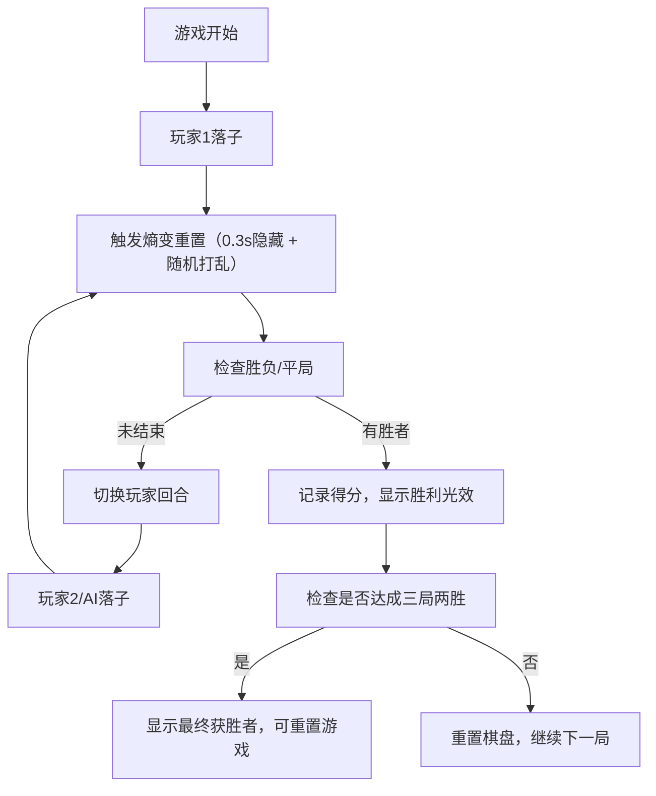

## 1. 产品概述

「熵变棋局」是一款基于 3x3 网格的创新逻辑博弈游戏，融合了经典井字棋规则与随机熵变机制。玩家轮流落子，但每次落子后棋盘会发生随机重置，棋子位置被完全打乱，玩家需要在混乱中重建优势，先形成连续同色线者获胜。

- 核心玩法：策略与随机性的平衡，考验玩家的适应能力和预判能力
- 目标用户：休闲游戏爱好者、喜欢策略博弈的玩家
- 市场价值：提供独特的游戏体验，在经典玩法基础上增加创新机制

## 2. 核心功能

### 2.1 用户角色

| 角色 | 注册方式 | 核心权限 |
|------|----------|----------|
| 玩家 | 无需注册，直接开始 | 进行游戏、切换对战模式、重置游戏 |

### 2.2 功能模块

1. **游戏主界面**：3x3 棋盘、回合提示、得分记录、重置按钮
2. **对战系统**：双人对战 / 人机对战模式切换
3. **熵变机制**：每次落子后触发棋盘随机重置
4. **胜负判定**：横/竖/斜三线判定、平局判定
5. **视觉效果**：落子动画、重置粒子爆散、胜利光效
6. **AI 对手**：简单随机策略 AI

### 2.3 页面详情

| 页面名称 | 模块名称 | 功能描述 |
|----------|----------|----------|
| 游戏主页面 | 棋盘区域 | 3x3 网格交互区域，支持点击落子 |
| 游戏主页面 | 状态显示区 | 左侧回合提示（带动画指示），右侧得分记录（三局两胜） |
| 游戏主页面 | 模式切换 | 双人/人机对战模式切换按钮 |
| 游戏主页面 | 重置按钮 | 右下角重置游戏按钮 |
| 游戏主页面 | 标题区 | 顶部「熵变棋局」标题 |

## 3. 核心流程

游戏核心流程：玩家轮流落子 → 每次落子触发熵变重置 → 判定胜负 → 切换回合 → 循环直至胜负分出 → 三局两胜制。

## 4. 用户界面设计

### 4.1 设计风格

- **主色调**：墨黑（#0D0D0D）→ 暗金（#4A3B1A）径向渐变背景
- **强调色**：金色（#D4AF37）用于棋盘边框、标题、按钮
- **棋子色**：玩家1冰蓝（#4FC3F7），玩家2橙红（#FF7043）
- **按钮风格**：圆角矩形，悬停放大1.05倍
- **字体**：标题使用金色手写风格字体，正文清晰易读
- **布局风格**：居中卡片式布局，最大宽度500px
- **动效风格**：流畅的弹性缩放、粒子爆散、发光效果

### 4.2 页面设计概述

| 页面名称 | 模块名称 | UI 元素 |
|----------|----------|----------|
| 游戏主页面 | 标题区 | 顶部居中「熵变棋局」金色手写字体 |
| 游戏主页面 | 状态区 | 左侧回合指示（小圆点呼吸动画），右侧比分显示 |
| 游戏主页面 | 棋盘区 | 3x3发光金边框网格，半透明深褐格子底色 |
| 游戏主页面 | 模式切换 | 顶部模式切换按钮 |
| 游戏主页面 | 重置按钮 | 右下角金色圆角矩形按钮 |
| 游戏主页面 | 特效层 | Canvas 绘制粒子、动画、光效 |

### 4.3 响应式

- 桌面端优先，最大宽度500px居中显示
- 移动端自适应视口大小，保持正方形棋盘比例
- 触摸操作优化，确保点击区域足够大

### 4.4 Canvas 渲染指导

- **环境**：纯 Canvas 2D 渲染，单页面应用
- **渲染层次**：背景层 → 棋盘网格层 → 棋子层 → 粒子特效层 → 胜利光效层
- **动画帧率**：requestAnimationFrame 驱动，目标60FPS
- **性能控制**：粒子数量≤50，动画总时长≤1秒
- **视觉效果**：发光效果使用 shadowBlur，粒子使用随机速度和衰减
