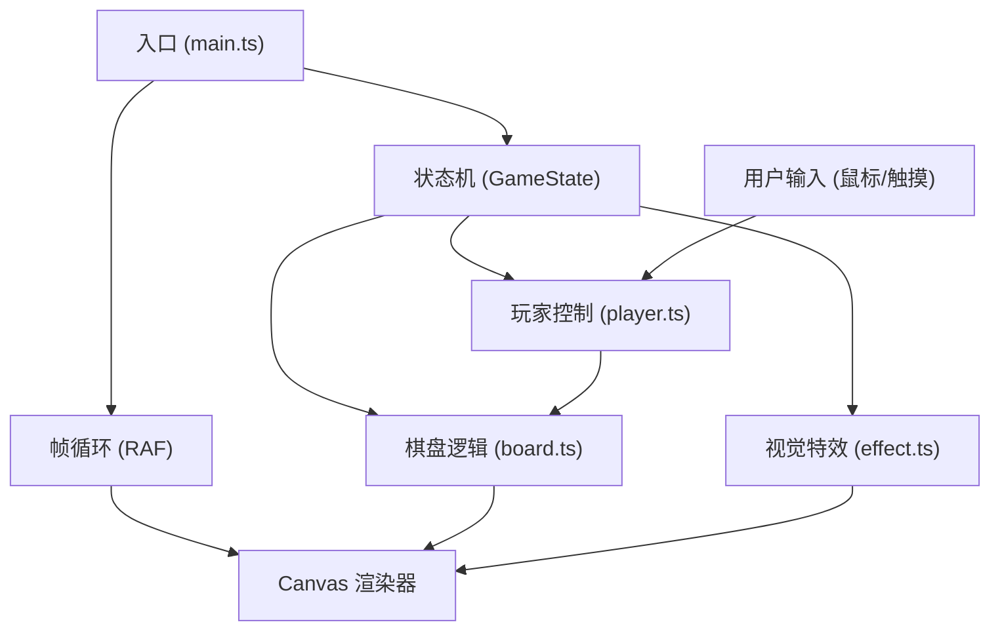

## 1. 架构设计



纯前端单页应用，无后端服务。采用模块化架构，将游戏逻辑、玩家控制、视觉特效分离，通过主入口进行状态管理和帧循环调度。

## 2. 技术描述

- **前端**：TypeScript + Vite + Canvas 2D
- **构建工具**：Vite 5.x，支持 HMR
- **语言标准**：ES2020，严格模式 TypeScript
- **无框架**：纯原生实现，不使用 React/Vue
- **无外部依赖**：仅 typescript 和 vite 作为开发依赖
- **渲染**：Canvas 2D API 实现所有视觉效果

## 3. 文件结构

| 文件路径 | 用途 |
|----------|------|
| `package.json` | 项目配置，依赖：typescript、vite |
| `vite.config.js` | Vite 构建配置，支持 HMR |
| `tsconfig.json` | TypeScript 配置，严格模式，目标 ES2020 |
| `index.html` | 入口页面，启动画面和全局样式 |
| `src/main.ts` | 游戏主入口，状态机管理，帧循环 |
| `src/board.ts` | 棋盘逻辑，网格数据、落子检测、熵变重置、胜负判定 |
| `src/player.ts` | 玩家控制，鼠标事件、回合切换、AI 走法 |
| `src/effect.ts` | 视觉特效，落子动画、粒子爆散、胜利光效 |

## 4. 核心数据模型

### 4.1 类型定义

```typescript
// 棋子类型
type PieceType = 'player1' | 'player2' | null;

// 棋盘状态 3x3
type BoardState = PieceType[][];

// 游戏状态
type GameState = 'idle' | 'playing' | 'resetting' | 'gameOver';

// 玩家类型
type PlayerMode = 'pvp' | 'pve';

// 棋子动画状态
interface PieceAnimation {
  scale: number;
  targetScale: number;
  opacity: number;
}

// 粒子
interface Particle {
  x: number;
  y: number;
  vx: number;
  vy: number;
  color: string;
  size: number;
  life: number;
  maxLife: number;
}
```

### 4.2 核心算法

1. **熵变重置算法**：
   - 收集当前所有棋子（保持颜色比例）
   - Fisher-Yates 洗牌算法打乱顺序
   - 随机分配到9个格子中
   - 保持总棋子数和颜色比例不变

2. **胜负判定算法**：
   - 检查3行、3列、2对角线
   - 任意一线全为同色即获胜
   - 9格填满且无胜者为平局

3. **AI 落子算法**：
   - 收集所有空位
   - 随机选择一个空位落子

## 5. 性能要求

- **帧率**：≥55 FPS
- **粒子数量**：每次重置30-50个，不超过50个
- **动画时长**：
  - 落子动画：0.2秒（弹性缩放 0→1.2→1）
  - 重置隐藏：0.3秒
  - 粒子效果：0.6秒
  - 总动画时长：≤1秒
- **内存管理**：及时清理已完成的动画和粒子对象

## 6. 状态机

```
IDLE → PLAYING → RESETTING → PLAYING → ... → GAME_OVER
         ↓                          ↑
         └─── 落子 → 判定 → 熵变 ───┘
```

状态转换：
- `idle`: 游戏空闲，等待开始
- `playing`: 正常游戏，接受玩家输入
- `resetting`: 熵变重置中，忽略输入
- `gameOver`: 游戏结束，显示结果
