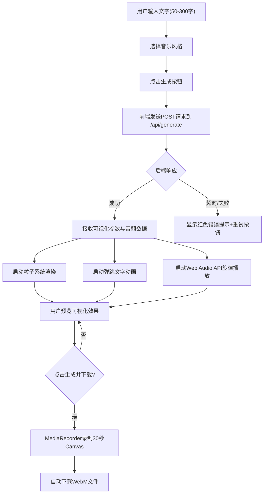

## 1. 产品概述

「余音织梦」是一款将文字情感转化为动态音乐可视化短片的AI驱动Web应用。用户输入50-300字的文字描述后，系统自动分析文字情感极性，生成由流动抽象粒子、发光弹跳关键词和AI合成背景旋律构成的沉浸式短片，支持渲染为WebM视频下载。

- 目标用户：创意写作者、音乐爱好者、视觉艺术创作者、社交媒体内容制作者
- 核心价值：将抽象文字情感具象化为可听可视的艺术体验，降低音视频创作门槛

## 2. 核心功能

### 2.1 用户角色
| 角色 | 注册方式 | 核心权限 |
|------|----------|----------|
| 访客用户 | 无需注册 | 输入文字、选择风格、生成可视化、预览与下载视频 |

### 2.2 功能模块
1. **主页面**：文字输入表单、情感风格选择器、实时可视化预览、视频录制与下载、错误提示与加载状态

### 2.3 页面详情
| 页面名称 | 模块名称 | 功能描述 |
|----------|----------|----------|
| 主页面 | 文字输入区 | 50-300字文本框，白色字体，60%宽度，圆角12px，1px #444边框 |
| 主页面 | 风格选择器 | 四个风格按钮（梦幻/紧张/治愈/史诗），选中高亮主题色，悬停缩放1.05倍，弹性点击动画 |
| 主页面 | 粒子可视化画布 | Canvas绘制150-500个粒子，深空蓝背景，颜色随情感实时变化，正弦波轨迹漂移 |
| 主页面 | 弹跳文字动画 | 3-5个关键词发光弹跳显示，随音乐节奏缩放，淡入+弹跳动画 |
| 主页面 | 背景旋律播放 | Web Audio API生成8小节循环和弦进行，四种风格对应不同和弦 |
| 主页面 | 视频录制下载 | MediaRecorder API录制30秒WebM视频，自动下载 |
| 主页面 | 加载与错误状态 | 旋转加载指示器，15秒超时红色错误提示条+重试按钮 |

## 3. 核心流程

用户打开页面 → 在文本框输入50-300字描述 → 选择音乐风格（梦幻/紧张/治愈/史诗）→ 点击"生成"按钮 → 系统分析文字情感极性 → 后端返回可视化参数 → 前端启动粒子渲染、弹跳文字动画和背景旋律 → 用户预览可视化效果 → 点击"生成并下载"按钮 → 系统录制30秒Canvas动画为WebM → 自动触发下载

## 4. 用户界面设计

### 4.1 设计风格
- **主色调**：深空蓝渐变背景（#0A0A1A → #1A1A2E），灰白文字（#E0E0E0），主题高亮色（#7B68EE）
- **粒子色系**：积极（#FFD700 → #FF69B4）、中性（#E0E0E0）、消极（#1E3A5F → #7B2D8E）
- **按钮风格**：圆角胶囊形，选中时主题色填充，悬停缩放1.05倍，点击弹性动画
- **字体**：显示字体用Noto Serif SC，正文用Noto Sans SC，字号16px基准
- **布局**：垂直居中单栏布局，最大宽度1200px，Canvas区域高度≥500px
- **阴影与边框**：组件带box-shadow 0 4px 12px rgba(0,0,0,0.3)，悬停/聚焦时流动渐变边框动画

### 4.2 页面设计概览
| 页面名称 | 模块名称 | UI元素 |
|----------|----------|--------|
| 主页面 | 文字输入区 | 深色半透明背景，白色文字，圆角12px文本框，流动渐变聚焦边框 |
| 主页面 | 风格按钮组 | 四个水平排列胶囊按钮，选中填充主题色，弹性点击动画 |
| 主页面 | 可视化画布 | 全宽Canvas，深空蓝背景，粒子+弹跳文字+旋律同步 |
| 主页面 | 控制栏 | "生成"按钮 + "生成并下载"按钮，渐变背景，悬停发光 |
| 主页面 | 加载指示器 | 居中蓝色半透明旋转圆（60px），1秒/圈 |
| 主页面 | 错误提示条 | 红色（#FF4444）横幅，含重试按钮 |

### 4.3 响应式设计
- 桌面优先设计，最大宽度1200px居中
- <768px：文本框宽度调整为90%，按钮改为纵向排列，Canvas高度至少400px
- 触控优化：按钮最小点击区域44px，间距适当增加

### 4.4 动效规范
- 粒子漂移：正弦波扰动，幅度2-8px，速度0.5px/帧
- 弹跳文字：0.5秒周期弹跳，高度8-15px，字号20-36px缩放
- 旋律同步：粒子运动和文字弹跳与音频节拍联动
- 加载旋转：CSS rotate 360度，1秒/圈
- 按钮弹性：transform scale弹性过渡，transition timing-function: cubic-bezier
