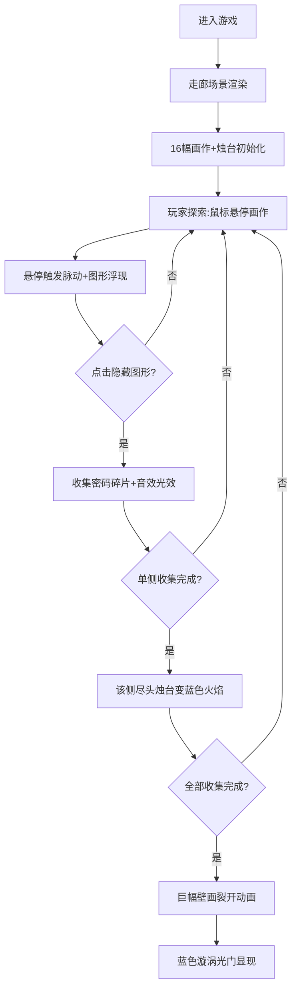

## 1. 产品概述

「烛影谜廊」是一款在浏览器中运行的沉浸式解谜体验游戏。玩家置身于一条由摇曳烛光引导的神秘走廊中，通过探索画作中隐藏的图形来收集密码碎片，最终打开通往下一层的神秘光门。游戏以复古神秘的视觉风格和精巧的互动设计，为玩家带来一场充满探索感的解谜之旅。

- 目标用户：休闲解谜游戏爱好者，追求沉浸式视觉体验的玩家
- 核心价值：通过精细的光影效果和巧妙的谜题设计，营造神秘探索氛围，提供简单上手但富有仪式感的解谜体验

## 2. 核心功能

### 2.1 功能模块

1. **走廊场景系统**：全屏沉浸式透视走廊、深褐色木板地面、粗糙石膏质感墙壁
2. **烛台粒子系统**：每幅画作下方的动态烛台、粒子火焰效果、蓝色火焰特殊状态
3. **画作互动系统**：16幅抽象画作、悬停脉动效果、隐藏图形浮现、点击收集
4. **密码收集系统**：密码碎片收集、进度追踪、收集音效与光效反馈
5. **终局解锁系统**：单侧收集完成触发蓝色火焰、全部收集触发壁画裂开、蓝色漩涡光门显现

### 2.2 页面详情

| 页面名称 | 模块名称 | 功能描述 |
|----------|----------|----------|
| 游戏主界面 | 走廊场景 | 透视视角深褐色木板地面、两侧粗糙石膏质感墙壁、纵深延伸的空间感 |
| 游戏主界面 | 画作阵列 | 两侧墙壁各8幅暗金色画框画作、等间距1.2米悬挂、近大远小透视效果 |
| 游戏主界面 | 烛台系统 | 每幅画下方一盏动态烛台、粒子火焰摇曳效果、烛光投射到墙面的光影 |
| 游戏主界面 | 画作交互 | 初始抽象色块图案、鼠标悬停时画面脉动、隐藏图形逐渐浮现 |
| 游戏主界面 | 收集反馈 | 点击隐藏图形收集密码、触发收集音效、金色光芒扩散效果 |
| 游戏主界面 | 进度提示 | 单侧8幅全部收集后，该侧尽头烛台亮起蓝色火焰 |
| 游戏主界面 | 终局动画 | 全部16幅收集后，走廊尽头巨幅壁画裂开，露出蓝色漩涡光门 |

## 3. 核心流程

玩家进入游戏 → 置身于烛光摇曳的走廊中 → 鼠标悬停探索画作 → 发现隐藏图形 → 点击收集密码碎片 → 收集完一侧8幅后触发蓝色火焰 → 继续收集另一侧 → 全部收集完成 → 壁画裂开 → 蓝色漩涡光门显现

## 4. 用户界面设计

### 4.1 设计风格

- **复古神秘感**：整体色调偏暗，以烛光为主要光源，营造古老神秘的探索氛围
- **主色板**：
  - 深棕底色：`#2C1810`、`#3D1C10`
  - 暗金装饰：画框、烛台金属质感
  - 烛光橙：`#FFB347`、`#FF6D00`，用于火焰和光晕
  - 午夜蓝：`#4A00E0`、`#8E2DE2`，用于收集完成后的特殊光效
- **材质表现**：
  - 画框和烛台使用多层 box-shadow + 渐变模拟金属质感
  - 墙壁为粗糙石膏质感，带有细微纹理
  - 地面为深褐色木板，带有木纹和透视效果
- **动效节奏**：所有过渡动画 300-600ms，ease-out 缓动，营造优雅流畅的交互体验

### 4.2 页面设计概览

| 页面名称 | 模块名称 | UI元素 |
|----------|----------|--------|
| 游戏主界面 | 地面层 | 深褐色木板透视纹理、近大远小纵深效果、烛光照射的明暗变化 |
| 游戏主界面 | 墙壁层 | 两侧粗糙石膏质感墙面、随距离增加的暗角效果、烛光投射的暖光晕 |
| 游戏主界面 | 画作层 | 16幅暗金色画框、抽象色块画布、悬停时的脉动发光效果、隐藏图形半透明浮现 |
| 游戏主界面 | 烛台层 | 金属质感烛台底座、30颗以内粒子组成的动态火焰、火焰摇曳的随机节奏 |
| 游戏主界面 | 收集特效 | 点击时金色光芒从图形中心扩散、密码碎片飞入的动画、粒子爆发效果 |
| 游戏主界面 | 进度标识 | 收集完成的画作微微发光、蓝色火焰烛台标记单侧完成 |
| 游戏主界面 | 终局光门 | 壁画裂缝中透出蓝光、漩涡状旋转光门、渐变紫色神秘光晕 |

### 4.3 响应式

- 全屏 Canvas 自适应 100% 宽高，保持透视比例
- 窗口 resize 时重新计算画作和烛台的透视位置
- 支持鼠标悬停和点击操作
- 移动端适配触摸操作，触摸替代悬停效果

### 4.4 动画设计

- **烛火摇曳**：粒子随机上下浮动，大小和透明度周期性变化，模拟真实火焰跳动
- **画作悬停**：300ms ease-out 过渡，画面轻微脉动放大，隐藏图形从模糊到清晰逐渐显现
- **收集反馈**：点击瞬间 0.2s 金色光芒扩散，图形缩小消失，伴随粒子向上飘散
- **蓝色火焰**：单侧完成时烛火从橙色渐变到蓝色，600ms 平滑过渡
- **壁画裂开**：裂缝从中心向四周蔓延，400ms 后壁画向两侧分开
- **漩涡光门**：蓝色渐变旋转漩涡，带紫色光晕，持续缓慢旋转脉动
