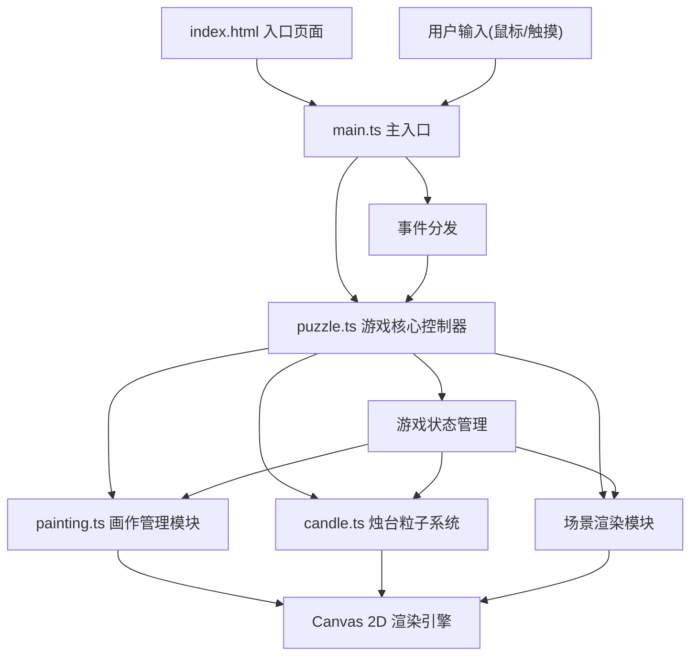

## 1. 架构设计



**数据流向**：用户输入 → main.ts（事件监听）→ puzzle.ts（状态更新/收集逻辑）→ painting.ts / candle.ts（元素状态更新）→ Canvas 2D 绘制 → 屏幕渲染

## 2. 技术说明

- **前端**：TypeScript + Canvas 2D API + Vite
- **构建工具**：Vite（支持 HMR 热更新，快速开发）
- **无后端、无数据库**：纯前端单页游戏体验
- **无第三方 UI 框架**：全部使用 Canvas 原生绘制，精确控制视觉效果
- **音频**：Web Audio API 生成简单音效（可选）
- **性能目标**：16 幅画全动画时帧率不低于 45fps

## 3. 文件结构

| 文件路径 | 职责 | 调用关系 |
|----------|------|----------|
| package.json | 项目依赖与构建脚本 | 被 npm/vite 读取 |
| vite.config.js | Vite 构建配置，支持 HMR 热更新 | 被 vite 读取 |
| tsconfig.json | TypeScript 配置（严格模式，ES2020） | 被 tsc 读取 |
| index.html | 入口页面，全屏 Canvas 容器 | 加载 main.ts |
| src/main.ts | 入口脚本：初始化 Canvas、创建游戏实例、启动主循环、监听用户输入 | 调用 Puzzle 类 |
| src/puzzle.ts | 游戏核心控制器：状态管理、收集进度、画作与烛台协调、终局逻辑 | 调用 Painting 和 Candle |
| src/painting.ts | 画作模块：画作数据、透视位置计算、悬停动画、隐藏图形、收集状态 | 被 Puzzle 调用 |
| src/candle.ts | 烛台模块：粒子系统、火焰动画、蓝色火焰状态、光影投射 | 被 Puzzle 调用 |

## 4. 核心数据模型

### 4.1 粒子数据

```typescript
interface Particle {
  x: number;
  y: number;
  vx: number;
  vy: number;
  size: number;
  baseSize: number;
  life: number;
  maxLife: number;
  color: string;
  alpha: number;
}
```

### 4.2 隐藏图形数据

```typescript
interface HiddenShape {
  type: 'circle' | 'triangle' | 'square' | 'star' | 'diamond';
  x: number;
  y: number;
  size: number;
  rotation: number;
  color: string;
  collected: boolean;
}
```

### 4.3 画作数据

```typescript
interface Painting {
  id: number;
  side: 'left' | 'right';
  index: number;
  x: number;
  y: number;
  width: number;
  height: number;
  perspectiveScale: number;
  zDepth: number;
  isHovered: boolean;
  hoverProgress: number;
  collected: boolean;
  collectProgress: number;
  hiddenShape: HiddenShape;
  colors: string[];
  patternSeed: number;
}
```

### 4.4 烛台数据

```typescript
interface Candle {
  id: number;
  x: number;
  y: number;
  baseWidth: number;
  baseHeight: number;
  perspectiveScale: number;
  zDepth: number;
  isBlue: boolean;
  blueTransition: number;
  particles: Particle[];
  maxParticles: number;
  glowIntensity: number;
}
```

### 4.5 游戏状态

```typescript
interface GameState {
  leftCollected: number;
  rightCollected: number;
  totalCollected: number;
  leftComplete: boolean;
  rightComplete: boolean;
  allComplete: boolean;
  finaleProgress: number;
  doorOpen: boolean;
  time: number;
  deltaTime: number;
}
```

## 5. 性能策略

- **主循环**：使用 `requestAnimationFrame` 驱动动画，保持流畅帧率
- **帧率监控**：实时计算 FPS，低于 45fps 时自动降低远处画作的动画精度
- **粒子池复用**：预分配粒子对象池，避免频繁 GC，每盏烛台粒子数量 ≤ 30 颗
- **分层绘制**：按深度顺序绘制（地面→墙壁→远处画作→近处画作→烛台→特效），减少 overdraw
- **空间裁剪**：视口外的画作和烛台跳过渲染，仅计算可见区域
- **透视缓存**：画作和烛台的透视位置在初始化和 resize 时计算缓存，每帧仅更新动画状态
- **离屏画布**：静态元素（如地面纹理、墙壁纹理）预渲染到离屏 Canvas，提高绘制效率

## 6. 关键算法

### 6.1 透视投影算法

将 3D 空间坐标（走廊纵深）投影到 2D 屏幕坐标，实现近大远小的透视效果：

- 消失点位于屏幕中心水平线上
- 根据 z 轴深度计算缩放比例：`scale = focalLength / (focalLength + zDepth)`
- x 坐标随 z 深度向中心收敛，模拟走廊两侧墙面的透视
- y 坐标随 z 深度上移，模拟地面透视

### 6.2 粒子火焰系统

每盏烛台使用最多 30 颗粒子模拟火焰效果：

- 粒子从烛芯位置向上发射，初始速度随机
- 粒子受轻微横向风力影响，产生摇曳效果
- 粒子大小和透明度随生命周期变化：初生时小而暗，中段明亮，末端淡出
- 使用正弦函数叠加随机扰动，模拟火焰的自然跳动
- 颜色从底部橙红向上渐变到亮黄，蓝色火焰状态下使用蓝紫色调

### 6.3 画作悬停动画

鼠标悬停时画作产生脉动效果，隐藏图形逐渐浮现：

- 使用 `ease-out` 缓动函数控制悬停进度（0 → 1）
- 画作整体轻微放大（1.0 → 1.05），模拟呼吸感
- 隐藏图形使用透明度渐变（0 → 1）+ 模糊滤镜过渡
- 画框光晕强度随悬停进度增强
- 收集后播放反向动画，图形缩小消失

### 6.4 收集进度与终局触发

- 每侧 8 幅画作，独立计数收集进度
- 单侧收集完成时，该侧最远处烛台触发蓝色火焰渐变（600ms 过渡）
- 全部 16 幅收集后，启动终局序列：
  1. 壁画裂缝从中心向四周蔓延（400ms）
  2. 壁画向两侧分开，露出光门（600ms）
  3. 蓝色漩涡光门开始旋转脉动（持续动画）
