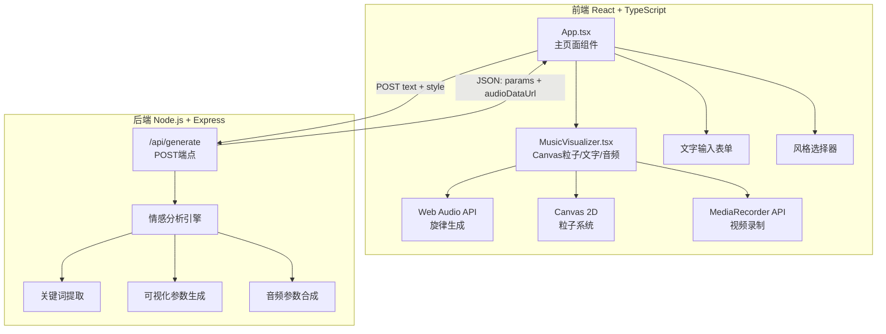
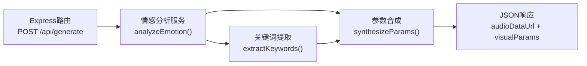

## 1. 架构设计



## 2. 技术说明
- 前端：React@18 + TypeScript + Vite
- 初始化工具：Vite
- 后端：Express@4 + TypeScript + cors
- 数据库：无（纯计算服务，无持久化存储）
- 音频：Web Audio API（4个振荡器 + 增益包络）
- 视频录制：MediaRecorder API + Canvas.captureStream()
- 构建工具：Vite + @vitejs/plugin-react

## 3. 路由定义
| 路由 | 用途 |
|------|------|
| / | 主页面，包含文字输入、风格选择、可视化预览和下载 |

## 4. API定义

### 4.1 POST /api/generate
请求体：
```typescript
interface GenerateRequest {
  text: string;
  style: "dreamy" | "tense" | "healing" | "epic";
}
```

响应体：
```typescript
interface GenerateResponse {
  audioDataUrl: string;
  visualParams: {
    particles: {
      count: number;
      colors: string[];
      sizes: number[];
      speeds: number[];
    };
    keywords: Array<{
      word: string;
      color: string;
      position: { x: number; y: number };
    }>;
    emotionPolarity: number;
    bpm: number;
    chordProgression: string[][];
  };
}
```

### 4.2 情感极性词库与映射规则
- 内置积极词库（如：快乐、幸福、温暖、阳光、希望...）
- 内置消极词库（如：悲伤、孤独、黑暗、恐惧、绝望...）
- 内置中性词库（如：日常、平静、思考、观察...）
- 情感极性值：-1.0（极消极）到 +1.0（极积极）
- 粒子颜色映射：积极→暖金#FFD700到粉色#FF69B4渐变，中性→银白#E0E0E0，消极→深蓝#1E3A5F到紫色#7B2D8E渐变
- BPM映射：积极→120-140，中性→80-100，消极→60-80

### 4.3 和弦进行定义
| 风格 | 和弦进行（8小节循环） | 波形组合 |
|------|----------------------|----------|
| 梦幻(dreamy) | C-F-Am-G-C-F-Dm-G | sine + triangle |
| 紧张(tense) | Am-Dm-Em-Am-F-E-Am-Am | sawtooth + square |
| 治愈(healing) | C-F-G-Am-C-F-G-C | sine + sine |
| 史诗(epic) | Am-G-F-E-Am-G-F-E | square + sawtooth |

## 5. 服务端架构图



## 6. 文件结构

```
├── package.json
├── vite.config.ts
├── tsconfig.json
├── index.html
├── src/
│   ├── client/
│   │   ├── main.tsx          # React应用入口
│   │   ├── App.tsx           # 主页面组件
│   │   └── MusicVisualizer.tsx # 核心可视化组件
│   └── server/
│       └── index.ts          # Express服务端
```

### 6.1 核心模块职责

**App.tsx**：管理应用整体状态（输入文字、选中风格、生成结果、加载/错误状态），渲染表单和可视化组件

**MusicVisualizer.tsx**：
- Canvas粒子系统（requestAnimationFrame循环，150-500粒子，正弦波运动）
- 弹跳文字动画（3-5关键词，淡入+弹跳+缩放）
- Web Audio API旋律生成（4振荡器，8小节和弦循环，包络控制）
- MediaRecorder视频录制（captureStream + 30秒WebM）

**server/index.ts**：
- Express服务，/api/generate端点
- 情感分析：内置极性词库匹配，计算整体情感值
- 关键词提取：词频+情感权重排序，返回3-5个关键词
- 可视化参数生成：粒子数量/颜色/大小/速度，关键词位置/颜色
- 音频参数合成：风格对应和弦、BPM、波形组合
