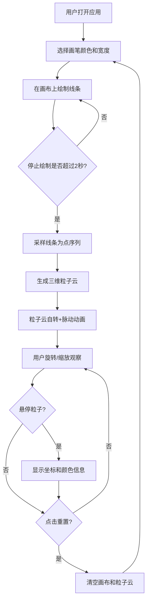

## 1. 产品概述

将二维手绘草图实时转换为动态三维粒子云结构的交互式Web应用，解决二维草图缺乏空间深度和动态表现力的问题。用户用鼠标在屏幕上自由绘制线条或形状，系统自动将绘制内容映射为三维空间中的发光粒子云，形成可从任意角度观察的立体抽象雕塑。

## 2. 核心功能

### 2.1 用户角色
| 角色 | 注册方式 | 核心权限 |
|------|----------|----------|
| 普通用户 | 无需注册 | 绘制草图、生成粒子云、旋转缩放观察、重置画布 |

### 2.2 功能模块
1. **主界面**: 左侧工具栏（色板、画笔宽度、重置按钮）+ 中央画布区域 + 右侧3D粒子云展示区域（画布与3D场景叠加/切换显示）

### 2.3 页面详情
| 页面名称 | 模块名称 | 功能描述 |
|----------|----------|----------|
| 主界面 | 草图绘制画布 | 宽度占80%的黑色画布，支持多色画笔、宽度调节、发光拖尾效果 |
| 主界面 | 色板选择器 | 7色预设色板（红橙黄绿蓝紫白），选中时带发光圆环 |
| 主界面 | 画笔宽度滑块 | 1-10px滑动条，滑块颜色跟随当前画笔颜色 |
| 主界面 | 粒子云生成 | 停止绘制2秒后自动将画布线条采样为3D粒子点阵 |
| 主界面 | 粒子云动画 | 粒子云绕Y轴自转，每个粒子沿法线方向正弦波动，呼吸般脉动 |
| 主界面 | 视角控制 | 鼠标拖拽旋转、滚轮缩放、悬停粒子显示坐标和颜色信息 |
| 主界面 | 重置按钮 | 右上角圆形按钮，清空画布和粒子云，恢复初始视角 |

## 3. 核心流程

用户打开应用后看到黑色画布和左侧工具栏，选择画笔颜色和宽度后在画布上自由绘制，绘制时轨迹带有发光拖尾效果。停止绘制2秒后系统自动采样线条并生成三维粒子云，粒子云在3D场景中缓慢自转和脉动。用户可通过鼠标拖拽从不同角度观察粒子云，滚轮缩放，悬停粒子查看原始坐标。点击重置按钮清空一切重新开始。

## 4. 用户界面设计

### 4.1 设计风格
- 主色调：深空黑 #0B0B1A → #1A1A2E 垂直渐变
- 强调色：粒子颜色（红 #FF3366、橙 #FF9933、黄 #FFD700、绿 #33CC66、蓝 #3399FF、紫 #9966FF、白 #FFFFFF）
- 按钮风格：圆形、半透明毛玻璃、hover上浮
- 字体：IBM Plex Mono（等宽），14px，颜色 #E0E0E0
- 布局风格：左侧工具栏 + 中央画布/3D场景
- 图标风格：简约线条图标

### 4.2 页面设计概述
| 页面名称 | 模块名称 | UI元素 |
|----------|----------|--------|
| 主界面 | 左侧工具栏 | 毛玻璃半透明背景(rgba(255,255,255,0.05))，1px边框(rgba(255,255,255,0.1))，220px宽，元素间距12px，hover上浮效果 |
| 主界面 | 色板 | 7个圆形色块(直径24px)，选中时发光圆环(发光色同色板色，宽2px，偏移3px) |
| 主界面 | 滑动条 | 细线(高4px，圆角2px)，圆形滑块(直径14px，颜色随画笔色) |
| 主界面 | 画布 | 宽80%，最小高400px，背景#0B0B1A，圆形十字准星光标(半径10px) |
| 主界面 | 重置按钮 | 圆形(直径36px)，回收箭头图标#FF4444，hover #FF6666，0.2s过渡动画 |
| 主界面 | 粒子悬停提示 | 半透明深色背景(rgba(0,0,0,0.7))，白色文字，圆角8px |

### 4.3 响应式设计
- 桌面优先设计，画布宽度80%自适应
- 最小高度400px保证绘制空间
- 工具栏固定220px宽度

### 4.4 3D场景指引
- 环境：深空黑背景，无环境光，粒子自发光
- 灯光：无传统灯光，依靠粒子自发光和半透明发光效果
- 相机：透视相机，初始位置适中，支持自由旋转和缩放
- 构图：粒子云居中，整体绕Y轴旋转
- 交互：鼠标拖拽旋转、滚轮缩放、悬停信息展示
- 后处理：粒子发光效果（发光强度随距中心距离递减）
- 性能预算：粒子数上限3000，目标30FPS以上
