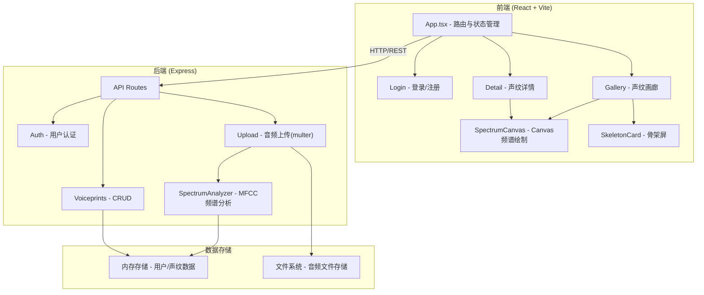
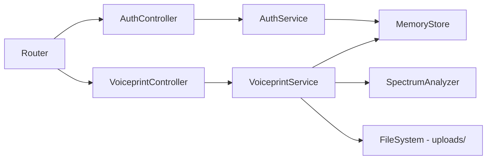
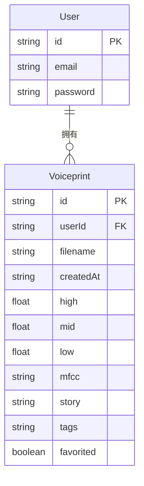

## 1. 架构设计



## 2. 技术说明

- **前端**: React@18 + TypeScript + Vite + TailwindCSS
- **初始化工具**: vite-init (react-express-ts模板)
- **后端**: Express@4 + TypeScript + multer(文件上传) + cors
- **数据库**: 内存存储（Map结构），开发阶段无需外部数据库
- **音频分析**: Node.js原生FFT实现MFCC特征提取
- **Canvas绘制**: 浏览器原生Canvas API，根据频谱数据绘制抽象图

## 3. 路由定义

| 路由 | 用途 |
|------|------|
| `/login` | 登录/注册页面 |
| `/` | 声纹画廊主页（需登录） |
| `/voiceprint/:id` | 声纹图详情页（需登录） |

## 4. API定义

### 4.1 认证相关

```typescript
POST /api/auth/register
Request: { email: string; password: string }
Response: { user: { id: string; email: string }; token: string }

POST /api/auth/login
Request: { email: string; password: string }
Response: { user: { id: string; email: string }; token: string }
```

### 4.2 声纹相关

```typescript
POST /api/voiceprints
Request: FormData { audio: File }
Response: {
  id: string;
  filename: string;
  createdAt: string;
  spectrum: {
    high: number;   // 0-100 高频能量百分比
    mid: number;    // 0-100 中频能量百分比
    low: number;    // 0-100 低频能量百分比
    mfcc: number[]; // MFCC特征向量(13维)
  };
  story: string;
  tags: string[];
  favorited: boolean;
}

GET /api/voiceprints
Query: { search?: string; tag?: string }
Response: Voiceprint[]

GET /api/voiceprints/:id
Response: Voiceprint

PUT /api/voiceprints/:id
Request: { story?: string; tags?: string[]; favorited?: boolean }
Response: Voiceprint

DELETE /api/voiceprints/:id
Response: { success: boolean }

GET /api/voiceprints/search?query=xxx
Response: Voiceprint[]
```

### 4.3 数据类型

```typescript
interface Voiceprint {
  id: string;
  userId: string;
  filename: string;
  createdAt: string;
  spectrum: {
    high: number;
    mid: number;
    low: number;
    mfcc: number[];
  };
  story: string;
  tags: string[];
  favorited: boolean;
}

interface User {
  id: string;
  email: string;
  password: string;
}
```

## 5. 服务端架构图



## 6. 数据模型

### 6.1 数据模型定义



### 6.2 数据存储

- 用户数据：内存Map<string, User>
- 声纹数据：内存Map<string, Voiceprint>
- 音频文件：本地文件系统 uploads/ 目录
- 认证Token：简单JWT模拟（base64编码）
