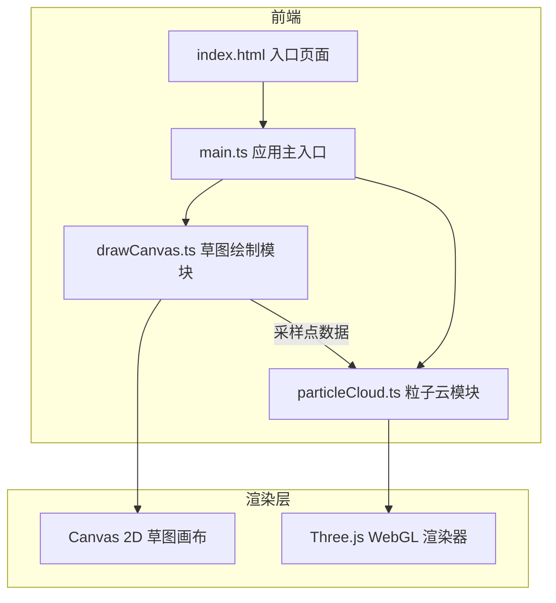
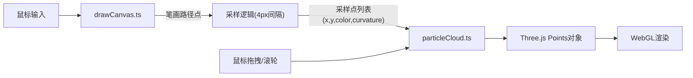

## 1. 架构设计

## 2. 技术说明
- 前端：TypeScript + Three.js + Canvas 2D + Vite
- 初始化工具：Vite
- 后端：无
- 数据库：无

## 3. 文件结构

| 文件路径 | 用途 |
|----------|------|
| package.json | 项目依赖和启动脚本 |
| vite.config.js | Vite构建配置（HMR，端口3000） |
| tsconfig.json | TypeScript配置（严格模式，ES2020） |
| index.html | 入口页面（暗色主题、加载提示、字体链接） |
| src/main.ts | 应用主入口：初始化Three.js场景、相机、渲染器，管理模块，启动动画循环 |
| src/drawCanvas.ts | Canvas 2D草图绘制：鼠标事件、笔画记录、颜色/宽度选择，停止绘制后提取采样点 |
| src/particleCloud.ts | Three.js粒子系统：生成Points对象、z轴映射、波动动画、发光效果、视角控制 |

## 4. 模块职责

### 4.1 main.ts
- 初始化Three.js场景(Scene)、透视相机(PerspectiveCamera)、WebGL渲染器(WebGLRenderer)
- 创建Canvas 2D草图绘制模块实例
- 创建粒子云模块实例
- 管理两个模块之间的数据传递
- 启动requestAnimationFrame动画循环
- 处理窗口resize事件

### 4.2 drawCanvas.ts
- 创建和管理Canvas 2D画布元素
- 绑定鼠标绘制事件(mousedown/mousemove/mouseup)
- 记录笔画路径点序列(含颜色、宽度、时间戳)
- 实现发光拖尾效果绘制
- 管理色板选择和宽度滑块交互
- 停止绘制2秒后触发采样：将线条按4px间隔采样
- 计算每个采样点的曲率
- 将采样点数据(位置x,y,颜色,曲率)传递给粒子云模块
- 管理画笔光标样式(圆形十字准星、颜色预览)

### 4.3 particleCloud.ts
- 接收采样点列表，生成Three.js Points对象
- z轴映射：z = 曲率 × 30，范围限制在[-60, +60]
- 粒子属性：位置(x,y,z)、大小(3-8px随机)、颜色
- 整体旋转：绕Y轴0.5度/秒
- 粒子波动：沿法线方向正弦波动(振幅2-4px，频率0.8-1.2Hz)
- 粒子大小脉动：50%-150%原始大小随波动周期变化
- 发光效果：半透明发光，强度随距中心距离递减
- 鼠标视角控制：拖拽旋转(0.3度/像素)、滚轮缩放(0.3x-3x)
- 粒子悬停检测：显示坐标和颜色信息
- 粒子数量上限：3000，超限时丢弃最旧绘制段

## 5. 数据流

## 6. 关键技术细节

### 6.1 曲率计算
取相邻三个采样点P1、P2、P3，计算P1P2和P2P3的夹角作为曲率近似值。

### 6.2 粒子发光效果
使用自定义ShaderMaterial或PointsMaterial + AdditiveBlending实现发光效果，发光强度 = baseIntensity × (1 - distance/maxLength)。

### 6.3 性能保障
- 粒子上限3000个
- 使用BufferGeometry存储粒子数据
- 动画循环中仅更新变化属性
- 超过3000粒子时FIFO丢弃最旧绘制段
