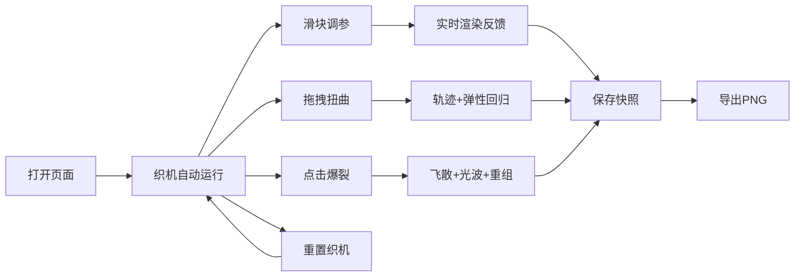

## 1. 产品概述

星尘织机是一款面向数字艺术家的交互式三维粒子纺织工具，用户通过实时调整参数和鼠标交互，驱动数千个发光粒子交织成不断变幻的抽象织物纹理，解决数字艺术创作中缺乏实时交互和随机生成工具的痛点。

- 目标用户：数字艺术家、视觉设计师、创意编程爱好者
- 核心价值：提供沉浸式的粒子织机交互体验，支持实时参数调控与鼠标物理交互，激发创意灵感

## 2. 核心功能

### 2.1 功能模块

1. **织机主画布**：三维粒子织机平面，经纬网格 + 发光粒子，正弦波微振动
2. **参数控制面板**：纱线密度、张力、颜色流速三个滑块控制，实时预览
3. **鼠标交互系统**：拖拽扭曲、点击爆裂、轨迹线特效、环形光波
4. **快捷操作按钮**：重置织机、保存快照

### 2.3 页面详情

| 页面名称 | 模块名称 | 功能描述 |
|---------|---------|---------|
| 主页 | 织机主画布 | 全屏渐变背景，中央三维织机平面（60%宽 × 70%高），2000个彩色粒子组成经纬网格，粒子做正弦波微振动 |
| 主页 | 右侧控制面板 | 磨砂玻璃效果面板（280px宽），三个参数滑块（密度1-10、张力0-10、颜色流速0-5），数值显示+实时缩略预览画布 |
| 主页 | 顶部按钮区 | "重置织机"按钮，500ms动画重置所有粒子和参数 |
| 主页 | 底部按钮区 | "保存快照"按钮，导出PNG截图至本地 |
| 主页 | 鼠标交互 | 拖拽扭曲粒子（最大偏移50px，轨迹线1秒渐隐，弹性回归500ms ease-out） |
| 主页 | 点击爆裂 | 80px半径内粒子飞散变白闪烁，环形光波扩散150px，800ms归位恢复 |

## 3. 核心流程

用户打开页面 → 织机自动运行（粒子微振动、颜色渐变流动） → 用户拖动滑块调整参数（实时反馈） → 用户鼠标拖拽扭曲纹理（轨迹特效 + 弹性回归） → 用户点击触发爆裂（飞散 + 光波 + 重组） → 满意后保存快照 → 或重置织机重新开始

## 4. 用户界面设计

### 4.1 设计风格

- **整体风格**：赛博朋克 + 有机织物质感，暗黑科技美学
- **主色调**：深炭灰 #1A1A1A、暗夜蓝 #0B132B 渐变背景
- **暖色系粒子**：橙红 #FF6B35 → 金色 #FFD700 渐变
- **冷色系粒子**：冰蓝 #4ECDC4 → 紫罗兰 #6C5CE7 渐变
- **发光效果**：所有粒子和控件边缘带微弱发光（box-shadow + shadowBlur）
- **按钮风格**：矩形 120×40px，深色渐变背景，悬停时暖色调渐变过渡
- **字体**：微软雅黑 14px 按钮文字，简洁现代

### 4.2 页面设计概述

| 页面名称 | 模块名称 | UI 元素 |
|---------|---------|--------|
| 主页 | 织机主画布 | 全屏背景径向光晕、60%×70%织机平面居中、经纬半透明发光线、4px彩色粒子、正弦波动效 |
| 主页 | 右侧控制面板 | 280px宽半透明磨砂玻璃、边缘微弱发光、三个滑块（带110%放大反馈动画150ms）、数值整数显示、200×100px预览画布 |
| 主页 | 交互特效 | 6px宽明亮轨迹线（1秒渐隐）、纯白色粒子闪烁（150ms×2次）、环形光波扩散（150px半径400ms） |

### 4.3 响应式

- **桌面端**（≥768px）：织机居中，右侧固定280px控制面板
- **移动端**（<768px）：右侧面板折叠为底部横条（高100px），滑块精简为触摸友好圆钮
- 织机平面保持相对视口比例自适应

### 4.4 性能指标

- 常规状态：2000粒子稳定60FPS
- 爆裂状态：4000粒子（飞散+原始）保持50FPS以上
- 拖拽响应延迟：≤16ms
- 所有动画缓动：200-500ms
