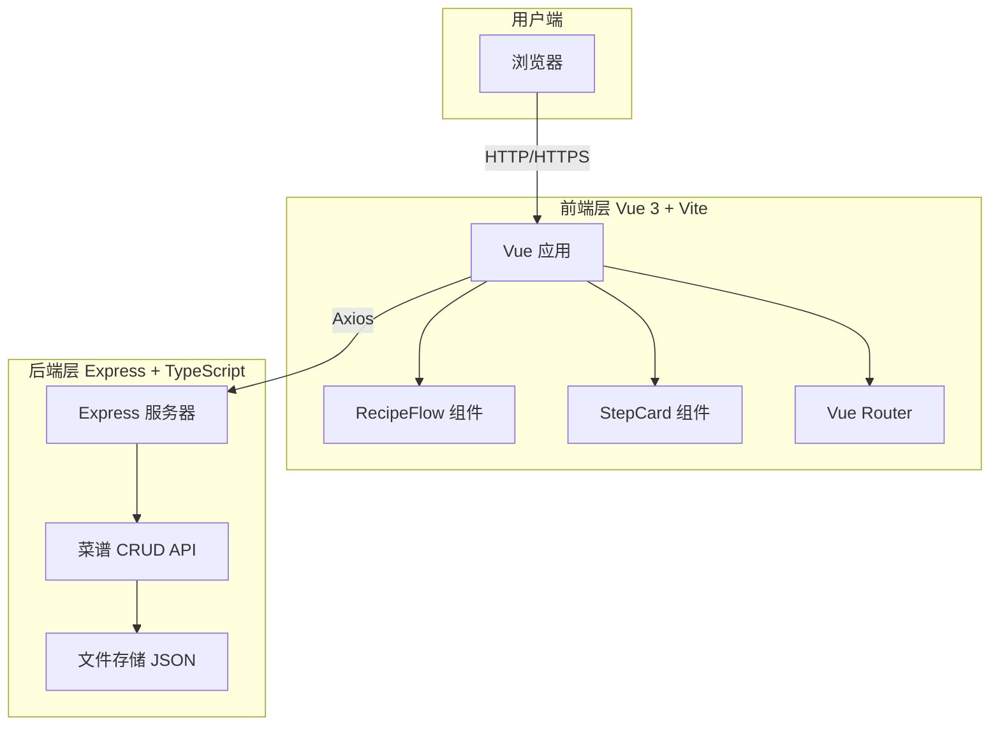
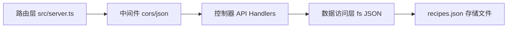

## 1. 架构设计



## 2. 技术描述

- **前端框架**：Vue 3.3 + Composition API + `<script setup>`
- **构建工具**：Vite 5.x + @vitejs/plugin-vue + HMR 热更新
- **路由管理**：vue-router 4.x
- **HTTP 请求**：axios 1.x
- **开发语言**：TypeScript 5.x（严格模式）
- **后端框架**：Express 4.x
- **CORS 支持**：cors 中间件
- **数据存储**：本地 JSON 文件持久化
- **唯一ID**：uuid 生成

## 3. 路由定义

| 路由路径 | 组件/页面 | 用途 |
|----------|-----------|------|
| `/` | RecipeFlow | 首页，展示菜谱输入和流程图导航 |

## 4. API 接口定义

### 4.1 类型定义

```typescript
interface Step {
  id: string;
  index: number;
  title: string;
  action: string;
  ingredients: string[];
  duration: number; // 秒
  detail?: string;
  image?: string;
}

interface Recipe {
  id: string;
  title: string;
  rawText: string;
  steps: Step[];
  createdAt: number;
  updatedAt: number;
}
```

### 4.2 REST API

| Method | Path | Request Body | Response | 功能 |
|--------|------|--------------|----------|------|
| GET | `/api/recipes` | - | `Recipe[]` | 获取所有菜谱列表 |
| GET | `/api/recipes/:id` | - | `Recipe` | 获取单个菜谱详情 |
| POST | `/api/recipes` | `{title, rawText, steps}` | `Recipe` | 创建新菜谱 |
| PUT | `/api/recipes/:id` | `{title?, rawText?, steps?}` | `Recipe` | 更新菜谱 |
| DELETE | `/api/recipes/:id` | - | `{ok: true}` | 删除菜谱 |

## 5. 服务器架构图



## 6. 目录结构

```
auto24/
├── package.json
├── vite.config.js
├── tsconfig.json
├── index.html
├── data/
│   └── recipes.json          # 菜谱数据持久化
└── src/
    ├── main.ts               # Vue 入口
    ├── server.ts             # Express 后端
    ├── router/
    │   └── index.ts          # 路由配置
    └── components/
        ├── RecipeFlow.vue    # 流程图主组件
        └── StepCard.vue      # 步骤卡片组件
```

## 7. 性能与实现要点

### 7.1 计时器精度控制
- 使用 `requestAnimationFrame` 结合 `performance.now()` 时间戳补偿
- 误差控制在 200ms 以内
- 圆形进度条使用 SVG `stroke-dasharray` + `stroke-dashoffset` 动画

### 7.2 流畅动画 60fps
- 所有动画使用 `transform` + `opacity`，避免布局抖动
- 滚动行为使用 CSS `scroll-behavior: smooth`
- Hover 过渡使用 `transition: 0.3s ease`

### 7.3 正则解析规则
- 步骤序号：`/步骤\s*(\d+)\s*[:：]/`
- 时长提取：`/(\d+)\s*(分钟|分|秒)/`
- 食材提取：从操作文本中提取常见食材关键词

### 7.4 连接线光效
- 使用 SVG `<linearGradient>` 定义渐变
- 光点使用 `<circle>` 配合 SVG `<animate>` 每1秒移动
- 渐变颜色：`#FF6B35` → `#F7C948`

### 7.5 进度条颜色渐变
- SVG stroke 颜色根据 progress 插值计算
- 0% → 红色 `#E53E3E`
- 100% → 绿色 `#38A169`
- 中间值使用 RGB 线性插值
