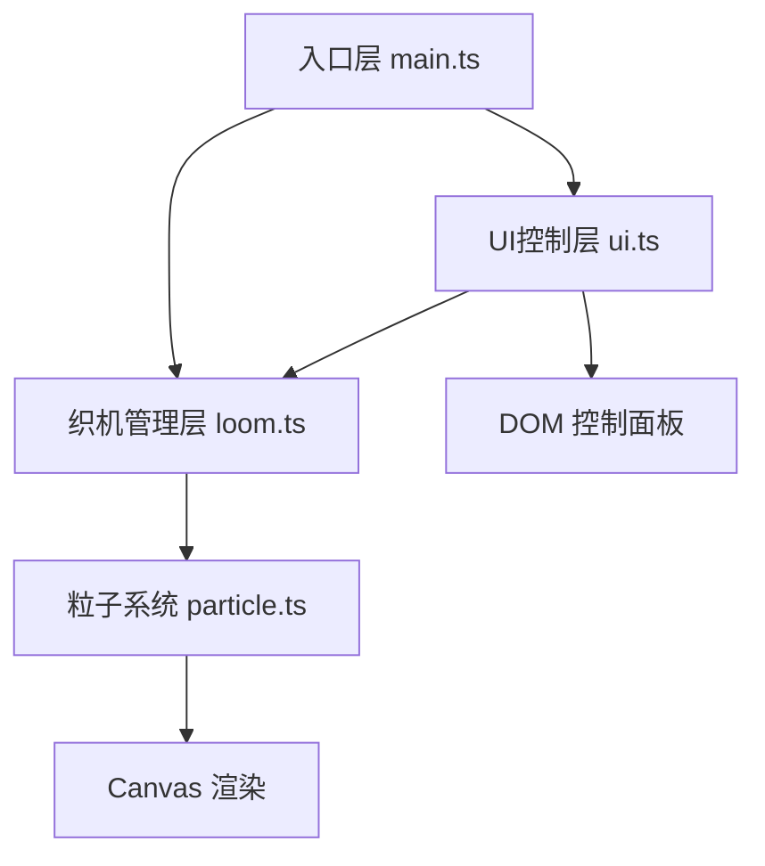

## 1. 架构设计

分层架构：
- **入口层**：初始化 Canvas、绑定事件、主循环（requestAnimationFrame）
- **织机管理层**：管理经纬网格、粒子阵列、参数状态、对外暴露 API
- **粒子系统**：单个粒子的物理行为、颜色过渡、渲染方法
- **UI控制层**：DOM 面板生成、事件绑定、参数转换与调用

## 2. 技术描述

- **前端框架**：原生 TypeScript（无 UI 框架）
- **渲染引擎**：原生 Canvas 2D API（不使用 Three.js）
- **构建工具**：Vite 5 + HMR
- **语言**：TypeScript 5（严格模式，ES2022 目标）
- **包管理**：npm
- **输出目录**：dist

## 3. 文件结构

| 文件路径 | 作用 |
|---------|------|
| `package.json` | 依赖声明（typescript、vite）、启动脚本 |
| `vite.config.js` | Vite 构建配置（HMR、dist 输出） |
| `tsconfig.json` | TypeScript 配置（严格模式、ES2022、bundler） |
| `index.html` | 入口页面（深色渐变背景、标题、引入 main.js） |
| `src/main.ts` | 主入口：Canvas 初始化、事件绑定、主循环 update/render |
| `src/particle.ts` | 粒子类：位置、颜色、速度、状态、update、render |
| `src/loom.ts` | 织机类：网格管理、粒子阵列、参数方法（setDensity/setTension/setColorSpeed/distortRegion/burstAt） |
| `src/ui.ts` | UI 类：右侧面板 DOM 生成、滑块/按钮事件、预览画布 |

## 4. 核心模块设计

### 4.1 Particle 类

**属性：**
- `baseX`, `baseY`：原始经纬位置（锚点）
- `x`, `y`：当前位置
- `vx`, `vy`：速度
- `color`：当前颜色
- `baseColorIndex`：基准色盘索引
- `size`：粒子大小
- `state`：状态（idle / distorted / bursting / returning）
- `phase`：正弦波相位

**方法：**
- `update(deltaTime, tension, colorSpeed, time)`：更新位置、颜色、状态
- `render(ctx)`：绘制粒子（shadowBlur 发光效果）
- `distort(offsetX, offsetY)`：施加扭曲偏移
- `burst(targetX, targetY, distance)`：触发爆裂飞散
- `reset()`：归位到原始位置

### 4.2 Loom 类

**属性：**
- `particles`：粒子数组
- `density`：纱线密度（1-10）
- `tension`：张力（0-10）
- `colorSpeed`：颜色流速（0-5）
- `width`, `height`：织机尺寸
- `warmPalette`：暖色系色盘
- `coolPalette`：冷色系色盘
- `trailPoints`：拖拽轨迹点队列
- `burstRings`：爆裂光波队列

**方法：**
- `initParticles(count)`：初始化粒子网格
- `setDensity(value)`：调整密度，重新布局粒子
- `setTension(value)`：调整张力
- `setColorSpeed(value)`：调整颜色流速
- `distortRegion(centerX, centerY, radius, offsetX, offsetY)`：区域扭曲
- `burstAt(x, y)`：点击爆裂
- `addTrailPoint(x, y)`：添加轨迹点
- `update(deltaTime)`：更新所有粒子和特效
- `render(ctx)`：渲染织机（网格+粒子+轨迹+光波）
- `reset()`：重置所有状态

### 4.3 UI 类

**属性：**
- `panel`：面板 DOM 元素
- `sliders`：滑块元素集合
- `valueDisplays`：数值显示元素
- `previewCanvas`：预览画布
- `resetBtn`, `saveBtn`：按钮元素

**方法：**
- `createPanel()`：创建控制面板 DOM
- `bindEvents(loom)`：绑定事件，调用 loom 方法
- `updateValues(density, tension, colorSpeed)`：更新数值显示
- `updatePreview(loom)`：更新预览画布
- `onReset(callback)`：重置按钮回调
- `onSave(callback)`：保存按钮回调

## 5. 性能优化策略

- **对象池**：粒子复用，避免频繁 GC
- **批量绘制**：同类粒子一次路径绘制，减少 state 切换
- **离屏计算**：颜色插值预计算，避免每帧重复计算
- **轨迹优化**：固定长度轨迹队列，超出自动移除
- **requestAnimationFrame**：严格60帧循环，deltaTime 时间步长
- **Canvas 层级**：可考虑双层 Canvas（静态网格 + 动态粒子），但单 Canvas 已足够

## 6. 动画缓动函数

- 弹性回归：`easeOutCubic(t) = 1 - (1-t)³`
- 爆裂飞散：`easeOutQuad(t) = 1 - (1-t)²`
- 光波扩散：线性 + 透明度衰减
- 滑块反馈：150ms 放大到 110%，再恢复
