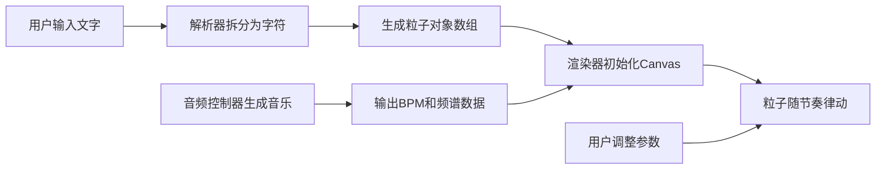

## 1. 产品概述

「词间潮汐」是一款交互式文字节奏可视化器，让用户输入的文字字符变成随背景音乐律动起伏的粒子，构成一片有节奏的潮汐文字海。

- 主要面向前端设计师、音乐爱好者和创意工作者，提供沉浸式的文字音乐可视化体验
- 核心价值在于将静态文字转化为动态的、可交互的视听艺术作品

## 2. 核心功能

### 2.1 用户角色
| 角色 | 注册方式 | 核心权限 |
|------|---------|----------|
| 普通用户 | 无需注册 | 使用全部可视化功能，调整参数 |

### 2.2 功能模块
1. **主画布区域**：粒子文字渲染、星空背景、光晕效果
2. **文字输入模块**：支持中英文输入，最多200字符
3. **音频控制模块**：Web Audio API生成电子氛围音乐，支持三种音色风格
4. **交互控制面板**：播放/暂停、速度调节、粒子大小调节、音色切换

### 2.3 页面详情
| 页面名称 | 模块名称 | 功能描述 |
|---------|---------|----------|
| 主页面 | 文字输入框 | 半透明磨砂玻璃效果，支持粘贴输入，实时字符数统计 |
| 主页面 | Canvas画布 | 75vh高度，粒子文字渲染，星空背景，光晕效果 |
| 主页面 | 控制面板 | 折叠式设计，播放/暂停按钮，速度滑块(0.5x-2.0x)，粒子大小滑块(8px-24px)，音色切换 |
| 主页面 | 加载提示 | 深色主题加载动画 |

## 3. 核心流程

用户打开页面 → 输入/粘贴文字 → 文字被解析为粒子数组 → 音频自动开始播放 → 粒子随音乐节奏律动 → 用户可调整速度、大小、音色等参数 → 可随时暂停/播放

## 4. 用户界面设计

### 4.1 设计风格
- **主色调**：深蓝#0B101E到纯黑#000000径向渐变背景
- **渐变色彩**：冷色#2C3E50→#3498DB到暖色#E74C3C→#F39C12的水平渐变
- **玻璃效果**：backdrop-filter: blur(12px)，边框rgba(255,255,255,0.1)
- **发光效果**：交互元素悬停时0.2px发光外扩
- **字体**：选用现代感强的无衬线字体，支持中英文渲染

### 4.2 页面设计概述
| 页面名称 | 模块名称 | UI元素 |
|---------|---------|--------|
| 主页面 | 文字输入框 | 半透明背景，圆角，磨砂玻璃效果，字符计数 |
| 主页面 | Canvas画布 | 全屏宽度，75vh高度，居中显示 |
| 主页面 | 控制面板 | 右侧固定，折叠/展开滑入动画(0.4s ease-in-out)，按钮脉冲呼吸动画(1.5s循环) |
| 主页面 | 粒子效果 | Y轴正弦波动+音频振幅调制，水平颜色渐变，每10秒色相偏移5度，底部垂直光晕 |
| 主页面 | 星空背景 | 随机生成的静态星星，缓慢闪烁 |

### 4.3 响应式设计
- **桌面端**(≥768px)：控制面板固定右侧，画布居中
- **移动端**(<768px)：控制面板移至底部，折叠为横向图标按钮组
- **字体缩放**：根据视口宽度自动等比例缩放，最小1rem，最大1.8rem
- **粒子间距**：随视口宽度自动调整

### 4.4 动画与交互细节
- 控制面板展开/收起：0.4秒ease-in-out滑入动画
- 按钮悬停：0.2秒发光外扩效果
- 控制按钮：1.5秒循环的脉冲呼吸动画
- 所有参数调整：0.3秒ease-out平滑过渡
- 粒子颜色漂移：每10秒整体色相偏移5度
