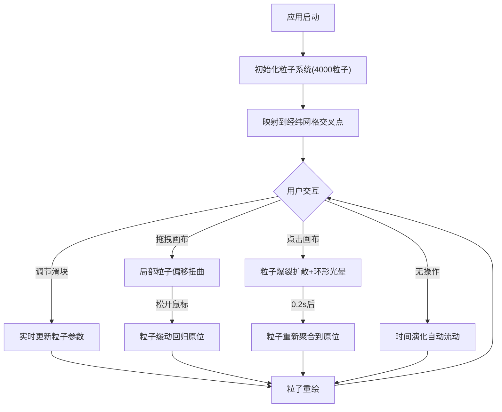

## 1. 产品概述

「星尘织机」是一款交互式浏览器粒子艺术应用，用户通过调节纱线密度、张力、颜色渐变等参数，驱动4000个发光粒子在虚拟经纬网格上交织成不断变幻的织物纹理。支持鼠标拖拽扭曲纹理、点击触发粒子爆裂重组，以深色宇宙风格营造沉浸式视觉体验。

- 目标用户：创意工作者、视觉艺术爱好者、交互设计探索者
- 核心价值：将传统纺织工艺的经纬交织概念转化为实时粒子物理模拟，提供直观的参数化创作体验

## 2. 核心功能

### 2.1 功能模块

1. **织机画布页面**：全屏Canvas粒子系统、参数控制面板、实时帧率显示

### 2.2 页面详情

| 页面名称 | 模块名称 | 功能描述 |
|---------|---------|---------|
| 织机画布 | 粒子系统 | 4000个粒子在经纬网格交叉点上渲染，带浮动偏移、透明度变化、颜色插值 |
| 织机画布 | 参数控制面板 | 纱线密度/张力/颜色渐变偏移三个滑块，磨砂玻璃风格面板 |
| 织机画布 | 拖拽交互 | 鼠标拖拽使区域内粒子偏移，松开后平滑回归 |
| 织机画布 | 点击爆裂 | 点击触发粒子向外爆炸扩散后重新聚合，带环形光晕特效 |
| 织机画布 | 时间演化 | 颜色随时间偏移流动，正弦波横向波动，透明度微调模拟丝绸光泽 |
| 织机画布 | 帧率监控 | 实时FPS显示，低帧率变色警告 |

## 3. 核心流程

用户打开应用 → 粒子系统初始化4000个粒子映射到经纬网格 → 用户通过滑块调节参数实时改变纹理 → 用户拖拽扭曲局部纹理 → 用户点击触发爆裂重组动画 → 纹理持续随时间演化流动

## 4. 用户界面设计

### 4.1 设计风格

- 主色调：深炭灰(#1A1A1A)、暗夜蓝(#0B132B)，背景径向渐变
- 强调色：紫(#9B59B6)、蓝(#3498DB)、青(#1ABC9C)、金(#F1C40F)渐变序列
- 控制面板：磨砂玻璃风格(rgba(26,26,26,0.7) + backdrop-filter: blur(10px))
- 边框：半透明白色(rgba(255,255,255,0.1))，圆角12px
- 字体：14px白色，滑块轨道#333深灰
- 过渡动画：300ms ease-out

### 4.2 页面设计概览

| 页面名称 | 模块名称 | UI元素 |
|---------|---------|--------|
| 织机画布 | Canvas画布 | 占视口85%宽×95%高，居中，深色径向渐变背景，边缘柔和晕影 |
| 织机画布 | 控制面板 | 固定右侧220px宽，磨砂玻璃质感，三个自定义滑块+数值显示 |
| 织机画布 | 帧率显示 | 左下角14px字体，半透明背景，低FPS变色(橙/红) |
| 织机画布 | 光线特效 | 面板右侧2px宽渐变光线，参数变化时从顶到底流动 |
| 织机画布 | 环形光晕 | 点击爆炸时从中心扩展到150px，透明度0.8→0，持续500ms |

### 4.3 响应式设计

- 桌面端(≥800px)：画布85%宽居中，控制面板固定右侧
- 移动端(<800px)：纵向布局，画布占上60%，面板移至底部100%宽，帧率移至画布左上角

### 4.4 动画与视觉反馈

- 粒子浮动：每帧±1px无规则偏移
- 拖拽偏移：最大30px，1秒ease-out回归
- 点击爆裂：0.2s扩散至200px → 0.8s聚合回原位，颜色白→金→原色
- 颜色流动：每帧偏移0.02单位(最大速度)
- 正弦波动：频率0.02，振幅由张力控制
- 透明度闪烁：0.6-1.0随机微调
- 光线流动：400ms完成一次完整流动(参数变化>0.2时)
