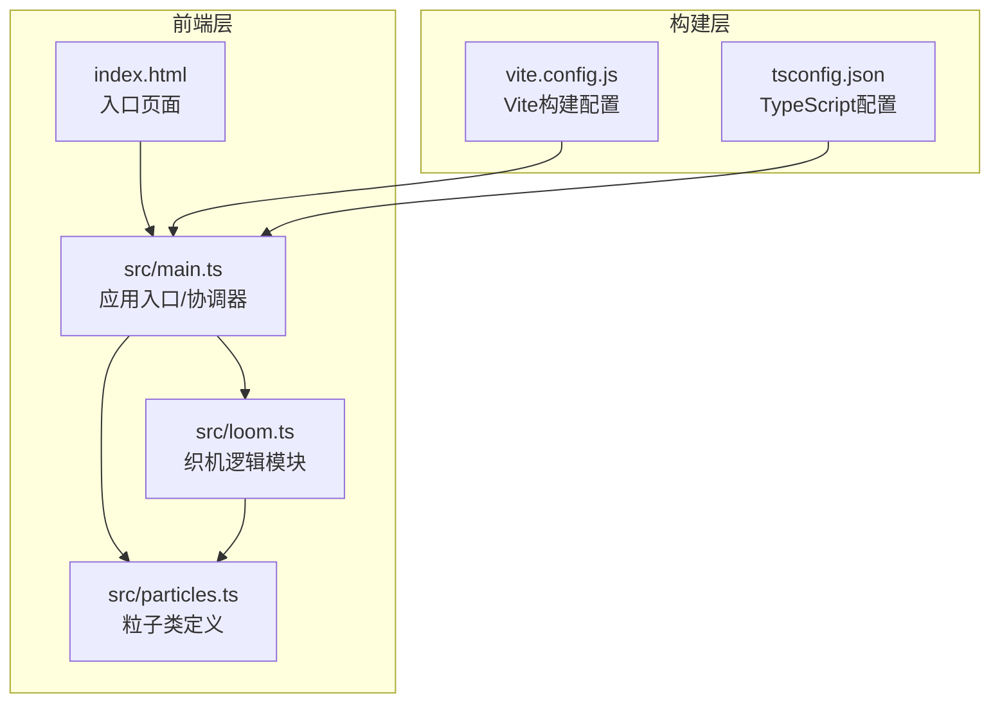

## 1. 架构设计



## 2. 技术说明

- 前端：原生 TypeScript + Canvas 2D API（无框架依赖）
- 构建工具：Vite + TypeScript
- 初始化工具：npm init vite（vanilla-ts模板）
- 后端：无
- 数据库：无

### 依赖清单

| 依赖 | 版本 | 用途 |
|------|------|------|
| typescript | latest | 类型检查与编译 |
| vite | latest | 开发服务器与构建 |

## 3. 文件结构

| 文件路径 | 职责 |
|---------|------|
| package.json | 项目依赖与启动脚本(npm run dev) |
| vite.config.js | Vite基础构建配置，支持HMR |
| tsconfig.json | 严格模式，目标ES2020 |
| index.html | 入口页面，深炭灰到暗夜蓝渐变背景 |
| src/main.ts | 应用入口：初始化Canvas、粒子系统、参数面板，协调各模块 |
| src/particles.ts | 粒子类：位置、速度、颜色、生命周期；更新和绘制方法 |
| src/loom.ts | 织机逻辑：经纬网格生成、粒子运动约束、交互事件响应 |

## 4. 模块接口定义

### 4.1 Particle 类 (src/particles.ts)

```typescript
interface ParticleState {
  x: number;
  y: number;
  originX: number;
  originY: number;
  vx: number;
  vy: number;
  color: string;
  originalColor: string;
  alpha: number;
  baseAlpha: number;
  radius: number;
  life: number;
  maxLife: number;
  dragging: boolean;
  dragOffsetX: number;
  dragOffsetY: number;
  exploding: boolean;
  explodeProgress: number;
  explodePhase: 'explode' | 'gather';
  colorPhase: 'white' | 'gold' | 'original';
}
```

### 4.2 Loom 模块 (src/loom.ts)

```typescript
interface LoomParams {
  density: number;
  tension: number;
  colorShift: number;
}

interface LoomState {
  gridWidth: number;
  gridHeight: number;
  particles: Particle[];
  params: LoomParams;
}
```

### 4.3 Main 入口 (src/main.ts)

```typescript
interface AppState {
  canvas: HTMLCanvasElement;
  ctx: CanvasRenderingContext2D;
  loom: LoomState;
  fps: number;
  isDragging: boolean;
  mouseX: number;
  mouseY: number;
  prevMouseX: number;
  prevMouseY: number;
}
```

## 5. 性能策略

- 4000粒子单次遍历更新+绘制，使用requestAnimationFrame
- 避免每帧创建对象，预分配粒子数组
- Canvas 2D批量绘制：按颜色分组减少fillStyle切换
- 鼠标交互使用空间索引优化（网格分区）减少距离计算
- 目标：50FPS以上稳定运行
