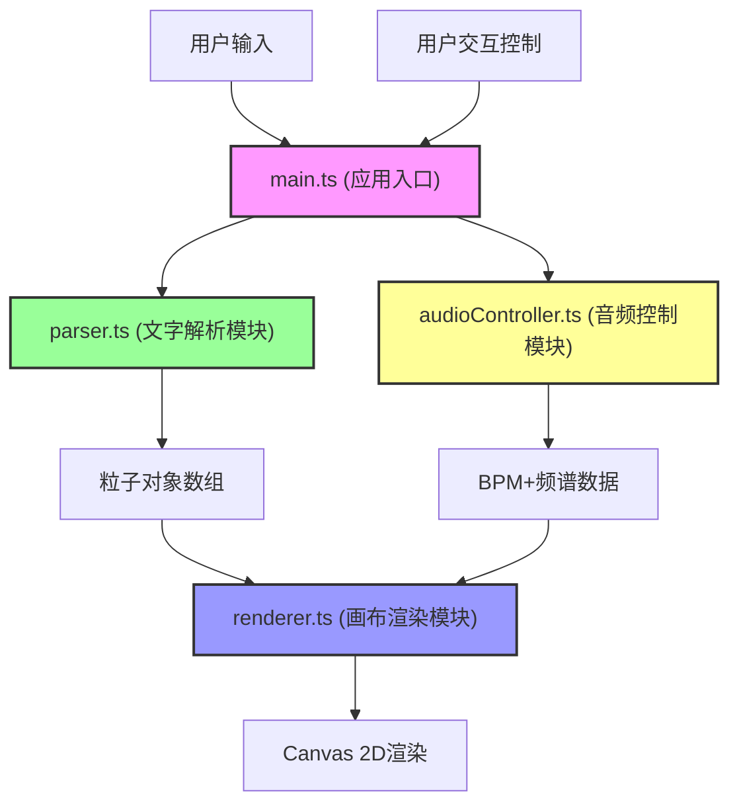

## 1. 架构设计

本项目为纯前端应用，采用模块化架构，各模块职责单一，数据流向清晰。



**模块调用关系与数据流向：**

1. **main.ts** ↔ **parser.ts**：文字 → 粒子数组（单向数据流）
2. **main.ts** → **renderer.ts**：粒子数组 + 控制参数（单向）
3. **main.ts** ↔ **audioController.ts**：播放/暂停/音色控制 → 音频输出 + 频谱数据（双向）
4. **audioController.ts** → **renderer.ts**：BPM + 频谱数据（单向，通过main.ts中转）
5. **renderer.ts** → Canvas DOM：绘制操作（单向）

## 2. 技术栈

- **前端框架**：原生 TypeScript（无UI框架，直接操作DOM和Canvas）
- **构建工具**：Vite 5.x，支持HMR
- **语言标准**：TypeScript 5.x 严格模式，目标 ES2020
- **图形渲染**：HTML5 Canvas 2D API
- **音频处理**：Web Audio API（原生）
- **样式方案**：原生 CSS（CSS变量，无CSS框架）

## 3. 文件结构与职责

```
.
├── package.json              # 项目配置与依赖
├── vite.config.js            # Vite构建配置
├── tsconfig.json             # TypeScript配置（严格模式）
├── index.html                # 入口页面
└── src/
    ├── main.ts               # 应用入口，数据流协调
    ├── parser.ts             # 文字解析模块
    ├── renderer.ts           # 画布渲染模块
    ├── audioController.ts    # 音频控制模块
    └── types.ts              # 类型定义（新增，用于跨模块类型共享）
```

### 各文件详细职责

#### 3.1 main.ts（应用入口）
- 监听文字输入变化，触发解析流程
- 协调各模块间的数据流向
- 管理动画循环（requestAnimationFrame）
- 处理用户交互（播放/暂停、参数调节）
- 音频分析数据采样控制（每3帧抽取一次）

#### 3.2 parser.ts（文字解析模块）
- 输入：原始文字字符串
- 输出：Particle[] 粒子对象数组
- 计算：每个字符的初始位置、字体大小、颜色索引、水平偏移量
- 限制：最多处理200个字符

#### 3.3 renderer.ts（画布渲染模块）
- 输入：粒子数组、音频分析数据、控制参数
- 输出：Canvas绘制结果
- 功能：
  - 逐帧更新粒子Y轴位置（正弦波+音频调制）
  - 颜色渐变与漂移效果
  - 透明度随字符权重变化
  - 背景星空效果
  - 字符底部光晕线条

#### 3.4 audioController.ts（音频控制模块）
- 基于Web Audio API生成4小节循环电子氛围音乐
- 支持三种音色风格：柔和、明亮、暗黑
- 随机BPM（60-120）
- 输出：实时频谱数据、BPM值
- 提供：播放/暂停、音色切换接口

#### 3.5 types.ts（类型定义）
- 定义Particle接口
- 定义AudioData接口
- 定义ControlParams接口
- 定义音色风格类型

## 4. 核心数据结构

### 4.1 Particle 粒子对象

```typescript
interface Particle {
  char: string;           // 字符内容
  x: number;              // X轴位置（像素）
  baseY: number;          // Y轴基准位置
  offsetY: number;        // Y轴当前偏移量
  fontSize: number;       // 字体大小（像素）
  colorIndex: number;     // 颜色索引（0-1，用于渐变）
  opacity: number;        // 透明度（0-1）
  scale: number;          // 缩放比例
  weight: number;         // 字符权重（用于透明度计算）
  phase: number;          // 正弦波相位
  frequency: number;      // 波动频率
}
```

### 4.2 AudioData 音频数据

```typescript
interface AudioData {
  bpm: number;                    // 节拍速度
  bassAmplitude: number;          // 低频振幅（0-1）
  midAmplitude: number;           // 中频振幅（0-1）
  highAmplitude: number;          // 高频振幅（0-1）
  spectrum: Float32Array;         // 完整频谱数据
  isPlaying: boolean;             // 播放状态
}
```

### 4.3 ControlParams 控制参数

```typescript
interface ControlParams {
  speed: number;          // 播放速度（0.5-2.0）
  particleSize: number;   // 粒子基础大小（8-24px）
  toneStyle: 'soft' | 'bright' | 'dark';  // 音色风格
  isPlaying: boolean;     // 播放状态
  hueOffset: number;      // 色相偏移量（动态更新）
}
```

## 5. 性能优化策略

### 5.1 帧率保障
- 动画循环使用 requestAnimationFrame
- 单帧计算耗时控制在12ms以内
- 粒子数量上限：200个
- 目标帧率：60FPS，最低不低于55FPS

### 5.2 音频分析优化
- 音频分析数据获取与帧率解耦，每3帧抽取一次
- 使用 AnalyserNode 的 getFloatFrequencyData
- 频谱数据缓存，避免重复计算

### 5.3 渲染优化
- Canvas 离屏绘制（如需复杂背景）
- 粒子更新与渲染分离，批量处理
- 避免在循环中创建新对象，复用对象池
- 使用 requestAnimationFrame 而非 setInterval

### 5.4 内存管理
- 粒子数组复用，避免频繁GC
- 音频资源在暂停时挂起，恢复时继续
- 事件监听器在组件销毁时移除

## 6. 类型定义（TypeScript）

```typescript
// types.ts
export type ToneStyle = 'soft' | 'bright' | 'dark';

export interface Particle {
  char: string;
  x: number;
  baseY: number;
  offsetY: number;
  fontSize: number;
  colorIndex: number;
  opacity: number;
  scale: number;
  weight: number;
  phase: number;
  frequency: number;
}

export interface AudioData {
  bpm: number;
  bassAmplitude: number;
  midAmplitude: number;
  highAmplitude: number;
  spectrum: Float32Array;
  isPlaying: boolean;
}

export interface ControlParams {
  speed: number;
  particleSize: number;
  toneStyle: ToneStyle;
  isPlaying: boolean;
  hueOffset: number;
}

export interface Star {
  x: number;
  y: number;
  size: number;
  opacity: number;
  twinkleSpeed: number;
  twinklePhase: number;
}
```

## 7. 关键算法

### 7.1 粒子Y轴偏移计算
```
offsetY = sin(phase + time * frequency * speed) * baseAmplitude 
        + bassAmplitude * globalWaveHeight
        + highAmplitude * localJitter
```

### 7.2 颜色渐变算法
- 水平位置映射到冷→暖渐变（0→1）
- 每10秒整体色相偏移5度
- 使用 HSL 颜色空间进行色相旋转

### 7.3 字符权重计算
- 中英文混合计算：中文字符权重1.2，英文字符权重1.0
- 标点符号权重0.8
- 空格权重0.3
- 权重影响透明度和波动幅度
