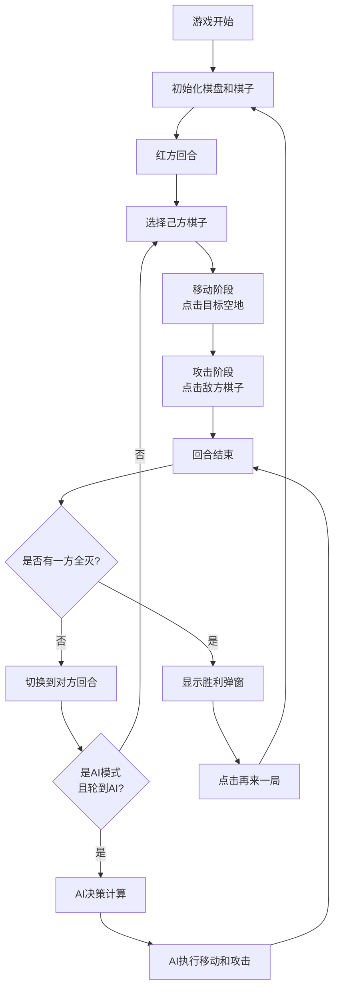

## 1. 产品概述

「暗影棋盘」是一款浏览器端的双人格斗策略游戏，玩家通过拖拽棋子进行回合制对战，结合策略走位、技能释放和能量系统，体验紧凑刺激的棋盘战斗。

- **核心玩法**：8x8棋盘上红蓝双方各5个棋子（国王、骑士、弓箭手），轮流移动和攻击，消灭对方所有棋子获胜
- **目标用户**：喜欢策略对战游戏的玩家，支持双人同屏对战和人机对战
- **游戏价值**：轻量级浏览器游戏，无需安装，即开即玩，兼具策略深度和视觉表现力

## 2. 核心功能

### 2.1 用户角色

| 角色 | 进入方式 | 核心权限 |
|------|----------|----------|
| 红方玩家 | 游戏开始默认操控红方 | 移动红方棋子、攻击蓝方棋子、释放技能 |
| 蓝方玩家 | 双人模式下操控蓝方 | 移动蓝方棋子、攻击红方棋子、释放技能 |
| AI对手 | AI模式下自动操控 | 自动计算最优走位和攻击策略 |

### 2.2 功能模块

1. **棋盘系统**：8x8棋盘渲染、棋子布局、位置查询、点击和拖拽事件处理
2. **棋子系统**：三类棋子（国王、骑士、弓箭手）属性定义、生命值、攻击力、移动/攻击范围
3. **战斗系统**：拖拽攻击判定、伤害计算、粒子爆炸效果、死亡动画
4. **技能系统**：三类特殊技能（暗影庇护、突袭冲锋、贯穿之箭）、能量条积累与释放
5. **回合系统**：回合切换、移动+攻击阶段管理、胜负判定
6. **AI系统**：minimax算法（深度3）AI决策、200ms响应时间限制
7. **UI界面**：回合提示、双方状态面板、胜利动画、再来一局按钮

### 2.3 页面详情

| 页面名称 | 模块名称 | 功能描述 |
|----------|----------|----------|
| 游戏主界面 | 棋盘区域 | 8x8暗色棋盘，棋子渲染，拖拽交互，高亮提示 |
| 游戏主界面 | 回合提示区 | 当前回合方显示，旋转光圈动画 |
| 游戏主界面 | 双方状态面板 | 剩余棋子数量、总生命值显示 |
| 游戏主界面 | 模式切换按钮 | 双人模式/AI模式切换 |
| 游戏主界面 | 胜利弹窗 | 胜利牌匾动画、金色粒子雨、再来一局按钮 |

## 3. 核心流程

### 3.1 游戏主流程

游戏开始 → 初始化棋盘和棋子 → 红方回合 → 选择棋子 → 移动阶段 → 攻击阶段 → 回合结束 → 切换到蓝方 → 循环直到一方全灭 → 胜利判定 → 显示胜利弹窗 → 再来一局/重新开始

### 3.2 拖拽攻击流程

按下棋子 → 拖拽移动 → 悬停目标格高亮 → 释放鼠标 → 判定是否有效攻击 → 播放攻击动画 → 扣减生命值 → 判定死亡 → 回合结束

## 4. 用户界面设计

### 4.1 设计风格

- **主题风格**：暗影主题，深色基调，神秘氛围
- **主色调**：深灰 `#1A1A2E` 作为背景主色，暗红 `#E94560` 作为红方强调色
- **辅助色**：深蓝 `#4A90D9`（蓝方）、金色 `#FFD700`（高亮/胜利）、红色 `#FF0000`（错误提示）
- **棋盘色**：深灰 `#2C2C3A` 和深蓝 `#1A1A3A` 交替
- **字体**：使用具有力量感的无衬线字体，标题加粗，正文清晰
- **视觉层次**：棋子发光效果、粒子动画、光晕脉冲，营造战斗氛围

### 4.2 页面设计概览

| 页面名称 | 模块名称 | UI元素 |
|----------|----------|--------|
| 游戏主界面 | 棋盘区域 | 8x8方格、圆形棋子、角色符号、能量条、高亮提示 |
| 游戏主界面 | 左侧回合区 | 回合文字、旋转光圈动画、脉冲效果 |
| 游戏主界面 | 右侧状态区 | 双方棋子数量、生命值总计、队伍色标识 |
| 游戏主界面 | 顶部/底部按钮 | 模式切换按钮、再来一局按钮 |
| 游戏主界面 | 胜利弹窗 | 居中放大牌匾、金色粒子雨、胜利文字 |

### 4.3 响应式设计

- **桌面端**：棋盘宽度自适应，最小500px，最大800px，高宽比1:1，居中显示
- **移动端**（宽度<600px）：棋盘宽度为屏幕的90%，棋子和文字适配缩放
- **触摸优化**：拖拽支持触摸事件，点击区域适当放大

### 4.4 动画与特效

- **棋子悬停**：放大1.15倍 + 淡蓝色光晕（半径5px，透明度30%）
- **可移动棋子**：底部脉冲光环（周期0.8s，向外扩散）
- **目标高亮**：可达目标黄色半透明（#FFD700，50%透明度）
- **不可达提示**：红色半透明闪烁（#FF0000，2Hz，0.5秒）
- **攻击效果**：10-15个发光碎片爆炸（队伍色，半径30px，0.4秒）
- **伤害数字**：抖动效果（幅度3px，持续0.2秒）
- **死亡效果**：20个碎片分解（持续0.6秒）
- **回合切换**：中心闪光扩散（最大半径100px，持续0.3秒）
- **胜利动画**：牌匾放大出现 + 金色粒子雨（持续2秒）
- **能量条**：灰色渐变到队伍色

## 5. 棋子与技能设定

### 5.1 棋子属性

| 棋子类型 | 生命值 | 攻击力 | 移动范围 | 攻击范围 | 数量 |
|----------|--------|--------|----------|----------|------|
| 国王 | 15 | 3 | 3x3 | 1格 | 1 |
| 骑士 | 10 | 5 | 3x3 | 1格 | 2 |
| 弓箭手 | 8 | 4 | 3x3 | 2格 | 2 |

### 5.2 特殊技能

| 棋子类型 | 技能名称 | 技能效果 | 冷却 |
|----------|----------|----------|------|
| 国王 | 暗影庇护 | 自身周围2格内所有己方棋子获得持续2回合的护盾（吸收5点伤害） | 每3回合 |
| 骑士 | 突袭冲锋 | 直线移动3格并攻击路径上第一个敌人 | 每3回合 |
| 弓箭手 | 贯穿之箭 | 攻击直线2格内的所有敌人（穿透伤害，伤害减半） | 每3回合 |

### 5.3 能量系统

- 初始能量：0点
- 每次造成或受到伤害：+10点
- 满能量：100点（可释放技能）
- 能量条显示：棋子下方，灰色渐变到队伍色
