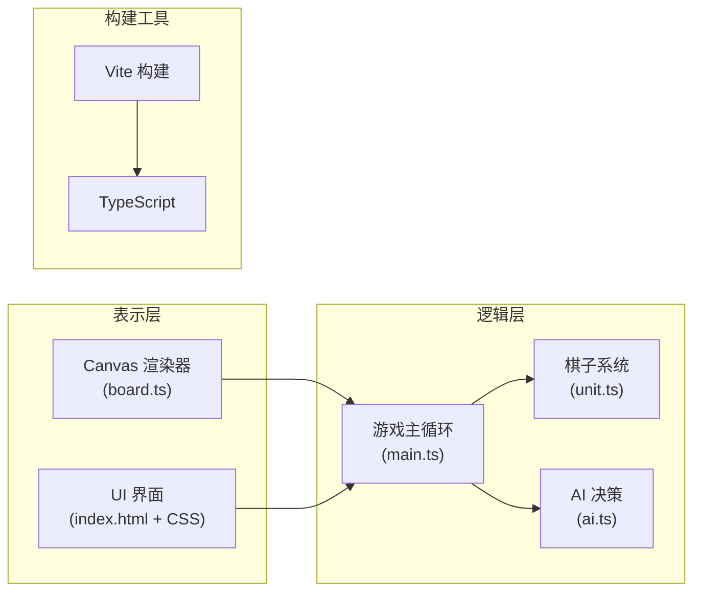

## 1. 架构设计

「暗影棋盘」采用纯前端 Canvas 渲染架构，使用 TypeScript 编写，Vite 作为构建工具，支持热更新（HMR）。



## 2. 技术说明

- **前端框架**：原生 TypeScript + HTML5 Canvas（无框架依赖）
- **构建工具**：Vite 5.x（支持 HMR、快速构建）
- **语言版本**：TypeScript 5.x，目标 ES2020，严格模式
- **渲染方式**：Canvas 2D API，60FPS 游戏循环
- **无后端**：纯前端游戏，所有逻辑在浏览器端运行

## 3. 文件结构

```
project/
├── package.json          # 项目依赖和脚本
├── vite.config.js        # Vite 配置
├── tsconfig.json         # TypeScript 配置
├── index.html            # 入口页面
└── src/
    ├── main.ts           # 游戏主循环、回合管理、状态机
    ├── board.ts          # 棋盘渲染、拖拽交互、位置查询
    ├── unit.ts           # 棋子类、属性、技能、粒子效果
    └── ai.ts             # minimax AI 算法、决策逻辑
```

## 4. 核心模块说明

### 4.1 main.ts - 游戏主控制器

**职责**：
- 游戏主循环（requestAnimationFrame，60FPS）
- 回合状态机管理（选择棋子 → 移动 → 攻击 → 结束回合）
- 胜负判定
- 全局事件协调
- 粒子系统管理

**核心类型**：
```typescript
type GamePhase = 'select' | 'move' | 'attack' | 'skill' | 'aiThinking' | 'gameOver';
type Team = 'red' | 'blue';

interface GameState {
  phase: GamePhase;
  currentTeam: Team;
  selectedUnit: Unit | null;
  board: Board;
  turnCount: number;
  winner: Team | null;
  aiMode: boolean;
}
```

### 4.2 board.ts - 棋盘系统

**职责**：
- 8x8 棋盘渲染
- 棋子位置管理和查询
- 鼠标/触摸事件处理（点击、拖拽）
- 移动/攻击范围高亮显示
- 坐标转换（网格坐标 ↔ 像素坐标）

**核心接口**：
```typescript
class Board {
  gridSize: number;
  cellSize: number;
  
  getUnitAt(x: number, y: number): Unit | null;
  getMoveRange(unit: Unit): Position[];
  getAttackRange(unit: Unit): Position[];
  screenToGrid(screenX: number, screenY: number): Position | null;
  render(ctx: CanvasRenderingContext2D): void;
}
```

### 4.3 unit.ts - 棋子系统

**职责**：
- 棋子属性定义（生命值、攻击力、类型、队伍）
- 移动/攻击范围计算
- 特殊技能实现
- 粒子效果系统（攻击爆炸、死亡碎片）
- 能量条管理
- 护盾系统

**核心类**：
```typescript
type UnitType = 'king' | 'knight' | 'archer';

class Unit {
  id: string;
  type: UnitType;
  team: Team;
  hp: number;
  maxHp: number;
  attack: number;
  moveRange: number;
  attackRange: number;
  position: Position;
  energy: number;
  shield: number;
  shieldTurns: number;
  skillCooldown: number;
  
  takeDamage(damage: number): number;
  canUseSkill(): boolean;
  useSkill(board: Board): SkillResult;
}
```

### 4.4 ai.ts - AI 决策系统

**职责**：
- minimax 算法（深度 3）
- 局面评估函数
- 最优移动和攻击决策
- 响应时间控制（< 200ms）

**核心接口**：
```typescript
class AI {
  depth: number;
  
  findBestMove(board: Board, team: Team): MoveAction | null;
  evaluateBoard(board: Board, team: Team): number;
  minimax(board: Board, depth: number, alpha: number, beta: number, isMax: boolean, team: Team): number;
}
```

## 5. 性能优化

- **渲染优化**：仅在需要时重绘，使用 requestAnimationFrame
- **粒子池**：对象池复用粒子，减少 GC
- **AI 优化**：alpha-beta 剪枝，限制搜索深度，超时终止
- **动画控制**：粒子总数限制在 100 以内
- **响应式**：Canvas 尺寸自适应，高 DPI 屏幕适配

## 6. 数据模型

### 6.1 位置与坐标

```typescript
interface Position {
  x: number;  // 网格 x 坐标 (0-7)
  y: number;  // 网格 y 坐标 (0-7)
}
```

### 6.2 粒子系统

```typescript
interface Particle {
  x: number;
  y: number;
  vx: number;
  vy: number;
  color: string;
  size: number;
  life: number;
  maxLife: number;
}
```

### 6.3 动画状态

```typescript
interface DamageNumber {
  x: number;
  y: number;
  value: number;
  life: number;
  shakeOffset: number;
}

interface TurnFlash {
  radius: number;
  maxRadius: number;
  life: number;
  color: string;
}
```
