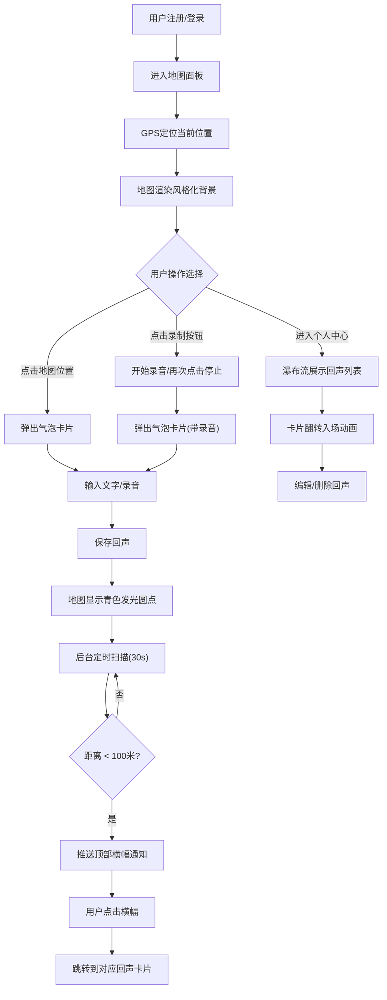

## 1. 产品概述

「回声备忘录」是一款基于地理位置的语音/文字笔记应用，允许用户在地图上标记位置并留下语音或文字「回声」，当其他用户靠近该位置（100米内）时自动触发通知推送。

- 核心目的：将记忆与物理空间绑定，创造「空间胶囊」式的社交体验
- 目标用户：喜欢探索城市、记录生活点滴、分享隐藏故事的年轻用户群体
- 产品价值：让每个地点都承载独特的声音与故事，创造发现式的社交互动

## 2. 核心功能

### 2.1 用户角色
| 角色 | 注册方式 | 核心权限 |
|------|---------|---------|
| 普通用户 | 用户名注册 | 创建/编辑/删除回声、浏览地图、接收位置通知、查看个人中心 |

### 2.2 功能模块
1. **地图面板页**：全屏风格化地图、GPS定位、回声标记点显示、录音悬浮按钮、气泡卡片弹窗
2. **回声卡片组件**：录音波形可视化、文字输入框、保存/取消/编辑/删除操作
3. **通知横幅组件**：位置触发通知、滑入滑出动画、点击跳转
4. **个人中心页**：瀑布流回声列表、卡片翻转入场动画、编辑删除功能
5. **后台扫描服务**：每30秒坐标扫描、100米距离判定、通知推送

### 2.3 页面详情
| 页面名称 | 模块名称 | 功能描述 |
|---------|---------|---------|
| 地图面板页 | 风格化地图 | 藏蓝到暮光紫圆形渐变全屏渲染，Leaflet地图库实现 |
| 地图面板页 | 定位系统 | 默认聚焦当前/模拟GPS位置，支持手动拖拽缩放 |
| 地图面板页 | 悬浮录制按钮 | 60px直径毛玻璃按钮，点击变红脉冲动画，Web Audio API录音 |
| 地图面板页 | 气泡卡片弹窗 | 点击地图任意位置弹出，含三角箭头、磨砂玻璃背景、12px圆角 |
| 地图面板页 | 回声标记点 | 8px青色发光圆点，2.5秒呼吸动画，悬停放大20px显示摘要 |
| 地图面板页 | 通知横幅 | 顶部右侧滑入左侧滑出，暗琥珀色渐变，4秒停留 |
| 个人中心页 | 瀑布流列表 | 每张卡片280px宽，20px间隔，从底部翻转入场动画 |
| 个人中心页 | 回声卡片 | 发布时间、地理位置名称、编辑删除按钮 |

## 3. 核心流程

用户注册后进入地图面板，系统定位到当前位置。用户可点击右下角录制按钮或点击地图任意位置创建回声。选择录音或输入文字后保存，回声以青色发光圆点显示在地图上。后台每30秒扫描所有坐标，当其他用户进入100米范围时触发顶部横幅通知。用户可在个人中心以瀑布流形式查看和管理自己发布的所有回声。

## 4. 用户界面设计

### 4.1 设计风格
- **主色调**：深色主题背景 #0F1A2E，地图渐变从藏蓝色 #0B1D3A 到暮光紫 #2A1545
- **强调色**：青色系 #40E0D0（冷色调，用于标记点、波形、交互元素）与琥珀色系 #D4A017 / #FFA500（暖色调，用于通知、强调按钮）冷暖对比
- **磨砂玻璃效果**：backdrop-filter: blur(8px)，半透明白色背景用于卡片和按钮
- **按钮风格**：圆角毛玻璃材质，悬浮录制按钮直径60px圆形
- **字体**：现代无衬线字体，标题粗体，正文常规字重
- **动画风格**：呼吸动画（2.5s周期）、翻转入场（500ms ease-out）、滑入滑出（横幅通知）、脉冲动画（录音状态）

### 4.2 页面设计概述
| 页面名称 | 模块名称 | UI元素 |
|---------|---------|--------|
| 地图面板页 | 全屏地图 | 圆形径向渐变背景藏蓝→暮光紫，Leaflet瓦片叠加 |
| 地图面板页 | 悬浮录制按钮 | 60px直径圆形，毛玻璃8px模糊，常态白色半透明，录音态红色脉冲 |
| 地图面板页 | 气泡卡片 | 三角箭头指向标记点，半透明白色磨砂玻璃，12px圆角，8px模糊 |
| 地图面板页 | 波形可视化 | 绿松石色 #40E0D0 线条，振幅随音量实时跳动 |
| 地图面板页 | 文字输入框 | placeholder「留下你的回声音」，半透明边框 |
| 地图面板页 | 回声标记点 | 8px青色圆点，发光阴影，2.5s呼吸缩放，悬停放大20px |
| 地图面板页 | 通知横幅 | 顶部全宽，暗琥珀 #B8860B→金橙 #FFA500 水平渐变，白色文字 |
| 个人中心页 | 瀑布流容器 | CSS columns布局，280px列宽，20px间距 |
| 个人中心页 | 回声卡片 | 底部显示时间+地名，从底部翻转+渐显入场，500ms ease-out |

### 4.3 响应式
- 桌面优先设计，地图面板自适应全屏
- 个人中心瀑布流根据窗口宽度自动调整列数
- 气泡卡片和按钮支持触控交互优化

### 4.4 性能要求
- 地图标记点渲染 < 200ms
- 回声卡片列表渲染 < 200ms
- 音频录制/回放延迟 < 100ms
- 后台扫描任务间隔 30s
