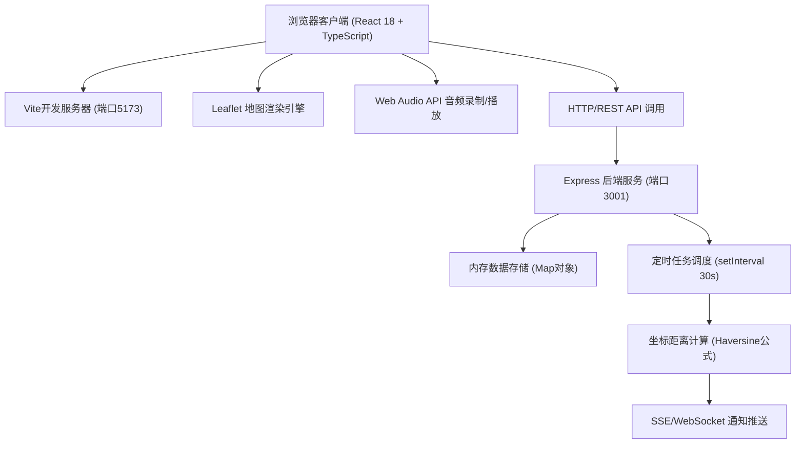
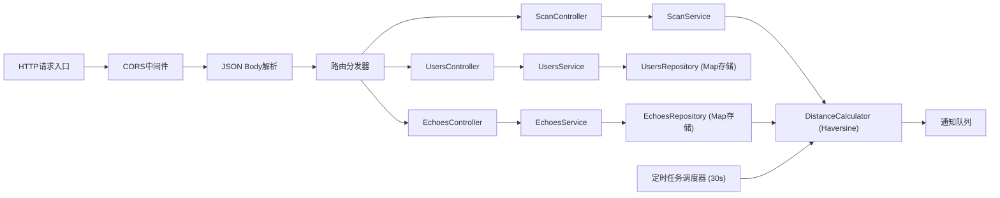
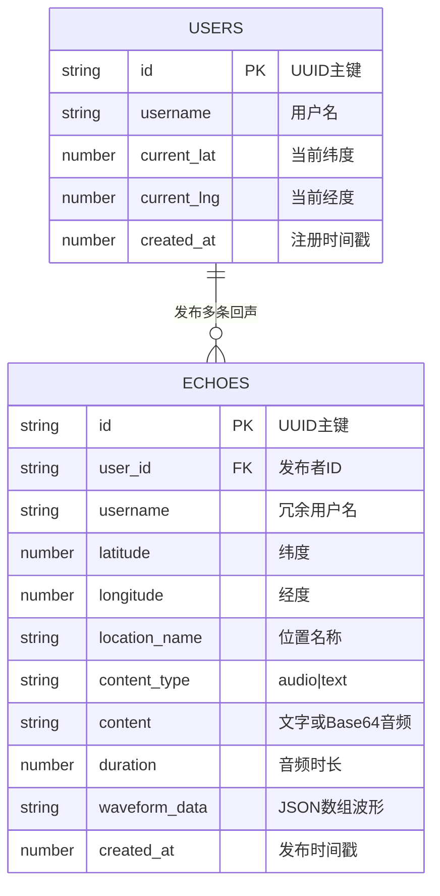

## 1. 架构设计



## 2. 技术描述

- **前端框架**：React 18 + TypeScript，严格模式，目标ES2020
- **构建工具**：Vite，支持React HMR热更新
- **地图引擎**：Leaflet，CDN引入 + 自定义风格化瓦片覆盖层
- **音频处理**：Web Audio API (AudioContext, MediaRecorder, AnalyserNode)
- **路由管理**：React Router DOM 单页路由
- **状态管理**：React useState/useReducer，组件级状态
- **样式方案**：原生CSS + CSS Modules + CSS变量，backdrop-filter毛玻璃
- **动画实现**：CSS Keyframes + CSS Transitions，纯CSS动画方案
- **后端框架**：Express 4 + TypeScript，CORS跨域支持
- **数据存储**：内存Map对象存储（开发演示用，uuid生成唯一ID）
- **距离算法**：Haversine公式计算球面两点距离（米级精度）

## 3. 路由定义

| 路由 | 用途 |
|------|------|
| / | 地图面板主页（默认路由，登录后进入） |
| /profile | 个人中心页面（瀑布流回声列表） |
| /register | 用户注册页面（首访引导注册） |

## 4. API 定义

```typescript
// 回声数据模型
interface Echo {
  id: string;                    // UUID
  userId: string;                // 发布者ID
  username: string;              // 发布者用户名
  latitude: number;              // 纬度
  longitude: number;             // 经度
  locationName: string;          // 逆地理编码位置名
  contentType: 'audio' | 'text'; // 内容类型
  content: string;               // 文字内容或Base64音频数据
  duration?: number;             // 音频时长(秒)
  waveformData?: number[];       // 波形振幅数据
  createdAt: number;             // 时间戳
}

interface User {
  id: string;       // UUID
  username: string; // 用户名
  currentLat: number;
  currentLng: number;
}

interface Notification {
  id: string;
  echoId: string;
  title: string;
  distance: number;
  timestamp: number;
}

// REST API 端点
// POST   /api/register          { username }        → { user, token }
// GET    /api/echoes            ?lat=&lng=&radius=  → Echo[]
// POST   /api/echoes            EchoCreatePayload   → Echo
// GET    /api/echoes/:id                            → Echo
// PUT    /api/echoes/:id        EchoUpdatePayload   → Echo
// DELETE /api/echoes/:id                            → { success }
// GET    /api/users/:id/echoes                      → Echo[]
// GET    /api/scan?userId=&lat=&lng=                 → Notification[]
```

## 5. 服务器架构图



## 6. 数据模型

### 6.1 数据模型定义



### 6.2 内存数据结构说明

- **usersMap**: `Map<string, User>` — 以用户ID为key的用户存储
- **echoesMap**: `Map<string, Echo>` — 以回声ID为key的回声存储
- **userEchoesIndex**: `Map<string, string[]>` — 用户ID到回声ID数组的倒排索引
- **spatialGrid**: 简单网格索引（按经纬度0.001度分格）加速邻近查询
