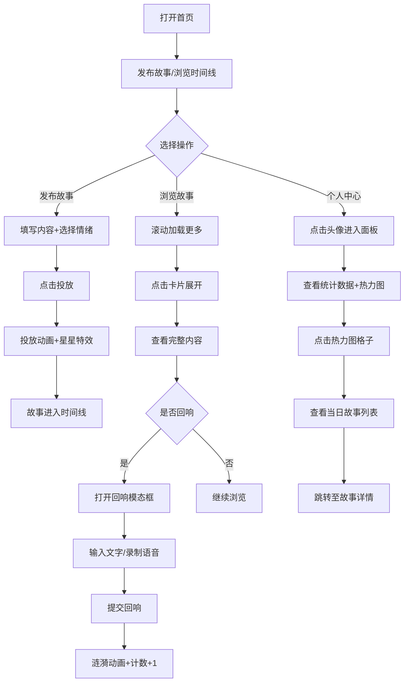

## 1. 产品概述

「时光树洞」是一个匿名情绪分享平台，用户可以匿名发布带有情绪标签的故事，在公共时间线墙上浏览他人的故事，并通过「回响」功能进行互动。平台同时提供个人情绪日历，帮助用户记录和回顾自己的情绪变化轨迹。

- 核心价值：为用户提供一个安全、温暖的匿名情绪表达空间，通过时间线和情绪热力图创造独特的情感记录体验
- 目标用户：需要情绪宣泄、寻求共鸣、记录生活感悟的年轻人群体

## 2. 核心功能

### 2.1 用户角色
| 角色 | 注册方式 | 核心权限 |
|------|----------|----------|
| 普通用户 | 匿名访问，无需注册 | 发布故事、浏览时间线、发表回响、查看个人情绪日历 |

### 2.2 功能模块
1. **故事发布模块**：毛玻璃输入框、情绪标签选择、投放动画效果
2. **时间线墙模块**：瀑布流布局、无限滚动加载、故事卡片展示
3. **回响交互模块**：模态框回复、涟漪动画效果、回响列表展示
4. **个人情绪日历模块**：情绪热力图、饼图统计、故事预览跳转
5. **情绪统计概览模块**：数据卡片展示、动画数字效果

### 2.3 页面详情
| 页面名称 | 模块名称 | 功能描述 |
|----------|----------|----------|
| 首页（时间线墙） | 故事发布区 | 毛玻璃质感输入框，支持标题（30字）、内容（500字）、情绪标签选择 |
| 首页（时间线墙） | 故事卡片列表 | 瀑布流三列布局，显示情绪标签、摘要、回响数、发布时间 |
| 首页（时间线墙） | 无限滚动加载 | 滚动到底部自动加载更多故事（每次20条） |
| 故事卡片 | 展开/收起 | 点击展开查看完整故事和回响列表 |
| 故事卡片 | 回响功能 | 弹出模态框，支持文字回复（200字）或语音录制（模拟） |
| 个人面板 | 情绪统计概览 | 四个数据卡片：总故事数、总回响数、最常情绪、连续记录天数 |
| 个人面板 | 情绪热力图 | 七行四周布局，周一为起始，颜色深浅代表故事数量 |
| 个人面板 | 情绪饼图 | Canvas绘制本周情绪分布，0.5秒动画过渡 |
| 个人面板 | 故事预览 | 点击热力图格子，右侧展开当天故事列表，支持跳转 |

## 3. 核心流程

### 3.1 发布故事流程
用户在顶部输入框填写标题和内容 → 选择情绪标签 → 点击「投放」按钮 → 按钮播放缩小飞入动画 → 新故事出现在时间线顶部 → 播放星星散落特效

### 3.2 浏览故事流程
用户滚动时间线 → 卡片渐入显示 → 鼠标悬停时光晕增强 → 点击「展开」查看完整内容 → 点击「回响」打开回复模态框 → 提交回响 → 涟漪动画扩散 → 回响数+1

### 3.3 个人情绪追踪流程
点击右上角头像 → 进入个人面板 → 查看统计数据卡片 → 浏览情绪热力图 → 点击某日格子 → 右侧显示当天故事列表 → 点击故事跳转至完整页面

## 4. 用户界面设计

### 4.1 设计风格
- **设计主题**：深邃时空 / 时光秘境
- **主色调**：深色斜角渐变背景 `#0E1626` 到 `#1A233A`
- **情绪色板**：
  - 喜悦 `#FFD700`
  - 忧伤 `#4A90D9`
  - 怀念 `#E67E22`
  - 困惑 `#9B59B6`
  - 惊喜 `#2ECC71`
- **辅助色**：浅灰蓝 `#D0D8E8`、深紫红 `#8B2252`、藏青渐变 `#1B2A3A`→`#0F1E2E`
- **卡片效果**：磨砂玻璃质感 `rgba(255,255,255,0.05)` + `backdrop-filter: blur(12px)` + 1px半透明白边
- **按钮风格**：磨砂玻璃圆角按钮，悬停亮度+20%，点击缩放0.95倍
- **字体**：标题使用 'Noto Serif SC' 衬线字体，正文使用 'Noto Sans SC' 无衬线字体，营造温暖叙事感
- **布局风格**：卡片式布局，最大宽度1200px居中，三列瀑布流

### 4.2 页面设计概述
| 页面名称 | 模块名称 | UI元素 |
|----------|----------|--------|
| 首页 | 故事发布区 | 毛玻璃输入框（标题+内容）、情绪标签下拉选择、投放按钮 |
| 首页 | 时间线墙 | 三列瀑布流、故事卡片（情绪色块+摘要+回响数+时间）、无限加载 |
| 故事卡片 | 卡片主体 | 藏青渐变背景、情绪色光晕、悬停光晕增强50%、圆角20px（手机端8px） |
| 回响模态框 | 模态框 | 半透明黑色背景、磨砂玻璃卡片、20px圆角、文字输入框、录音按钮 |
| 个人面板 | 统计卡片 | 毛玻璃悬浮卡片、emoji图标、数字缩放动画（1.1→1） |
| 个人面板 | 热力图 | 7行4列网格、颜色渐变、悬停放大、点击高亮 |
| 个人面板 | 饼图 | Canvas绘制、0.5秒动画过渡、情绪色对应扇区 |

### 4.3 响应式设计
- **桌面端**（≥1200px）：三列瀑布流，卡片间距24px
- **平板端**（768px-1199px）：两列布局，卡片间距16px
- **手机端**（<768px）：单列满宽，卡片圆角8px，间距12px
- 触控优化：按钮最小尺寸44px×44px，关键操作区域扩大点击范围

### 4.4 动画设计
- **投放动画**：按钮内容缩小飞入时间线，持续1秒
- **星星特效**：`canvas-confetti` 实现星星散落
- **涟漪动画**：细密光点从卡片边缘扩散，1.5秒消失
- **数字动画**：统计数字变化时，0.3秒从1.1倍缩放到1倍
- **卡片悬停**：光晕亮度+50%，边框发光增强
- **页面加载**：卡片交错渐入，`animation-delay` 错开显示
