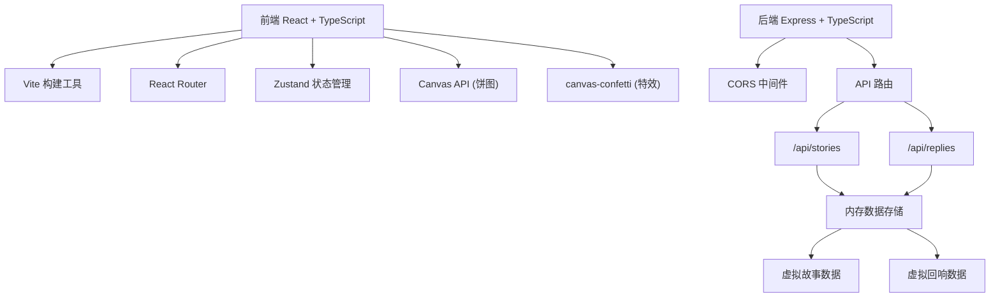
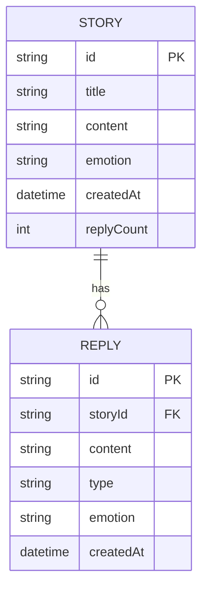

## 1. 架构设计



## 2. 技术描述

- **前端**：React@18 + TypeScript + Vite + Zustand + React Router DOM + canvas-confetti
- **后端**：Express@4 + TypeScript + CORS + UUID
- **构建工具**：Vite@5
- **语言**：TypeScript（严格模式，目标ES2020）
- **样式**：原生CSS + CSS Modules / 内联样式（无Tailwind，按需求使用指定颜色变量）
- **数据存储**：内存数据（虚拟数据，无数据库）

## 3. 路由定义

| 路由 | 页面 | 说明 |
|------|------|------|
| `/` | 时间线墙首页 | 故事发布、时间线瀑布流、无限滚动 |
| `/profile` | 个人面板 | 情绪统计概览、热力图、饼图 |
| `/story/:id` | 故事详情页 | 完整故事内容、回响列表 |

## 4. API 定义

### 4.1 类型定义
```typescript
// 情绪类型
type EmotionType = 'joy' | 'sadness' | 'nostalgia' | 'confusion' | 'surprise';

// 情绪颜色映射
const EMOTION_COLORS: Record<EmotionType, string> = {
  joy: '#FFD700',
  sadness: '#4A90D9',
  nostalgia: '#E67E22',
  confusion: '#9B59B6',
  surprise: '#2ECC71'
};

// 故事接口
interface Story {
  id: string;
  title: string;
  content: string;
  emotion: EmotionType;
  createdAt: string; // ISO 8601
  replyCount: number;
}

// 回响接口
interface Reply {
  id: string;
  storyId: string;
  content: string;
  type: 'text' | 'voice';
  emotion: EmotionType;
  createdAt: string;
}

// 分页响应
interface PaginatedResponse<T> {
  data: T[];
  hasMore: boolean;
  total: number;
}
```

### 4.2 故事 API
- `GET /api/stories?page=1&limit=20` - 分页获取故事列表（按时间倒序）
- `GET /api/stories/:id` - 获取单个故事详情
- `POST /api/stories` - 发布新故事
- `GET /api/stories/user/:date` - 获取指定日期的用户故事

### 4.3 回响 API
- `GET /api/replies?storyId=xxx` - 获取故事的回响列表
- `POST /api/replies` - 发表新回响

### 4.4 统计 API
- `GET /api/stats/user` - 获取用户情绪统计数据（总故事数、总回响数、最常情绪、连续记录天数）
- `GET /api/stats/calendar?weeks=4` - 获取情绪日历数据

## 5. 项目结构

```
.
├── package.json
├── vite.config.js
├── tsconfig.json
├── index.html
├── server/
│   └── server.ts          # Express后端入口
├── src/
│   ├── App.tsx            # 主应用组件
│   ├── main.tsx           # 入口文件
│   ├── types/
│   │   └── index.ts       # 类型定义
│   ├── store/
│   │   └── useStore.ts    # Zustand状态管理
│   ├── components/
│   │   ├── TimeWall.tsx   # 时间线墙组件
│   │   ├── StoryCard.tsx  # 故事卡片组件
│   │   ├── StoryForm.tsx  # 故事发布表单
│   │   ├── ReplyModal.tsx # 回响模态框
│   │   ├── RippleEffect.tsx # 涟漪动画组件
│   │   ├── EmotionCalendar.tsx # 情绪日历
│   │   ├── StatsCard.tsx  # 统计卡片
│   │   ├── EmotionPieChart.tsx # 情绪饼图
│   │   └── Header.tsx     # 头部导航
│   ├── pages/
│   │   ├── HomePage.tsx   # 首页
│   │   ├── ProfilePage.tsx # 个人面板
│   │   └── StoryDetailPage.tsx # 故事详情
│   ├── utils/
│   │   ├── api.ts         # API请求封装
│   │   ├── time.ts        # 时间格式化工具
│   │   └── emotion.ts     # 情绪相关工具
│   └── styles/
│       ├── global.css     # 全局样式
│       └── animations.css # 动画关键帧
```

## 6. 数据模型

### 6.1 ER图


### 6.2 初始数据
后端启动时生成50条虚拟故事数据和对应回响数据，每条故事包含0-5条随机回响，时间分布在过去28天内，用于演示情绪热力图功能。
