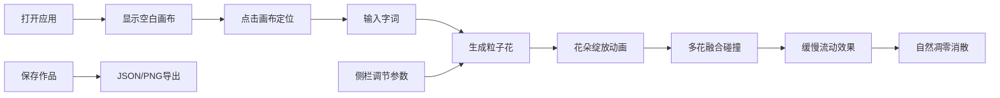

## 1. 产品概述

词光速写是一款创意互动艺术应用，用户在虚拟画布上通过打字实时生成动态光影诗篇。每输入一个字或词，画布上就会从光标位置绽放一朵由粒子光点构成的花，花朵的形状、颜色、扩张速度随输入词的情感属性而变化，形成独特的光影诗画效果。

- **核心价值**：将文字输入转化为视觉艺术，让用户以诗意的方式表达情感
- **目标用户**：创意爱好者、文字创作者、视觉艺术爱好者
- **使用场景**：灵感记录、情绪表达、艺术创作、互动展示

## 2. 核心功能

### 2.1 用户角色

| 角色 | 注册方式 | 核心权限 |
|------|---------|---------|
| 普通用户 | 无需注册 | 使用画布创作、保存作品、导出截图 |

### 2.2 功能模块

1. **主画布区**：粒子花绽放、融合碰撞、缓慢流动、凋零消散
2. **侧栏控制面板**：粒子密度调节、凋零时长调节、背景色选择
3. **作品保存**：JSON格式保存、PNG截图导出
4. **响应式适配**：桌面端侧栏、移动端底部横条

### 2.3 页面详情

| 页面名称 | 模块名称 | 功能描述 |
|---------|---------|----------|
| 主页面 | 画布区域 | 占视口宽75%高85%，1px柔和阴影边框，接收文字输入生成粒子花 |
| 主页面 | 粒子花系统 | 每朵花60-150个粒子，花瓣脉络连线，绽放动画0.6秒贝塞尔缓出 |
| 主页面 | 融合碰撞系统 | 相邻花重叠时金色连线脉冲，重叠区粒子每秒减少5% |
| 主页面 | 颜色系统 | HSL色环根据情感值偏移，正面暖色0-60，负面冷色180-240 |
| 主页面 | 侧栏控制 | 毛玻璃效果，粒子密度滑块、凋零时长滑块、背景色选择器、保存按钮 |
| 主页面 | 保存功能 | 一键保存JSON作品到后端，截图导出PNG |

## 3. 核心流程

用户打开应用 → 看到渐变背景的空白画布 → 在画布上点击定位输入 → 输入字词 → 对应位置绽放粒子花 → 多朵花之间产生融合效果 → 通过侧栏调节参数 → 保存作品为JSON或导出PNG → 花朵在设定时间后自然凋零消散

## 4. 用户界面设计

### 4.1 设计风格

- **主色调**：雾灰(#E6DFD3)到暖白(#FFF8EC)的线性渐变背景
- **强调色**：金色(#FFD700)用于重叠连线脉冲效果
- **视觉风格**：梦幻光影、粒子艺术、诗意流动
- **字体**：优雅的衬线体标题 + 现代无衬线体正文
- **动效风格**：柔和缓出、自然流动、有机生长

### 4.2 页面设计概述

| 页面名称 | 模块名称 | UI元素 |
|---------|---------|--------|
| 主页面 | 画布区 | 全屏渐变背景、1px阴影边框、Canvas渲染粒子、文字输入层 |
| 主页面 | 侧栏 | 毛玻璃(backdrop-filter: blur(10px))、宽度60px、垂直排列控件 |
| 主页面 | 滑块控件 | 粒子密度(50-200)、凋零时长(15-60秒)、自定义样式滑块 |
| 主页面 | 颜色选择器 | 背景色选择、HSL色板预览 |
| 主页面 | 保存按钮 | 透明到近白光晕悬停效果、双功能(JSON保存/PNG截图) |

### 4.3 响应式设计

- **桌面端**：画布占视口宽75%高85%，侧栏固定右侧宽60px
- **移动端(竖屏)**：画布宽95%，侧栏折叠为底部横条，水平排列控件
- **触摸优化**：增大触控区域，支持手势缩放画布

### 4.4 性能要求

- 同时存在30朵花(满负载)时帧率不低于45fps
- 使用Canvas 2D渲染，requestAnimationFrame驱动
- 对象池复用粒子，避免频繁GC
- 高效的碰撞检测(空间分区优化)
